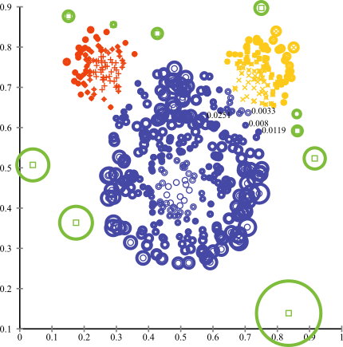

title: NPFL129, Lecture 1
class: title, cc-by-sa
style: .algorithm { background-color: #eee; padding: .5em }
# Introduction to Machine Learning

## Jindřich Libovický <small>(reusing materials by Milan Straka)</small>

### September 30, 2024

---
section: Organization

# Course Objectives: What you will learn

After this course you should…

- Be able to reason about tasks/problems **suitable for ML**
   - Know when to use classification, regression and clustering
   - Be able to choose from these methods: Linear and Logistic Regression,
     Multilayer Perceptron, Nearest Neighbors, Naive Bayes, Gradient Boosted Decision
     Trees, $k$-means clustering

~~~
- Think about learning as (mostly probabilistic) **optimization on training data**
  - Know how the ML methods learn including theoretical explanation

~~~
- Know how to properly **evaluate** ML
  - Think about generalization (and avoiding overfitting)
  - Be able to choose a suitable evaluation metric
  - Responsibly decide what model is better

~~~
- Be able to **implement ML algorithms** on a conceptual level
- Be able to **use Scikit-learn** to solve ML problems in Python

---
class: middle
# Course Objectives: What you will _not_ learn

- Data Science – How to (ethically, legally, effeciently, etc.) get data and
  how to **clean** data.

- More advanced neural networks – this is covered in
  [NPFL138](https://ufal.mff.cuni.cz/courses/npfl138)

- Details about Large Languge Models – this is covered in
  [NPFL140](https://ufal.mff.cuni.cz/courses/npfl140)

- How to apply ML in your specific field / your business

---
# Organization

**Course Website:** https://ufal.mff.cuni.cz/courses/npfl129
~~~
  - Slides, recordings, assignments, exam questions
~~~

**Course Repository:** https://github.com/ufal/npfl129
- Templates for the assignments, slide sources.

~~~

## Piazza

- Piazza will be used as a communication platform.

  You can post questions or notes,
  - **privately** to the instructors,
~~~
  - **publicly** to everyone (signed or anonymously).
~~~
    - Other students can answer these too, which allows you to get faster
      response.
~~~
    - However, **do not include even parts of your source code** in public
      questions.
~~~

- Please use Piazza for **all communication** with the instructors.
~~~
- You will get the invite link after the first lecture.

---
class: middle
# Piazza Screenshot

---
# ReCodEx

https://recodex.mff.cuni.cz

- The assignments will be evaluated automatically in ReCodEx.
~~~
- If you have a MFF SIS account, you should be able to create an account
  using your CAS credentials and should automatically see the right group.
~~~
- Otherwise, there will be **instructions** on **Piazza** how to get
  ReCodEx account (generally you will need to send me a message with several
  pieces of information and I will send it to ReCodEx administrators in
  batches).

---
# Course Requirements

## Practicals
~~~

- There will be about 2-3 assignments a week, each with a 2-week deadline.
~~~
  - There is also another week-long second deadline, but for fewer points.
~~~
- After solving the assignment, you get non-bonus points, and sometimes also
  bonus points.
~~~
- To pass the **practicals, you need to get 70 non-bonus points**. There will be
  assignments for at least 105 non-bonus points.
~~~
- If you get **more than 70 points** (be it bonus or non-bonus), they will be
  *transferred to the exam* (but at most 40 points are transferred).

~~~
## Lecture

You need to pass a written exam.
~~~
- All questions are publicly listed on the course website.
~~~
- There are questions for 100 points in every exam, plus at most 40 surplus
  points from the practicals and plus at most 10 surplus points for **community
  work** (improving slides, …).
~~~
- You need 60/75/90 points to pass with grade 3/2/1.

---
class: middle
# Schedule Irregularities

| Date | What happens |
|-----------------|-----------------------|
| Monday, October 28 | Public holiday = no English lecture |
| Thursday, October 31 | No English practicals |
| Tuesday, November 5 | Sports day = no Czech lecture |
| November 11 and 12 | Someone else will deliver the lecture |
| Tuesday, November 26 | Extra Czech lecture during the practicals slot |
| Thursday, November 28 | Extra English lecture during the practicals slot |

---
class: middle
# Today's Lecture Objectives

After this lecture you should be able to

- Explain to a non-expert what machine learning is

- Explain the difference between classification and regression

- Implement a simple linear-algebra-based algorithm for training linear regression

---
section: What is Machine Learning?
class: section
# What is Machine Learning?

---
# Definition of Machine Learning

A possible definition of learning from Mitchell (1997):
>  A computer program is said to learn from **experience E** with respect to some
>  class of **tasks T** and performance **measure P**, if its performance at tasks in
>  T, as measured by P, improves with experience E.

~~~
- Task T
    - _classification_: assigning one of $k$ categories to a given input
    - _regression_: producing a number $x∈ℝ$ for a given input
    - _structured prediction_, _denoising_, _density estimation_, …
~~~
- Measure P
    - _accuracy_, _error rate_, _F-score_, …
~~~
- Experience E
    - _supervised_: usually a dataset with desired outcomes (_labels_ or
      _targets_)
    - _unsupervised_: usually data without any annotation (raw text, raw images, …)
    - _reinforcement learning_, _semi-supervised learning_, …

---
# Intuitive definition: ML vs Standard Programming

## Programming

* We can **formally describe** a problem with clear concepts
* Program = unambiguous set of **instructions** that handles the concepts

*Example - e-shop:* Concepts: goods, store, customer, order, …  
Simple algorithms: place an order, send an order, …

~~~
## Machine Learning

* We have **data** and a **measure** how our problem is solved
* Typically, we do not know how to write code that solves the problem

*Example - machine translation* there is no set of formal instruction how to
translate, but there is a large amount of data

---
# Supervised Machine Learning

---
# Unsupervised Machine Learning

---
class: middle
# Brief Machine Learning History

---
section: Basic Methodology & Notation
class: section
#  Basic Methodology & Notation

---
# Basic ML Tasks
Assume input of $→x ∈ ℝ^D$. The two basic ML tasks are:

1. **Regression**: The goal is to predict a real-valued target variable $t ∈ ℝ$
   for given $→x$.
~~~

2. **Classification**: Assuming a fixed set of $K$ labels, the goal
   is to choose a corresponding label/class for given $→x$.
~~~
   - We can predict the class only.
~~~
   - We can predict the whole distribution of all classes probabilities.

~~~
We usually have a **training set**:
  * Consists of examples of $(→x, t)$
  * Probabilistic interpretation: Generated independently from a **data-generating distribution**

---
class: middle
# Optimization vs. Machine Learning

* **Optimization** = match the training set as well as possible
~~~
* ML's goals is **generalization** = match **previously unseen data** as well as possible

↓

<big>❓🔮❓</big>

~~~

We typically estimate it using a <b>test set</b> of examples independent of the
training set.

(in probabilistic interpretation generated by the same data-generating distribution)

---
# Notation

- $a$, $→a$, $⇉A$, $⇶A$: scalar (integer or real), vector, matrix, tensor

~~~
  - all vectors are always **column** vectors
~~~
  - transposition changes a column vector into a row vector, so $→a^T$ is a row vector
~~~
  - we denote the **dot (scalar) product** of the vectors $→a$ and $→b$ using $→a^T →b$
    - we understand it as matrix multiplication
~~~
  - the $\|→a\|_2$ or just $\|→a\|$ is the Euclidean (or $L^2$) norm
    - $\|→a\|_2 = \sqrt{\sum_i a_i^2}$
~~~

- $⁇a$, $⁇→a$, $⁇⇉A$: scalar, vector, matrix random variable

~~~

- $𝔸$: set; $ℝ$ is the set of real numbers, $ℂ$ is the set of complex numbers

~~~
- $\frac{df}{dx}$: derivative of $f$ with respect to $x$

- $\frac{∂f}{∂x}$: partial derivative of $f$ with respect to $x$

~~~
- $∇_{→x} f(→x)$: gradient of $f$ with respect to $→x$, i.e.,
  $\left(\frac{∂f(→x)}{∂x_1}, \frac{∂f(→x)}{∂x_2}, \ldots, \frac{∂f(→x)}{∂x_n}\right)$

---
# Example Dataset

Assume we have the following data, generated from an underlying curve
by adding a small amount of noise.

---
# Input Data

Usually, ML algorithms are trained using
the **train set** $⇉X ∈ ℝ^{N×D}$: a collection of $N$ instances,
each represented by $D$ real numbers.

~~~
In supervised learning, we also have a **target** $→t$ for every instance,
- a real number for regression, $→t ∈ ℝ^N$;
- a class for classification, $→t ∈ \{0, 1, …, K-1\}^N$.

~~~

The input to ML learning algorithms is frequently preprocessed, i.e., the
algorithms do not always work directly on the input $⇉X$, but on some
modification of it. These are called **features**.

~~~
In some literature, processed inputs are called a **design
matrix** $⇉Φ∈ ℝ^{N×M}$, we will denote everything as $⇉X$.

---
section: Linear Regression
class: section
# Linear Regression

---
class: middle
# Linear Regression

Given an input value $→x ∈ ℝ^D$, one of the simplest models to predict
a target real value is **linear regression**:
$$y(→x; →w, b) = x_1 w_1 + x_2 w_2 + … + x_D w_D + b = ∑_{i=1}^D x_i w_i + b = →x^T →w + b.$$
The $→w$ are usually called _weights_ and $b$ is called _bias_.

~~~

Sometimes it is convenient not to deal with the bias separately. Instead,
we might enlarge the input vector $→x$ by padding a value 1, and consider only
$→x^T→w$, the bias is encoded by the last weight.
Therefore, “weights” often contain both weights and biases.

---
# Separate Bias vs. Padding $⇉X$ with Ones

Using an explicit bias term in the form of $y(x) = →x^T →w + b$.
$$
\begin{bmatrix}
x_{11} \quad x_{12} \\
x_{21} \quad x_{22} \\
\vdots \\
x_{n1} \quad x_{n2} \\
\end{bmatrix} \cdot
\begin{bmatrix}
w_1 \\ w_2
\end{bmatrix} + b
=
\begin{bmatrix}
w_1 x_{11} + w_2 x_{12} + b \\
w_1 x_{21} + w_2 x_{22} + b \\
\vdots \\
w_1 x_{n1} + w_2 x_{n2} + b
\end{bmatrix}
$$

~~~
With extra $1$ padding in $⇉X$ and an additional $b$ weight representing the
bias.
$$
\begin{bmatrix}
x_{11} & x_{12} & 1 \\
x_{21} & x_{22} & 1 \\
& \vdots & \\
x_{n1} & x_{n2} & 1 \\
\end{bmatrix} \cdot
\begin{bmatrix}
w_1 \\ w_2 \\ b
\end{bmatrix}
=
\begin{bmatrix}
w_1 x_{11} + w_2 x_{12} + b \\
w_1 x_{21} + w_2 x_{22} + b \\
\vdots \\
w_1 x_{n1} + w_2 x_{n2} + b
\end{bmatrix}
$$

---
# Linear Regression

We have a dataset of $N$ input values $→x_1, …, →x_N$ and targets
$t_1, …, t_N$.

Find weight values = minimize an **error function**
between the real target values and their predictions.

~~~
A popular and simple error function is _mean squared error_:

$$\operatorname{MSE}(→w) = \frac{1}{N} ∑_{i=1}^N \big(y(→x_i; →w) - t_i\big)^2.$$

~~~
Often, _sum of squares_
$$\frac{1}{2} ∑_{i=1}^N \big(y(→x_i; →w) - t_i\big)^2$$
is used instead. Minimizing it is equal to minimizing MSE, but the math
comes out nicer.

---
# Linear Regression

Several ways how to minimize the error function – linear regression + sum of
squares error have an explicit solution.

Our goal is to minimize:

$$\tfrac{1}{2}∑_i^N (→x_i^T→w - t_i)^2.$$

~~~
If we denote $⇉X ∈ ℝ^{N×D}$ the matrix of input values with $→x_i$ on a row $i$
and $→t ∈ ℝ^N$ the vector of target values, we can write it as
$$\tfrac{1}{2}\|⇉X→w - →t\|^2,$$
~~~
because
$$\|⇉X→w - →t\|^2 = ∑_i \big((⇉X→w - →t)_i\big)^2 = ∑_i \big((⇉X→w)_i - t_i)\big)^2 = ∑_i (→x_i^T→w - t_i)^2.$$

---
# Minimization – Unconstrained, Single Real Variable

Assume we have a function and we want to find its minimum.

~~~
We usually use the Fermat's theorem (interior extremum theorem):

> Let $f : ℝ → ℝ$ be a function. If it has a minimum (or a maximum) in $x$
> and if it has a derivative in $x$, then
> $\frac{∂f}{∂x} = 0.$

---
# Minimization – Unconstrained, Multiple Real Variables

The previous theorem can be generalized to the multivariate case:

Let $f : ℝ^D → ℝ$ be a function. If it has a minimum or a maximum in
$→x = (x_1, x_2, …, x_D)$ and if it has a derivative in $→x$, then
for all $i$, $\frac{∂f}{∂x_i} = 0$. In other words, $∇_{→x} f(→x) = →0$.

~~~

---
# Linear Regression

In order to find a minimum of $\tfrac{1}{2}∑_i^N (→x_i^T→w - t_i)^2$,
we can inspect values where the derivative of the
error function is zero, with respect to all weights $w_j$.

~~~
$$\frac{∂}{∂w_j} \frac{1}{2}∑_i^N (→x_i^T→w - t_i)^2 = \frac{1}{2} ∑_i^N \left(2(→x_i^T→w - t_i) x_{ij}\right) = ∑_i^N x_{ij}(→x_i^T→w - t_i)$$

~~~
Therefore, we want for all $j$ that $∑_i^N x_{ij}(→x_i^T→w - t_i) = 0$.

~~~
We can rewrite the explicit sum into $⇉X_{*,j}^T(⇉X→w - →t) = 0$,
~~~
then write the equations for all $j$ together using matrix notation as
$⇉X^T(⇉X→w - →t) = →0$,
~~~
and finally, rewrite to
$$⇉X^T⇉X→w = ⇉X^T →t.$$

~~~
The matrix $⇉X^T⇉X$ is of size $D×D$. If it is invertible, we can compute its
inverse and
$$→w = (⇉X^T⇉X)^{-1}⇉X^T→t.$$

---
# Linear Regression

**Input**: Dataset ($⇉X ∈ ℝ^{N×D}$, $→t ∈ ℝ^N$). 
**Output**: Weights $→w ∈ ℝ^D$ minimizing MSE of linear regression.

- $→w ← (⇉X^T⇉X)^{-1}⇉X^T→t.$

~~~
The algorithm has complexity $𝓞(ND^2)$, assuming $N≥D$.

~~~
When the matrix $⇉X^T⇉X$ is singular, we can solve $⇉X^T⇉X→w = ⇉X^T →t$ using
SVD.

---
# Linear Regression Example: Polynomial Features

We want to predict a $t ∈ ℝ$ for a given $x ∈ ℝ$. Linear regression with “raw” input vectors $→x = (x)$ can only model straight lines.

~~~

If we consider input vectors $→x = (x^0, x^1, …, x^M)$ for a given
$M ≥ 0$, the linear regression is able to model polynomials of degree $M$.
The prediction is then computed as
$$w_0 x^0 + w_1 x^1 + … + w_M x^M.$$

~~~
The weights are the coefficients of a polynomial of degree $M$.

---
# Linear Regression Example

To plot the error, the _root mean squared error_
$\operatorname{RMSE}=\sqrt{\operatorname{MSE}}$ is frequently used.

~~~

The displayed error nicely illustrates two main challenges in machine learning:
- _underfitting_
- _overfitting_

---
section: Summary
class: summary
# Today's Lecture Objectives

After this lecture you should be able to

- Explain to a non-expert what machine learning is

- Explain the difference between classification and regression

- Implement a simple linear-algebra-based algorithm for training linear regression
