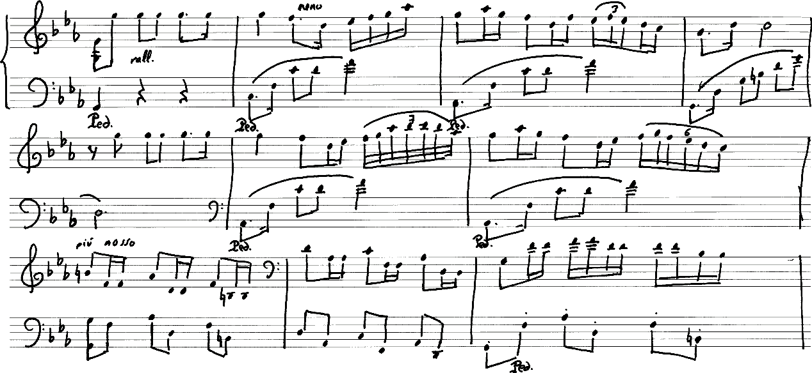
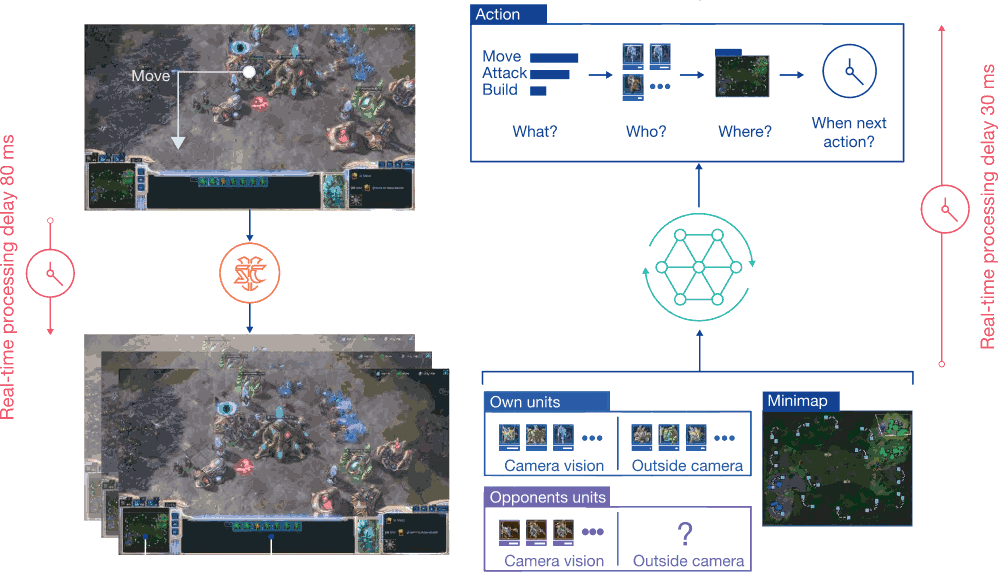
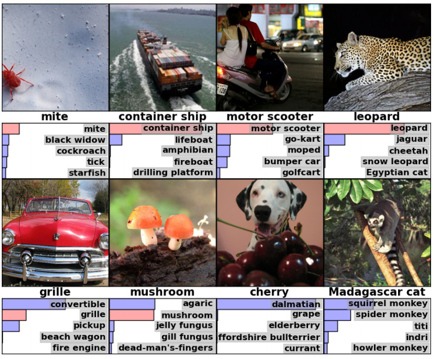
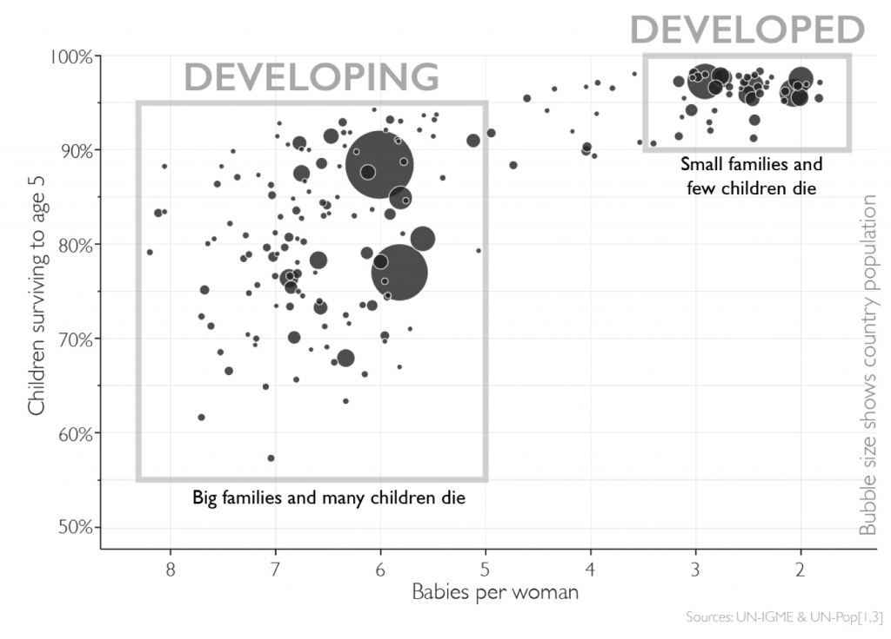
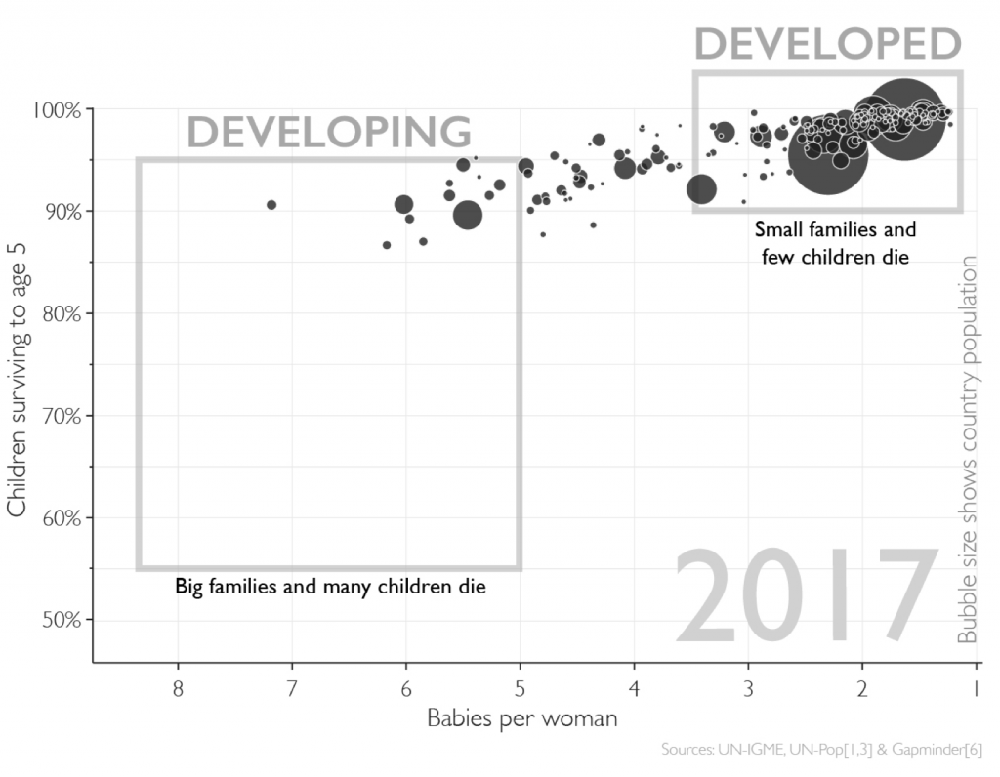

title: NPFL129, Lecture 1
class: title, cc-by-nc-sa
style: .algorithm { background-color: #eee; padding: .5em }
# Introduction to Machine Learning

## Milan Straka

### October 03, 2022

---
# Machine Learning

~~~

~~~

~~~

~~~

---
# Machine Learning

~~~

~~~

~~~

---
# Machine Learning

---
section: Organization

# Organization

**Course Website:** https://ufal.mff.cuni.cz/courses/npfl129
~~~
  - Slides, recordings, assignments, exam questions
~~~

**Course Repository:** https://github.com/ufal/npfl129
- Templates for the assignments, slide sources.

~~~

## Piazza

- Piazza will be used as a communication platform.

  You can post questions or notes,
  - privately to the instructors, or
~~~
  - to everyone (signed or anonymously).
~~~

  Students can answer other student's questions too, which allows you to get
  faster response. However, please do not send even parts of your solutions to
  other students.

~~~
- Please use Piazza for **all communication** with the instructors.
~~~
- You will get the invite link after the first lecture.

---
# ReCodEx

https://recodex.mff.cuni.cz

- The assignments will be evaluated automatically in ReCodEx.
~~~
- If you have a MFF SIS account, you should be able to create an account
  using your CAS credentials and should automatically see the right group.
~~~
- Otherwise, there will be **instructions** on **Piazza** how to get
  ReCodEx account (generally you will need to send me a message with several
  pieces of information and I will send it to ReCodEx administrators in
  batches).

---
# Course Requirements

## Practicals
~~~

- There will be 1-3 assignments a week, each with a 2-week deadline.
~~~
  - There is also another week-long second deadline, but for less points.
~~~
- After solving the assignment, you get non-bonus points, and sometimes also
  bonus points.
~~~
- To pass the practicals, you need to get 80 non-bonus points. There will be
  assignments for at least 120 non-bonus points.
~~~
- If you get more than 80 points (be it bonus or non-bonus), they will be
  transferred to the exam (but at most 40 points are transferred).

~~~
## Lecture

You need to pass a written exam.
~~~
- All questions are publicly listed on the course website.
~~~
- There are questions for 100 points in every exam, plus at most 40 surplus
  points from the practicals and plus at most 10 surplus points for **community
  work** (improving slides, …).
~~~
- You need 60/75/90 points to pass with grade 3/2/1.

---
section: Machine Learning
# Machine Learning

A possible definition of learning from Mitchell (1997):
>  A computer program is said to learn from experience E with respect to some
>  class of tasks T and performance measure P, if its performance at tasks in
>  T, as measured by P, improves with experience E.

~~~
- Task T
    - _classification_: assigning one of $k$ categories to a given input
    - _regression_: producing a number $x∈ℝ$ for a given input
    - _structured prediction_, _denoising_, _density estimation_, …
~~~
- Measure P
    - _accuracy_, _error rate_, _F-score_, …
~~~
- Experience E
    - _supervised_: usually a dataset with desired outcomes (_labels_ or
      _targets_)
    - _unsupervised_: usually data without any annotation (raw text, raw images, …)
    - _reinforcement learning_, _semi-supervised learning_, …

---
# Supervised Machine Learning

---
# Supervised Machine Learning

---
# Unsupervised Machine Learning – Clustering

---
# Unsupervised Machine Learning – Clustering

---
class: wide
# Introduction to Machine Learning History

---
section: TL;DR
# Basic Machine Learning Settings

Assume we have an input of $→x ∈ ℝ^D$. The two basic ML tasks are:
1. **regression**: The goal of a regression is to predict real-valued target
   variable $t ∈ ℝ$ for the given input.

~~~
2. **classification**: Assuming we have a fixed set of $K$ labels, the goal
   of a classification is to choose a corresponding label/class for a given
   input.
~~~
   - We can predict the class only.
~~~
   - We can predict the whole distribution of all classes probabilities.

~~~
We usually have a **training set**, which is assumed to consist of examples
of $(→x, t)$ generated independently from a **data generating distribution**.

~~~
The goal of _optimization_ is to match the training set as well as possible.

~~~
However, the goal of _machine learning_ is to perform well on _previously
unseen_ data, to achieve lowest **generalization error** or **test error**. We
typically estimate it using a **test set** of examples independent of the
training set, but generated by the same data generating distribution.

---
# Notation

- $a$, $→a$, $⇉A$, $⇶A$: scalar (integer or real), vector, matrix, tensor

~~~
  - all vectors are always **column** vectors
~~~
  - transposition changes a column vector into a row vector, so $→a^T$ is a row vector
~~~
  - we denote **scalar product** between vectors $→a$ and $→b$ as $→a^T →b$
    - we understand it as matrix multiplication
~~~
  - the $\|→a\|_2$ or just $\|a\|$ is the Euclidean (or $L^2$) norm
    - $\|→a\|_2 = \sqrt{\sum_i a_i^2}$
~~~

- $⁇a$, $⁇→a$, $⁇⇉A$: scalar, vector, matrix random variable

~~~
- $\frac{df}{dx}$: derivative of $f$ with respect to $x$

- $\frac{∂f}{∂x}$: partial derivative of $f$ with respect to $x$

~~~
- $∇_{→x} f(→x)$: gradient of $f$ with respect to $→x$, i.e.,
  $\left(\frac{∂f(→x)}{∂x_1}, \frac{∂f(→x)}{∂x_2}, \ldots, \frac{∂f(→x)}{∂x_n}\right)$

---
section: Input Data
# Example Dataset

Assume we have the following data, generated from an underlying curve
by adding a small amount of noise.

---
# Input Data

Usually, our machine learning algorithms will be trained using
the **train set** $⇉X ∈ ℝ^{N×D}$, which is a collection of $N$ instances,
each represented by $D$ real numbers.

~~~
In supervised learning, we also have a **target** $→t$ for every instance,
- a real number for regression, $→t ∈ ℝ^N$;
- a class for classification, $→t ∈ \{0, 1, …, K-1\}^N$.

~~~

The input to machine learning algorithms is frequently preprocessed, i.e., the
algorithms do not always work directly on the input $⇉X$, but on some
modification of it. These preprocessed input values are called **features**.

~~~
In literature, the collection of the processed inputs is called a **design
matrix** $⇉Φ∈ ℝ^{N×M}$. However, we will denote the inputs to algorithms
always as $⇉X$, be it the original training data or processed features.

---
section: Linear Regression
# Linear Regression

Given an input value $→x ∈ ℝ^D$, one of the simplest models to predict
a target real value is **linear regression**:
$$y(→x; →w, b) = x_1 w_1 + x_2 w_2 + … + x_D w_D + b = ∑_{i=1}^D x_i w_i + b = →x^T →w + b.$$
The $→w$ are usually called _weights_ and $b$ is called _bias_.

~~~
Sometimes it is convenient not to deal with the bias separately. Instead,
we might enlarge the input vector $→x$ by padding a value 1, and consider only
$→x^T→w$, where the role of a bias is accomplished by the last weight.
Therefore, when we say “weights”, we usually mean both weights and biases.

---
# Separate Bias vs. Padding $⇉X$ with Ones

Using an explicit bias term in the form of $y(x) = →x^T →w + b$.
$$
\begin{bmatrix}
x_{11} \quad x_{12} \\
x_{21} \quad x_{22} \\
\vdots \\
x_{n1} \quad x_{n2} \\
\end{bmatrix} \cdot
\begin{bmatrix}
w_1 \\ w_2
\end{bmatrix} + b
=
\begin{bmatrix}
w_1 x_{11} + w_2 x_{12} + b \\
w_1 x_{21} + w_2 x_{22} + b \\
\vdots \\
w_1 x_{n1} + w_2 x_{n2} + b
\end{bmatrix}
$$

~~~
With extra $1$ padding in $⇉X$ and an additional $b$ weight representing the
bias.
$$
\begin{bmatrix}
x_{11} & x_{12} & 1 \\
x_{21} & x_{22} & 1 \\
& \vdots & \\
x_{n1} & x_{n2} & 1 \\
\end{bmatrix} \cdot
\begin{bmatrix}
w_1 \\ w_2 \\ b
\end{bmatrix}
=
\begin{bmatrix}
w_1 x_{11} + w_2 x_{12} + b \\
w_1 x_{21} + w_2 x_{22} + b \\
\vdots \\
w_1 x_{n1} + w_2 x_{n2} + b
\end{bmatrix}
$$

---
# Linear Regression

Assume we have a dataset of $N$ input values $→x_1, …, →x_N$ and targets
$t_1, …, t_N$.

To find the values of weights, we usually minimize an **error function**
between the real target values and their predictions.

~~~
A popular and simple error function is _mean squared error_:

$$\operatorname{MSE}(→w) = \frac{1}{N} ∑_{i=1}^N \big(y(→x_i; →w) - t_i\big)^2.$$

~~~
Often, _sum of squares_
$$\frac{1}{2} ∑_{i=1}^N \big(y(→x_i; →w) - t_i\big)^2$$
is used instead, because minimizing it is equal to minimizing MSE, but the math
comes out nicer.

---
# Linear Regression

There are several ways how to minimize the error function, but in the case of
linear regression and sum of squares error, there exists an explicit solution.

Our goal is to minimize the following quantity:
$$\tfrac{1}{2}∑_i^N (→x_i^T→w - t_i)^2.$$

~~~
If we denote $⇉X ∈ ℝ^{N×D}$ the matrix of input values with $→x_i$ on a row $i$
and $→t ∈ ℝ^N$ the vector of target values, we can rewrite the minimized
quantity as
$$\tfrac{1}{2}\|⇉X→w - →t\|^2.$$

---
# Minimization – Unconstrained, Single Real Variable

Assume we have a function and we want to find its minimum.

~~~
We usually use the Fermat's theorem (interior extremum theorem):

Let $f : ℝ → ℝ$ be a function. If it has minimum (or maximum) in $x$
and if it has derivative in $x$, then
$$\frac{∂f}{∂x} = 0.$$

---
# Minimization – Unconstrained, Multiple Real Variables

The previous theorem can be generalized to the multivariate case:

Let $f : ℝ^D → ℝ$ be a function. If it has minimum (or maximum) in
$→x = (x_1, x_2, …, x_D)$ and if it has derivative in $→x$, then
for all $i$, $\frac{∂f}{∂x_i} = 0$. In other words, $∇_{→x} f(→x) = 0$.

~~~

---
# Linear Regression

In order to find a minimum of $\tfrac{1}{2}∑_i^N (→x_i^T→w - t_i)^2$,
we can inspect values where the derivative of the
error function is zero, with respect to all weights $w_j$.

~~~
$$\frac{∂}{∂w_j} \frac{1}{2}∑_i^N (→x_i^T→w - t_i)^2 = \frac{1}{2} ∑_i^N \left(2(→x_i^T→w - t_i) x_{ij}\right) = ∑_i^N x_{ij}(→x_i^T→w - t_i)$$

~~~
Therefore, we want for all $j$ that $∑_i^N x_{ij}(→x_i^T→w - t_i) = 0$. We can
write all the equations together using matrix notation as $⇉X^T(⇉X→w - →t) = 0$
and rewrite to
$$⇉X^T⇉X→w = ⇉X^T →t.$$

~~~
The matrix $⇉X^T⇉X$ is of size $D×D$. If it is regular, we can compute its
inverse and therefore
$$→w = (⇉X^T⇉X)^{-1}⇉X^T→t.$$

---
# Linear Regression

**Input**: Dataset ($⇉X ∈ ℝ^{N×D}$, $→t ∈ ℝ^N$). 
**Output**: Weights $→w ∈ ℝ^D$ minimizing MSE of linear regression.

- $→w ← (⇉X^T⇉X)^{-1}⇉X^T→t.$

~~~
The algorithm has complexity $𝓞(ND^2)$, assuming $N≥D$.

~~~
When the matrix $⇉X^T⇉X$ is singular, we can solve $⇉X^T⇉X→w = ⇉X^T →t$ using
SVD, which will be demonstrated on the next lecture.

---
# Linear Regression Example

Assume our input vectors comprise of $→x = (x^0, x^1, …, x^M)$, for $M ≥ 0$.

---
# Linear Regression Example

To plot the error, the _root mean squared error_
$\operatorname{RMSE}=\sqrt{\operatorname{MSE}}$ is frequently used.

~~~

The displayed error nicely illustrates two main challenges in machine learning:
- _underfitting_
- _overfitting_

---
section: Regularization
# Model Capacity
We can control whether a model underfits or overfits by modifying its **capacity**.
~~~
- representational capacity
- effective capacity

~~~

---
# Linear Regression Overfitting

Note that employing more data usually alleviates overfitting (the relative
capacity of the model is decreased).

---
# Regularization

**Regularization** in a broad sense is any change in a machine learning
algorithm that is designed to _reduce generalization error_ (but not necessarily
its training error).

~~~
We already saw that **limiting model capacity** can work as regularization.

---
# L2 Regularization

One of the oldest regularization techniques tries to prefer “simpler” models
by endorsing models with **smaller weights**.

~~~
Concretely, **$\boldsymbol{L^2}$-regularization** (also called **weight decay**) penalizes
models with large weights by utilizing the following error function:

$$\frac{1}{2} ∑_{i=1}^N \big(y(→x_i; →w) - t_i\big)^2 + \frac{λ}{2} \|→w\|^2$$

~~~
Note that the $L^2$-regularization usually is not applied on _bias_, only on the
“proper” weights. One of the reasons for this is that without penalizing bias,
$L^2$-regularization is invariant to shifts (i.e., adding a constant to all
targets would result in the same solution with only bias increased by that
constant; if bias would be penalized, this would not be true).

~~~
For simplicity, we will not explicitly exclude the bias from the
$L^2$-regularization penalty in the slides (several textbooks also take the
same approach).

---
# L2 Regularization

One way how you can look at $L^2$-regularization is that it promotes smaller
changes of the model (the gradient of linear regression with respect to the
inputs are exactly the weights, i.e., $∇_{→x} y(→x; →w) = →w$).

~~~
Considering the data points on the right, we present mean squared errors
and $L^2$ norms of the weights for three linear regression models:

---
# L2 Regularization

The effect of $L^2$-regularization can be seen as limiting the _effective
capacity_ of the model.

~~~

---
# Regularizing Linear Regression

In matrix form, regularized sum of squares error for linear regression amounts
to
$$\tfrac{1}{2} \|⇉X→w - →t\|^2 + \tfrac{λ}{2} \|→w\|^2.$$

When repeating the same calculation as in the unregularized case, we arrive at
$$(⇉X^T⇉X + λ⇉I)→w = ⇉X^T→t,$$
where $⇉I$ is an identity matrix.

~~~

**Input**: Dataset ($⇉X ∈ ℝ^{N×D}$, $→t ∈ ℝ^N$), constant $λ ∈ ℝ^+$. 
**Output**: Weights $→w ∈ ℝ^D$ minimizing MSE of regularized linear regression.

- $→w ← (⇉X^T⇉X + λ⇉I)^{-1}⇉X^T→t.$

~~~
Note that the $⇉X^T⇉X + λ⇉I$ matrix is always regular for $λ>0$, so another effect of
$L^2$-regularization is that the inverse always exists.

---
section: Hyperparameters
# Choosing Hyperparameters

_Hyperparameters_ are not adapted by the learning algorithm itself.

Usually a **validation set** or **development set** is used to
estimate the generalization error, allowing to update hyperparameters accordingly.
If there is not enough data (well, there is **always** not enough data),
more sophisticated approaches can be used.

~~~
So far, we have seen two hyperparameters, $M$ and $λ$.

~~~

