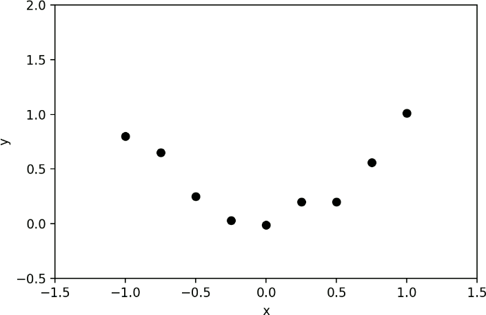
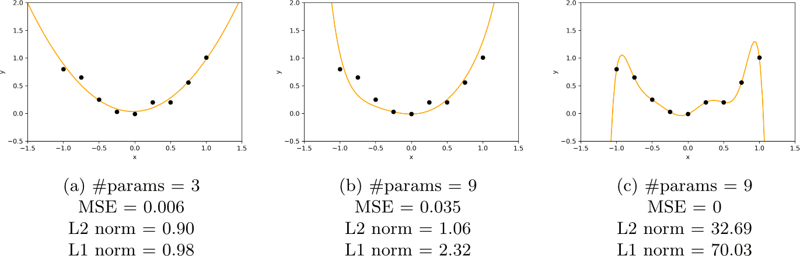
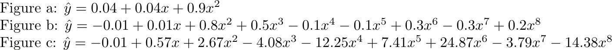

title: NPFL129, Lecture 2
class: title, cc-by-sa
style: .algorithm { background-color: #eee; padding: .5em }
# Linear Regression II, SGD

## Jindřich Libovický <small>(reusing materials by Milan Straka)</small>

### October 7, 2024

---
class: middle
# Today's Lecture Objectives

After this lecture you should be able to

- Reason about **overfitting** in terms of **model capacity**.

- Use **$L^2$-regularization** to control model capacity.

- Explain what the difference between **parameters and hyperparameters** is.

- Tell what the **basic probability concepts** are (joint, marginal,
  conditional probability; expected value, mean, variance).

- Mathematically describe and implement the **stochastic gradient descent**
  algorithm.

- Use both **numerical and categorical features** in linear regression.

---
section: Refresh
class: section
# Refresh from last week

---
# Linear Regression

Given an input value $→x ∈ ℝ^D$, **linear regression** computes predictions as:
$$y(→x; →w, b) = x_1 w_1 + x_2 w_2 + … + x_D w_D + b = ∑_{i=1}^D x_i w_i + b = →x^T →w + b.$$
The _bias_ $b$ can be considered one of the _weights_ $→w$ if convenient.

~~~
We learn the weights by minimizing an **error function** between the real target
values and their predictions, notably _sum of squares_:
$$\frac{1}{2} ∑_{i=1}^N \big(y(→x_i; →w) - t_i\big)^2$$

~~~
Various minimization approaches exist, but for linear regression an explicit solution exists:
$$→w = (⇉X^T⇉X)^{-1}⇉X^T→t.$$

---
# Linear Regression Example

Assume we want to predict a $t ∈ ℝ$ for a given $x ∈ ℝ$. If we train
the linear regression with “raw” input vectors $→x = (x)$, only straight lines
could be modeled.

However, if we consider input vectors $→x = (x^0, x^1, …, x^M)$ for a given
$M ≥ 0$, the linear regression can model polynomials of degree $M$,
because the prediction is then computed as
$$w_0 x^0 + w_1 x^1 + … + w_M x^M.$$

The weights are coefficients of a polynomial of degree $M$.

---
# Linear Regression Example

To plot the error, the _root mean squared error_
$\operatorname{RMSE}=\sqrt{\operatorname{MSE}}$ is frequently used.

~~~

The displayed error illustrates two main challenges in machine learning:
- _underfitting_
- _overfitting_

---
section: Regularization
class: section
# Regularization

---
# Model Capacity
We can control whether a model underfits or overfits by modifying its **capacity**.
~~~
- representational capacity
- effective capacity

~~~

---
# Linear Regression Overfitting

Employing more data usually alleviates overfitting (the relative
capacity of the model is decreased).

---
# Regularization

**Regularization** = any change that is designed to _reduce generalization error_ (but not necessarily
its training error) in a machine learning algorithm.

We already saw that **limiting model capacity** can work as regularization.

---
# L2 Regularization

$L^2$-regularization: one of the oldest regularization techniques; tries
to prefer “simpler” models by endorsing models with **smaller weights**.

~~~
**$\boldsymbol{L^2}$-regularization** (also called **weight decay**) penalizes
models with large weights by utilizing the following error function:

$$\frac{1}{2} ∑_{i=1}^N \big(y(→x_i; →w) - t_i\big)^2 + \textcolor{red}{\frac{λ}{2} \|→w\|^2}.$$

~~~

The $L^2$-regularization is usually not applied to the _bias_, only to the
“proper” weights, because we cannot really overfit via the bias.
~~~
Without penalizing the bias, linear regression with $L^2$-regularization is invariant
to shifts (i.e., adding a constant to all the targets results in the same solution, only with
the bias increased by that constant; if the bias were penalized, this would not
hold).

~~~
We will not explicitly exclude the bias from the
$L^2$-regularization penalty in the slides.

---
# L2 Regularization

One way to look at $L^2$-regularization: it promotes smaller
changes of the model (the gradient of linear regression with respect to the
inputs are exactly the weights, i.e., $∇_{→x} y(→x; →w) = →w$).

~~~
Considering the data points on the right, we present mean squared errors
and $L^2$ norms of the weights for three linear regression models:

---
# L2 Regularization

The effect of $L^2$-regularization can be seen as limiting the _effective
capacity_ of the model.

~~~

---
# Regularizing Linear Regression

In a matrix form, the regularized _sum of squares error_ for linear regression amounts
to
$$\tfrac{1}{2} \|⇉X→w - →t\|^2 + \tfrac{λ}{2} \|→w\|^2.$$

When repeating the same calculation as in the unregularized case, we arrive at
$$(⇉X^T⇉X + λ⇉I)→w = ⇉X^T→t,$$
where $⇉I$ is an identity matrix.

~~~

**Input**: Dataset ($⇉X ∈ ℝ^{N×D}$, $→t ∈ ℝ^N$), constant $λ ∈ ℝ^+$. 
**Output**: Weights $→w ∈ ℝ^D$ minimizing MSE of regularized linear regression.

- $→w ← (⇉X^T⇉X + λ⇉I)^{-1}⇉X^T→t.$

~~~
The matrix $⇉X^T⇉X + λ⇉I$ is always regular for $λ>0$ <small>(you can show
that the matrix is positive definite)<small>.
---
section: Hyperparameters
class: section
# Hyperparameters

---
# Choosing Hyperparameters

**Hyperparameters** are not adapted by the learning algorithm itself.

~~~
A **validation set** or **development set** is used to
estimate the generalization error, allowing us to update hyperparameters accordingly.
If there is not enough data (well, there is **always** not enough data),
more sophisticated approaches can be used.

~~~
So far: two hyperparameters, $M$ and $λ$.

~~~

---
# What went wrong? (1/5)

~~~

Too small model capacity.

---
# What went wrong? (2/5)

~~~

This is overfitting like crazy.

(We increased the capacity by adding polynomial features.)

---
# What went wrong? (3/5)

~~~

Nothing, this looks pretty good.

(We added L2 regularization to the previous model.)

---
# What went wrong? (4/5)

~~~

The outlier steers the line away.

---
# What went wrong? (5/5)

~~~

After adding L2 regularization, it is a little better.

---
section: Random Variables
class: section
# Random Variables

---
# Random Variables
A random variable $⁇x$ is a result of a random process, and it can be either
discrete or continuous.

~~~
## Probability Distribution
A probability distribution describes how likely are the individual values that
a random variable can take.

The notation $⁇x ∼ P$ stands for a random variable $⁇x$ having a distribution $P$.

~~~
For discrete variables, the probability that $⁇x$ takes a value $x$ is denoted as
$P(x)$ or explicitly as $P(⁇x = x)$. All probabilities are nonnegative, and the
sum of the probabilities of all possible values of $⁇x$ is $∑_x P(⁇x=x) = 1$.

~~~
For continuous variables, the probability that the value of $⁇x$ lies in the interval
$[a, b]$ is given by $∫_a^b p(x)\d x$, where $p(x)$ is the _probability density
function_, which is always nonnegative and integrates to 1 over the range of
all values of $⁇x$.

---
style: .katex-display { margin: .8em 0 }
# Joint, Conditional, Marginal Probability

For two random variables, a **joint probability distribution** is a distribution
of all possible pairs of outputs (and analogously for more than two):

$$P(⁇x = x_2, ⁇y = y_1).$$

~~~
**Marginal distribution** is a distribution of one (or a subset) of the random
variables and can be obtained by summing over the other variable(s):
$$P(⁇x=x_2) = {\small ∑\nolimits}_y P(⁇x = x_2, ⁇y = y).$$

~~~
**Conditional distribution** is a distribution of one (or a subset) of the
random variables, given that another event has already occurred:
$$P(⁇x=x_2 | ⁇y=y_1) = P(⁇x = x_2, ⁇y = y_1) / P(⁇y = y_1).$$

~~~
If $P(⁇x, ⁇y) = P(⁇x) ⋅ P(⁇y)$ or $P(⁇x | ⁇y) = P(⁇x)$, random variables $⁇x$ and $⁇y$ are **independent**.

---
# Random Variables

## Expectation
The expectation of a function $f(x)$ with respect to a discrete probability
distribution $P(⁇x)$ is defined as:
$$𝔼_{⁇x ∼ P}[f(x)] ≝ ∑_x P(x)f(x).$$

For continuous variables, the expectation is computed as:
$$𝔼_{⁇x ∼ p}[f(x)] ≝ ∫_x p(x)f(x)\d x.$$

~~~
If the random variable is obvious from context, we can write only $𝔼_P[x]$,
$𝔼_{⁇x}[x]$, or even $𝔼[x]$.

~~~
Expectation is linear, i.e., for constants $α, β ∈ ℝ$:
$$𝔼_{⁇x} [αf(x) + βg(x)] = α𝔼_{⁇x} [f(x)] + β𝔼_{⁇x} [g(x)].$$

---
# Random Variables

## Variance
Variance measures how much the values of a random variable differ from its
mean $𝔼[x]$.

$$\begin{aligned}
  \Var(x) &≝ 𝔼\left[\big(x - 𝔼[x]\big)^2\right]\textrm{, or more generally,} \\
  \Var_{⁇x ∼ P}(f(x)) &≝ 𝔼\left[\big(f(x) - 𝔼[f(x)]\big)^2\right].
\end{aligned}$$

~~~
It is easy to see that
$$\Var(x) = 𝔼\left[x^2 - 2x⋅𝔼[x] + \big(𝔼[x]\big)^2\right] = 𝔼\left[x^2\right] - \big(𝔼[x]\big)^2,$$
because $𝔼\big[2x⋅𝔼[x]\big] = 2(𝔼[x])^2$.

~~~
Variance is connected to $𝔼[x^2]$, the **second moment** of a random
variable – it is in fact a **centered** second moment.

---
section: SGD
class: section
# Stochastic Gradient Descent

---
# Gradient Descent

Sometimes it is more practical to search for the best model weights
in an iterative/incremental/sequential fashion. Either because there is too much
data, or the direct optimization is not feasible.

~~~

Assuming we are minimizing an error function
$$\argmin_{→w} E(→w),$$
we may use _gradient descent_:
$$→w ← →w - α∇_{→w} E(→w)$$

~~~
The constant $α$ is called a **learning rate** and specifies the “length”
of a step we perform in every iteration of the gradient descent.

---
# Gradient Descent Variants

Let $⇉X ∈ ℝ^{N×D}$, $→t ∈ ℝ^N$ be the training data, and denote
$p̂_\textrm{data}(→x, t) ≝ \frac{|\{i: (→x, t) = (→x_i, t_i)\}|}{N}$.
~~~
Assume that the error function can be computed as an expectation over the dataset:
$$E(→w) = 𝔼_{(⁇→x, ⁇t)∼p̂_\textrm{data}} L\big(y(→x; →w), t\big),\textrm{~~so that~~}
  ∇_{→w} E(→w) = 𝔼_{(⁇→x, ⁇t)∼p̂_\textrm{data}} ∇_{→w} L\big(y(→x; →w), t\big).$$

~~~
- **(Standard/Batch) Gradient Descent**: We use all training data to compute $∇_{→w} E(→w)$.

~~~
- **Stochastic (or Online) Gradient Descent**: We estimate $∇_{→w} E(→w)$ using
  a single random example from the training data. Such an estimate is unbiased,
  but very noisy.

$$∇_{→w} E(→w) ≈ ∇_{→w} L\big(y(→x; →w), t\big)\textrm{~~for a randomly chosen~~}(→x, t)\textrm{~~from~~}p̂_\textrm{data}.$$

~~~
- **Minibatch SGD**: Trade-off between gradient descent and SGD – the
  expectation in $∇_{→w} E(→w)$ is estimated using $B$ random independent
  examples from the training data.

$$∇_{→w} E(→w) ≈ \frac{1}{B} ∑\nolimits_{i=1}^B ∇_{→w} L\big(y(→x_i; →w), t_i\big)
               \textrm{~~for a randomly chosen~~}(→x_i, t_i)\textrm{~~from~~}p̂_\textrm{data}.$$

---
# Gradient Descent Convergence

Assume that we perform a stochastic gradient descent, using a sequence
of learning rates $α_i$, and using a noisy estimate $J(→w)$ of the real
gradient $∇_{→w} E(→w)$:
$$→w_{i+1} ← →w_i - α_i J(→w_i).$$

~~~
It can be proven (under some reasonable conditions; see Robbins and Monro algorithm, 1951) that if
the loss function $L$ is convex and continuous, then SGD converges to the unique
optimum almost surely if the sequence of learning rates $α_i$ fulfills the
following conditions:
$$∀i: α_i > 0,~~~∑_i α_i = ∞,~~~∑_i α_i^2 < ∞.$$

~~~
Note that the third condition implies that $α_i → 0$.

~~~
For nonconvex loss functions, we can get guarantees of converging to a _local_
optimum only.

---
# Gradient Descent Convergence

Convex functions mentioned on the previous slide are such that for $→u, →v$
and real $0 ≤ t ≤ 1$,
$$f(t→u + (1-t)→v) ≤ tf(→u) + (1-t)f(→v).$$

~~~
A twice-differentiable function of a single variable is convex iff its second
derivative is always nonnegative. (For functions of multiple variables,
the Hessian must be positive semi-definite.)

~~~
A local minimum of a convex function is always the unique global minimum.

~~~
Well-known examples of convex functions are $x^2$, $e^x$, $-\log x$, and also
the _sum of squares_.

---
# Solving Linear Regression using SGD

To apply SGD on linear regression, we usually minimize one half of the mean squared error:
$$E(→w) = 𝔼_{(⁇→x,t)∼p̂_\textrm{data}}\big[\tfrac{1}{2} (y(→x; →w) - t)^2\big] = 𝔼_{(⁇→x,⁇t)∼p̂_\textrm{data}}\big[\tfrac{1}{2} (→x^T →w - t)^2\big].$$

~~~
If we also include $L^2$ regularization, we get
$$E(→w) = 𝔼_{(⁇→x,⁇t)∼p̂_\textrm{data}}\big[\tfrac{1}{2} (→x^T →w - t)^2\big] + \tfrac{λ}{2}\|→w\|^2.$$

~~~
We then estimate the expectation by a minibatch of examples with indices $𝔹$ as
$$\frac{1}{|𝔹|} ∑_{i ∈ 𝔹} \Big(\tfrac{1}{2} (→x_i^T →w - t_i)^2\Big) + \tfrac{λ}{2}\|→w\|^2,$$
~~~
which gives us an estimate of a gradient
$$∇_{→w} E(→w) ≈ \frac{1}{|𝔹|} ∑_{i ∈ 𝔹} \Big((→x_i^T →w - t_i) →x_i\Big) + λ→w.$$

---
# Solving Linear Regression using SGD

The computed gradient allows us to formulate the following algorithm for solving
linear regression with minibatch SGD.

~~~

**Input**: Dataset ($⇉X ∈ ℝ^{N×D}$, $→t ∈ ℝ^N$), learning rate $α ∈ ℝ^+$, $L^2$ strength $λ ∈ ℝ$. 
**Output**: Weights $→w ∈ ℝ^D$ hopefully minimizing the regularized MSE of a linear regression model.

- $→w ← →0$ or we initialize $→w$ randomly
~~~
- repeat until convergence (or until our patience runs out):
  - sample a minibatch of examples with indices $𝔹$
~~~
    - either uniformly randomly,
~~~
    - or we may want to process all training instances before repeating them,
      which can be implemented by generating a random permutation and then
      splitting it into minibatch-sized chunks
      - the most common option; one pass through the data is called an **epoch**
~~~
  - $→w ← →w - α \frac{1}{|𝔹|} ∑_{i ∈ 𝔹} \big((→x_i^T→w-t_i)→x_i\big) - αλ→w$

---
class: middle
# Training course

---
# What went wrong? (1/2)

~~~

The training did not converge yet.

We need to continue training.

---
# What went wrong? (2/2)

~~~

The model is overfitting (zero training loss, increasing validation loss).

We should either regularize or take the best validation checkpoint (i.e.,
**early stopping**).

---
section: Features
class: section
# Features

---
# Features

Recall that the _input_ instance values are usually the raw observations and
are given. However, we might extend them suitably before running a ML
algorithm, especially if the algorithm cannot represent an arbitrary function
(e.g., is linear). Such instance representations are called _features_.

~~~
Example from the previous lecture: even if
our training examples were $x$ and $t$, we performed the linear regression
using features $(x^0, x^1, …, x^M)$:

---
# Feature Types

Generally, it would be best if the ML algorithms would process
only the raw inputs. However, many algorithms can represent
only a limited set of functions (e.g., linear), and in that case,
**feature engineering** plays a major part in the final model performance.
Feature engineering is a process of constructing features from raw inputs.

Commonly used features are:
~~~
- **polynomial features** of degree $p$: Given features $(x_1, x_2, …, x_D)$, we
  might consider _all_ products of $p$ input values. Therefore, polynomial
  features of degree 2 would consist of $x_i^2 \,∀i$ and of $x_i x_j \,∀i≠j$.

~~~
- **categorical one-hot features**: Assume that a day in a week is
  represented in the input as an integer value of 1 to 7, or a breed of a dog is
  expressed as an integer value of 0 to 366.
~~~
  Using these integral values as an input to linear regression makes little sense
  – instead, it might be better to learn weights for individual days in a week or
  for individual dog breeds.
~~~
  We might therefore represent input classes by binary indicators for every
  class, giving rise to a **one-hot** representation, where an input integral value
  $0 ≤ v < L$ is represented as $L$ binary values, which are all zero except for
  the $v^\mathrm{th}$ one, which is one.

---
# Feature Normalization

- Features in different scales would need different learning rates

- Common solution: normalize the features

  - Normalization: $x_{i,j}^\text{norm} = \frac{x_{i,j} - \min_k x_{k,j}}{ \max_k x_{k,j} - \min_k x_{k,j} }$ (`MinMaxScaler` in Scikit-learn)

  - Standardization: $x_{i,j}^\text{standard} = \frac{ x_{i,j} - \hat{\mu}_{j} }{\hat{\sigma{j}}}$ (`StandardScaler` in Scikit-learn)

---
class: summary
# Today's Lecture Objectives

After this lecture you should be able to

- Reason about **overfitting** in terms of **model capacity**.

- Use **$L^2$-regularization** to control model capacity.

- Explain what the difference between **parameters and hyperparameters** is.

- Tell what the **basic probability concepts** are (joint, marginal,
  conditional probability; expected value, mean, variance).

- Mathematically describe and implement the **stochastic gradient descent**
  algorithm.

- Use both **numerical and categorical features** in linear regression.

