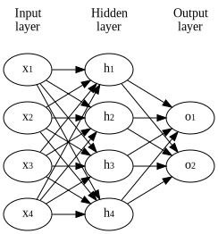

title: NPFL129, Lecture 4
class: title, cc-by-nc-sa
style: .algorithm { background-color: #eee; padding: .5em }
# Multiclass Logistic Regression, Multiplayer Perceptron

## Milan Straka

### November 11, 2019

---
section: LR
# Logistic Regression

An extension of perceptron, which models the conditional probabilities
of $p(C_0|→x)$ and of $p(C_1|→x)$. Logistic regression can in fact
handle also more than two classes, which we will see shortly.

~~~
Logistic regression employs the following parametrization of the conditional
class probabilities:
$$\begin{aligned}
  P(C_1 | →x) &= σ(→x^t →w + →b) \\
  P(C_0 | →x) &= 1 - P(C_1 | →x),
\end{aligned}$$
where $σ$ is a _sigmoid function_
$$σ(x) = \frac{1}{1+e^{-x}}.$$

~~~
Can be trained using an SGD algorithm.

---
# Sigmoid Function

The sigmoid function has values in range $(0, 1)$, is monotonically
increasing and it has a derivative of $\frac{1}{4}$ at $x=0$.

$$σ(x) = \frac{1}{1+e^{-x}}$$

~~~
$$σ'(x) = σ(x) \big(1 - σ(x)\big)$$

~~~

---
# Logistic Regression

To give some meaning to the sigmoid function, starting with
$$P(C_1 | →x) = σ(f(→x; →w)) = \frac{1}{1 + e^{-f(→x; →w)}}$$
~~~
we can arrive at
$$f(→x; →w) = \log\left(\frac{P(C_1 | →x)}{P(C_0 | →x)}\right),$$
where the prediction of the model $f(→x; →w)$ is called a _logit_
and it is a logarithm of odds of the two classes probabilities.

---
# Logistic Regression

To train the logistic regression $y(→x; →w) = →x^T →w$, we use MLE (the maximum likelihood
estimation). Note that $P(C_1 | →x; →w) = σ(y(→x; →w))$.

~~~
Therefore, the loss for a batch $𝕏=\{(→x_1, t_1), (→x_2, t_2), …, (→x_N, t_N)\}$
is
$$\begin{aligned}
𝓛(𝕏) = \frac{1}{N} ∑_i -\log(P(C_{t_i} | →x_i; →w)). \\
\end{aligned}$$

**Input**: Input dataset ($⇉X ∈ ℝ^{N×D}$, $→t ∈ \{0, +1\}$), learning rate $α ∈ ℝ^+$. 

- $→w ← 0$
- until convergence (or until patience is over), process batch of $N$ examples:
  - $g ← - \tfrac{1}{N} ∑_i ∇_→w \log(P(C_{t_i} | →x_i; →w)$
  - $→w ← →w - α→g$

---
# Linearity in Logistic Regression

---
section: MulticlassLR
# Multiclass Logistic Regression

To extend the binary logistic regression to a multiclass case with $K$ classes, we:
- Generate multiple outputs, notably $K$ outputs, each with its own set of
  weights, so that
  $$y(→x; ⇉W)_i = →W_i →x.$$

~~~
- Generalize the sigmoid function to a $\softmax$ function, such that
  $$\softmax(→z)_i = \frac{e^{z_i}}{∑_j e^{z_j}}.$$

~~~
  Note that the original sigmoid function can be written as
  $$σ(x) = \softmax\big([x~~0]\big)_0 = \frac{e^x}{e^x + e^0} = \frac{1}{1 + e^{-x}}.$$

~~~
The resulting classifier is also known as _multinomial logistic regression_,
_maximum entropy classifier_ or _softmax regression_.

---
# Multiclass Logistic Regression

Note that as defined, the multiclass logistic regression is overparametrized.
It is possible to generate only $K-1$ outputs and define $z_K = 0$, which is
the approach used in binary logistic regression.

~~~
In this settings, analogously to binary logistic regression, we can recover the
interpretation of the model outputs $→y(→x; ⇉W)$ (i.e., the $\softmax$ inputs)
as _logits_:

$$y(→x; ⇉W)_i = \log\left(\frac{P(C_i | →x; →w)}{P(C_K | →x; →w)}\right).$$

~~~
However, in all our implementations, we will use weights for all $K$ outputs.

---
# Multiclass Logistic Regression

Using the $\softmax$ function, we naturally define that
$$P(C_i | →x; ⇉W) = \softmax(⇉W_i →x)i = \frac{e^{⇉W_i →x}}{∑_j e^{⇉W_j →x}}.$$

~~~
We can then use MLE and train the model using stochastic gradient descent.

**Input**: Input dataset ($⇉X ∈ ℝ^{N×D}$, $→t ∈ \{0, 1, …, K-1\}$), learning rate $α ∈ ℝ^+$. 

- $→w ← 0$
- until convergence (or until patience is over), process batch of $N$ examples:
  - $g ← - \tfrac{1}{N} ∑_i ∇_→w \log(P(C_{t_i} | →x_i; →w)$
  - $→w ← →w - α→g$

---
# Multiclass Logistic Regression

Note that the decision regions of the binary/multiclass logistic regression are
singly connected and convex.

~~~

To see this, consider $→x_A$ and $→x_B$ in the same decision region $R_k$.

~~~
Any point $→x$ lying on the line connecting them is their linear combination,
$→x = λ→x_A + (1-λ)→x_B$,
~~~
and from the linearity of $→y(→x) = ⇉W→x$ it follows that
$$→y(→x) = λ→y(→x_A) + (1-λ)→y(→x_B).$$

~~~
Given that $y_k(→x_A)$ was the largest among $→y(→x_A)$ and also
given that $y_k(→x_B)$ was the largest among $→y(→x_B)$, it must
be the case that $y_k(→x)$ is the largest among all $→y(→x)$.

---
section: MSE as MLE
# Mean Square Error as MLE

During regression, we predict a number, not a real probability distribution.
In order to generate a distribution, we might consider a distribution with
the mean of the predicted value and a fixed variance $σ^2$ – the most general
such a distribution is the normal distribution.

---
section: MSE as MLE
# Mean Square Error as MLE

Therefore, assume our model generates a distribution
$$P(y | →x; →w) = 𝓝(y; f(→x; →w), σ^2).$$

~~~
Now we can apply MLE and get
$$\begin{aligned}
\argmax_→w P(𝕏; →w) =& \argmin_→w ∑_{i=1}^m -\log P(y_i | →x_i ; →w) \\
                         =& -\argmin_→w ∑_{i=1}^m \log \sqrt{\frac{1}{2πσ^2}}
                            e ^ {\normalsize -\frac{(y_i - f(→x_i; →w))^2}{2σ^2}} \\
                         =& -\argmin_→w {\color{gray} m \log (2πσ^2)^{-1/2} +}
                            ∑_{i=1}^m -\frac{(y_i - f(→x_i; →w))^2}{2σ^2} \\
                         =& \argmin_→w ∑_{i=1}^m \frac{(y_i - f(→x_i; →w))^2}{2σ^2} = \argmin_→w ∑_{i=1}^m (y_i - f(→x_i; →w))^2.
\end{aligned}$$

---
section: MLP
# Multilayer Perceptron

---
# Multilayer Perceptron

There is a weight on each edge, and an activation function $f$ is performed on the
hidden layers, and optionally also on the output layer.
$$h_i = f\left(∑_j w_{i,j} x_j + b_i\right)$$

If the network is composed of layers, we can use matrix notation and write:
$$→h = f\left(⇉W →x + →b\right)$$

---
# Multilayer Perceptron and Biases

---
# Neural Network Activation Functions
## Output Layers
- none (linear regression if there are no hidden layers)

~~~
- sigmoid (logistic regression model if there are no hidden layers)
  $$σ(x) ≝ \frac{1}{1 + e^{-x}}$$

~~~
- $\softmax$ (maximum entropy model if there are no hidden layers)
  $$\softmax(→x) ∝ e^→x$$
  $$\softmax(→x)_i ≝ \frac{e^{x_i}}{∑_j e^{x_j}}$$

---
# Neural Network Activation Functions
## Hidden Layers
- none (does not help, composition of linear mapping is a linear mapping)

~~~
- $σ$ (but works badly – nonsymmetrical, $\frac{dσ}{dx}(0) = 1/4$)

~~~
- $\tanh$
    - result of making $σ$ symmetrical and making derivation in zero 1
    - $\tanh(x) = 2σ(2x) - 1$

~~~
- ReLU
    - $\max(0, x)$

---
# Training MLP

The multilayer perceptron can be trained using an SGD algorithm:

**Input**: Input dataset ($⇉X ∈ ℝ^{N×D}$, $→t ∈ \{0, +1\}$), learning rate $α ∈ ℝ^+$. 

- $→w ← 0$
- until convergence (or until patience is over), process batch of $N$ examples:
  - $g ← ∇_→w \frac{1}{N} ∑_j - \log p(y_j | →x_j; →w)$
  - $→w ← →w - α→g$

---
# Training MLP – Computing the Derivatives

Assume a network with an input of size $N_1$, then weights
$→U ∈ ℝ^{N_1 × N_2}$, hidden layer with size $N_2$ and activation $h$,
weights $→V ∈ ℝ^{N_2 × N_3}$, and finally an output layer of size $N_3$
with activation $o$.

---
# Training MLP – Computing the Derivatives

(to be finished later)

---
# Universal Approximation Theorem '89

Let $φ(x)$ be a nonconstant, bounded and monotonically-increasing continuous function.
 (Later a proof was given also for $φ = \ReLU$.)

Then for any $ε > 0$ and any continuous function $f$ on $[0, 1]^m$ there exists
an $N ∈ ℕ, v_i ∈ ℝ, b_i ∈ ℝ$ and $→{w_i} ∈ ℝ^m$, such that if we denote
$$F(→x) = ∑_{i=1}^N v_i φ(→{w_i} \cdot →x + b_i)$$
then for all $x ∈ [0, 1]^m$
$$|F(→x) - f(→x)| < ε.$$

---
class: dbend
# Universal Approximation Theorem for ReLUs

Sketch of the proof:

~~~
- If a function is continuous on a closed interval, it can be approximated by
  a sequence of lines to arbitrary precision.

~~~
- However, we can create a sequence of $k$ linear segments as a sum of $k$ ReLU
  units – on every endpoint a new ReLU starts (i.e., the input ReLU value is
  zero at the endpoint), with a tangent which is the difference between the
  target tanget and the tangent of the approximation until this point.

---
class: dbend
# Universal Approximation Theorem for Squashes

Sketch of the proof for a squashing function $φ(x)$ (i.e., nonconstant, bounded and
monotonically-increasing continuous function like sigmoid):

~~~
- We can prove $φ$ can be arbitrarily close to a hard threshold by compressing
  it horizontally.

~~~
- Then we approximate the original function using a series of straight line
  segments

---
section: LagrangeMult
# Lagrange Multipliers – Equality Constraints

Given a funtion $J(→x)$, we can find a maximum with respect to a vector
$→x ∈ ℝ^d$, by investigating the critical points $∇_→x J(→x) = 0$.

~~~
Consider now finding maximum subject to a constraint $g(→x) = 0$.

~~~
- Note that $∇_→x g(→x)$ is orthogonal to the surface of the constraing, because
  if $→x$ and a nearby point $→x+→ε$ lie on the surface, from the Taylor
  expansion $g(→x+→ε) ≈ g(→x) + →ε^T ∇_→x g(→x)$ we get $→ε^T ∇_→x g(→x) ≈ 0$.

~~~
- In the seeked maximum, $∇_→x f(→x)$ must also be orthogonal to the constraing
  surface (or else moving in the direction of the derivative would increase the
  value).

~~~
- Therefore, there must exist $λ$ such that $∇_→x f + λ∇_→x g = 0$.

---
# Lagrange Multipliers – Equality Constraints

We therefore introduce the _Lagrangian function_
$$L(→x, λ) ≝ f(→x) + λg(→x).$$

~~~
We can then find the maximum under the constraing by inspecting critical points
of $L(→x, λ)$ with respect to both $→x$ and $λ$:
- $\frac{∂L}{∂λ} = 0$ leads to $g(→x)=0$;
- $\frac{∂L}{∂→x} = 0$ is the previously derived $∇_→x f + λ∇_→x g = 0$.

---
section: VariationalCalc
class: dbend
# Calculus of Variations

Many optimization techniques depend on minimizing a function $J(→w)$ with
respect to a vector $→w ∈ ℝ^d$, by investigating the critical points $∇_→w J(→w) = 0$.

~~~
A function of a function, $J[f]$, is known as a **functional**, for example
entropy $H[⋅]$.

~~~
Similarly to partial derivatives, we can take **functional derivatives** of
a functional $J[f]$ with respect to individual values $f(→x)$ for all points
$→x$. The functional derivative of $J$ with respect to a function $f$ in a point
$→x$ is denoted as
$$\frac{∂}{∂f(→x)} J.$$

~~~
For this class, we will use only the following theorem, which states that for
all differentiable functions $f$ and differentiable functions $g(y=f(→x), →x)$ with
continuous derivatives, it holds that
$$\frac{∂}{∂f(→x)} ∫g(f(→x), →x) \d→x = \frac{∂}{∂y} g(y, →x).$$

---
section: VariationalCalc
class: dbend
# Calculus of Variations

An intuitive view is to think about $f(→x)$ as a vector of uncountably many
elements (for every value $→x)$. In this interpretation the result is analogous
to computing partial derivatives of a vector $→w ∈ ℝ^d$:
$$\frac{∂}{∂w_i} ∑_j g(w_j, →x) = \frac{∂}{∂w_i} g(w_i, →x).$$
$$\frac{∂}{∂f(→x)} ∫g(f(→x), →x) \d→x = \frac{∂}{∂y} g(y, →x).$$

---
section: NormalAsMaxEntropy
class: dbend
# Function with Maximum Entropy

What distribution over $ℝ$ maximizes entropy $H[p] = -𝔼_x \log p(x)$?

~~~
For continuous values, the entropy is an integral $H[p] = -∫p(x) \log p(x) \d x$.

~~~
We cannot just maximize $H$ with respect to a function $p$, because:
- the result might not be a probability distribution – we need to add
  a constraint that $∫p(x) \d x=1$;
~~~
- the problem is unspecified because a distribution can be shifted without
  changing entropy – we add a constraing $𝔼[x] = μ$;
~~~
- because entropy increases as variance increases, we ask which distribution
  with a _fixed_ variance $σ^2$ has maximum entropy – adding a constraing
  $\Var(x) = σ^2$.

---
class: dbend
# Function with Maximum Entropy

Lagrangian of all the constraings and the entropy function is
$$L(p; μ, σ^2) = λ_1 \Big(∫p(x) \d x - 1\Big) + λ_2 \big(𝔼[x] - μ\big) + λ_3\big(\Var(x) - σ^2\big) + H[p].$$

~~~
By expanding all definitions to integrals, we get
$$\begin{aligned}
L(p; μ, σ^2) =& ∫\Big(λ_1 p(x) + λ_2 p(x) x λ_3 p(x) (x - μ)^2 - p(x)\log p(x) \Big) \d x - \\
              & -λ_1 - μ λ_2 - σ^2λ_3.
\end{aligned}$$

~~~
The functional derivative of $L$ is:
$$\frac{∂}{∂p(x)} L(p; μ, σ^2) = λ_1 + λ_2 x + λ_3 (x - μ)^2 - 1 - \log p(x) = 0.$$

---
class: dbend
# Function with Maximum Entropy
Rearrangint the functional derivative of $L$:
$$\frac{∂}{∂p(x)} L(p; μ, σ^2) = λ_1 + λ_2 x + λ_3 (x - μ)^2 - 1 - \log p(x) = 0.$$

we obtain
$$p(x) = \exp\Big(λ_1 + λ_2 x + λ_3 (x-μ)^2 - 1\Big).$$

~~~
We can verify that setting $λ_1 = 1 - \log σ \sqrt{2π}$, $λ_2=0$ and $λ_3=-1/(2σ^2)$
fulfils all the constraints, arriving at
$$p(x) = 𝓝(x; μ, σ^2).$$
