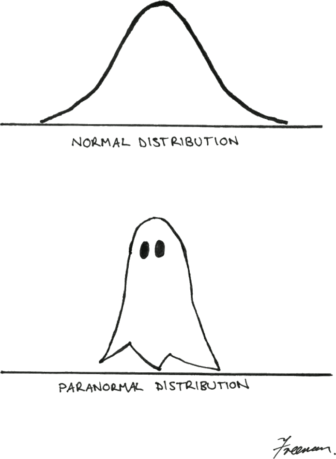

title: NPFL129, Lecture 4
class: title, cc-by-sa
style: .algorithm { background-color: #eee; padding: .5em }
# Multiclass Logistic Regression, Multilayer Perceptron

## Jindřich Libovický <small>(reusing materials by Milan Straka)</small>

### October 21, 2024

---
class: middle
# Today's Lecture Objectives

After this lecture you should be able to

- Implement **multiclass classification** with softmax.

- Reason about linear regression, logistic regression and softmax
  classification in a **single probabilistic framework**: with different target
  distributions, activation functions and training using maximum likelihood
  estimate.

- Explain **multi-layer perceptron** as a further generalization of linear models.

---
section: Refresh
class: section
# Refresh from the Last Week

---
# Logistic Regression

An extension of perceptron, which models the conditional probabilities
of $p(C_0|→x)$ and of $p(C_1|→x)$. <small>(It can, in fact,
handle more than two classes as well, which we will see shortly.)</small>

~~~
Logistic regression employs the following parametrization of the conditional
class probabilities:
$$\begin{aligned}
  p(C_1 | →x) &= σ(→x^T →w + b) \\
  p(C_0 | →x) &= 1 - p(C_1 | →x),
\end{aligned}$$

where $σ$ is the **sigmoid function**
$$σ(x) = \frac{1}{1+e^{-x}}.$$

~~~
It can be trained using the SGD algorithm.

---
# Logistic Regression

We denote the output of the “linear part” of logistic regression as
$ȳ(→x; →w) = →x^T →w$
and the overall prediction as
$y(→x; →w) = σ(ȳ(→x; →w)) = σ(→x^T →w).$

~~~
The logistic regression output $y(→x; →w)$ models the probability of class
$C_1$, $p(C_1 | →x)$.

To give some meaning to the output of the linear part $ȳ(→x; →w)$, starting with
$$p(C_1 | →x) = σ(ȳ(→x; →w)) = \frac{1}{1 + e^{-ȳ(→x; →w)}},$$
~~~
we arrive at
$$ȳ(→x; →w) = \log\left(\frac{p(C_1 | →x)}{1 - p(C_1 | →x)}\right) = \log\left(\frac{p(C_1 | →x)}{p(C_0 | →x)}\right),$$
which is called a **logit**, and it is the logarithm of the odds of the probabilities
of the two classes.

---
# Logistic Regression

To train logistic regression, we use MLE (the maximum likelihood
estimation). Its application is straightforward, given that $p(C_1 | →x; →w)$ is
directly the model output $y(→x; →w)$.

~~~
Therefore, the loss for a minibatch $𝕏=\{(→x_1, t_1), (→x_2, t_2), …, (→x_N, t_N)\}$
is
$$\begin{aligned}
E(→w) = \frac{1}{N} ∑_i -\log(p(C_{t_i} | →x_i; →w)). \\
\end{aligned}$$

**Input**: Input dataset ($⇉X ∈ ℝ^{N×D}$, $→t ∈ \{0, +1\}^N$), learning rate $α ∈ ℝ^+$. 

- $→w ← →0$ or we initialize $→w$ randomly
- until convergence (or patience runs out), process a minibatch of examples $𝔹$:
  - $→g ← \tfrac{1}{|𝔹|} ∑_{i∈𝔹} ∇_{→w} \Big(-\log\big(p(C_{t_i} | →x_i; →w)\big)\Big)$
  - $→w ← →w - α→g$

---
section: GLM
class: section
# Generalized Linear Models

---
class: tablewide
# Generalized Linear Models

Logistic regression is in fact extended linear regression. A linear
regression model, which is followed by an **activation function** $a$, is
called a **generalized linear model**:
$$p(t | →x; →w, b) = y(→x; →w, b) = a\big(ȳ(→x; →w, b)\big) = a(→x^T→w + b).$$

~~~
| Name | Activation | Distribution | Loss | Gradient |
|------|------------|--------------|------|----------|
| linear regression | identity | ? | $\textrm{MSE} ∝ 𝔼 (y(→x) - t)^2$ | $\big(y(→x) - t\big) →x$ |
~~~
| logistic regression | $σ(ȳ)$ | Bernoulli | $\textrm{NLL} ∝ 𝔼 -\log(p(t \vert →x))$ | ? |

---
# Logistic Regression Gradient

We start by computing the gradient of $σ(x)$.

$\displaystyle \kern4em\mathllap{\frac{∂}{∂x} σ(x)} = \frac{∂}{∂x} \frac{1}{1 + e^{-x}}$

~~~
$\displaystyle \kern4em{}=\mathrlap{\frac{\textcolor{darkgreen}{\frac{∂}{∂x}-(1 + e^{-x})}}{(1 + e^{-x})^2}}
 \kern30em\mathllap{\color{gray}\frac{∂}{∂x} \frac{1}{g(x)} = -\frac{\frac{∂}{∂x} g(x)}{g(x)^2}}$

~~~
$\displaystyle \kern4em{}=\mathrlap{\textcolor{blue}{\frac{1}{1+e^{-x}}} ⋅ \frac{\textcolor{darkgreen}{e^{-x}}}{1 + e^{-x}}}
 \kern30em\mathllap{\color{gray}\tfrac{∂}{∂x} e^{g(x)} = e^{g(x)} ⋅ \tfrac{∂}{∂x} g(x)}$

~~~
$\displaystyle \kern4em{}=\mathrlap{\textcolor{blue}{σ(x)} ⋅ \frac{\textcolor{darkred}{e^{-x}+1}-\textcolor{darkorange}{1}}{1 + e^{-x}}}$

~~~
$\displaystyle \kern4em{}=\mathrlap{σ(x) ⋅ \big(\textcolor{darkred}{1}-\textcolor{darkorange}{σ(x)}\big)}$

---
# Logistic Regression Gradient

Consider the log-likelihood of logistic regression $\log p(t|→x; →w)$. For
brevity, we denote $ȳ(→x; →w) = →x^T →w$ just as $ȳ$ in the following
computation.

~~~
Remembering that for $t∼\operatorname{Ber}(φ)$ we have $p(t) = φ^t (1-φ)^{1-t}$,
we can rewrite the log-likelihood to:

~~~
$\displaystyle \kern6em\mathllap{\log p(t|→x; →w)} = \log σ(ȳ)^t \big(1-σ(ȳ)\big)^{1-t}$

~~~
$\displaystyle \kern6em{}=t ⋅ \log \big(σ(ȳ)\big) + (1-t) ⋅ \log\big(1-σ(ȳ)\big).$

---
# Logistic Regression Gradient

$\displaystyle ∇_{→w} -\log p(t|→x; →w) =$

$\displaystyle \kern1em{}= ∇_{→w}\Big(-t ⋅ \log \big(σ(ȳ)\big) - (1-t) ⋅ \log\big(1-σ(ȳ)\big)\Big)$

~~~
$\displaystyle \kern34em\mathllap{\color{gray}\frac{∂}{∂x}\log g(x) = \frac{1}{g(x)} ⋅ \frac{∂}{∂x} g(x)}$

~~~
$\displaystyle \kern1em{}=-t⋅\frac{1}{σ(ȳ)}⋅∇_{→w}σ(ȳ) - (1-t)⋅\frac{1}{1-σ(ȳ)}⋅∇_{→w}\big(1\textcolor{magenta}{-}σ(ȳ)\big)$

~~~
$\displaystyle \kern34em\mathllap{\color{gray}\frac{∂}{∂x}f\big(g(x)\big)
  = \frac{∂}{∂g(x)}f\big(g(x)\big) ⋅ \frac{∂}{∂x} g(x) = \frac{∂}{∂z}f(z) ⋅ \frac{∂}{∂x} g(x)}$

~~~
$\displaystyle \kern34em\mathllap{\color{gray}∇_{→w}σ(ȳ) = \tfrac{∂}{∂ȳ}σ(ȳ) ⋅ ∇_{→w}ȳ}$

~~~
$\displaystyle \kern1em{}=\mathrlap{-t⋅\frac{1}{\textcolor{darkgreen}{σ(ȳ)}}⋅\textcolor{darkgreen}{σ(ȳ)}⋅\big(1-σ(ȳ)\big)⋅\textcolor{orange}{∇_{→w}ȳ}
 \textcolor{magenta}{+} (1-t)⋅\frac{1}{\textcolor{blue}{1-σ(ȳ)}}⋅σ(ȳ)⋅\textcolor{blue}{\big(1-σ(ȳ)\big)}⋅\textcolor{orange}{∇_{→w}ȳ}}$

~~~
$\displaystyle \kern1em{}=\big(-t+\textcolor{darkred}{tσ(ȳ)}+σ(ȳ)-\textcolor{darkred}{tσ(ȳ)}\big)\textcolor{orange}{→x}$

~~~
$\displaystyle \kern1em{}=\big(y(→x; →w) - t\big)→x$

---
class: tablewide
# Generalized Linear Models

Logistic regression is in fact extended linear regression. A linear
regression model, which is followed by some **activation function** $a$, is
called a **generalized linear model**:
$$p(t | →x; →w, b) = y(→x; →w, b) = a\big(ȳ(→x; →w, b)\big) = a(→x^T→w + b).$$

| Name | Activation | Distribution | Loss | Gradient |
|------|------------|--------------|------|----------|
| linear regression | identity | ? | $\textrm{MSE} ∝ 𝔼 (y(→x) - t)^2$ | $\big(y(→x) - t\big) →x$ |
| logistic regression | $σ(ȳ)$ | Bernoulli | $\textrm{NLL} ∝ 𝔼 -\log(p(t \vert →x))$ | $\color{red}\big(y(→x) - t\big) →x$ |

---
section: MSE as MLE
class: section
# Mean Square Error as Maximum Likelihood Estimation

---
# Mean Square Error as MLE

~~~

During regression, we predict a number, not a probability distribution.
To generate a distribution, we might consider a distribution with
the mean of the predicted value and a fixed variance $σ^2$ – the most general
such distribution is the normal distribution.

---
# Mean Square Error as MLE

Therefore, assume our model generates a distribution
$p(t | →x; →w) = 𝓝(t; y(→x; →w), σ^2)$.

~~~

Now we can apply the maximum likelihood estimation and get

$\displaystyle \kern8em\mathllap{\argmax_{→w} p(→t|⇉X; →w)} = \argmin_{→w} ∑_{i=1}^N -\log p(t_i | →x_i ; →w)$

~~~
$\displaystyle \kern8em{} = \argmin_{→w} -∑_{i=1}^N \log \sqrt{\frac{1}{2πσ^2}} e ^ {\normalsize -\frac{(t_i - y(→x_i; →w))^2}{2σ^2}}$

~~~
$\displaystyle \kern8em{} = \argmin_{→w} {\color{gray} -N \log (2πσ^2)^{-1/2}} - ∑_{i=1}^N -\frac{\big(t_i - y(→x_i; →w)\big)^2}{2σ^2}$

~~~
$\displaystyle \kern8em{} = \argmin_{→w} ∑_{i=1}^N \frac{\big(t_i - y(→x_i; →w)\big)^2}{2σ^2} = \argmin_{→w} \frac{1}{N} ∑_{i=1}^N \big(y(→x_i; →w) - t_i\big)^2.$

---
class: tablewide
# Generalized Linear Models

We have therefore extended the GLM table to

| Name | Activation | Distribution | Loss | Gradient |
|------|------------|--------------|------|----------|
| linear regression | identity | $\color{red}\textrm{Normal}$ | $\color{red}\textrm{NLL} ∝ \textrm{MSE}$ | $\big(y(→x) - t\big) →x$ |
| logistic regression | $σ(ȳ)$ | Bernoulli | $\textrm{NLL} ∝ 𝔼 -\log(p(t \vert →x))$ | $\big(y(→x) - t\big) →x$ |

---
section: MulticlassLogisticReg
class: section
# Multiclass Logistic Regression
---

# Multiclass Logistic Regression

To extend the binary logistic regression to a multiclass case with $K$ classes, we:
- generate $K$ outputs, each with its own set of weights, so that for $⇉W ∈ ℝ^{D×K}$,
  $$→ȳ(→x; ⇉W) = →x^T ⇉W,\textrm{~~~or in other words,~~~}→ȳ(→x; ⇉W)_i = →x^T (⇉W_{*, i})$$

~~~
- generalize the sigmoid function to a $\softmax$ function, such that
  $$\softmax(→z)_i = \frac{e^{z_i}}{∑_j e^{z_j}}.$$

~~~
  Note that the original sigmoid function can be written as
  $$σ(x) = \softmax\big([x, 0]\big)_0 = \frac{e^x}{e^x + e^0} = \frac{1}{1 + e^{-x}}.$$

~~~
The resulting classifier is also known as **multinomial logistic regression**,
**maximum entropy classifier** or **softmax regression**.

---
# Multiclass Logistic Regression

Using the $\softmax$ function, we naturally define that
$$p(C_i | →x; ⇉W) = →y(→x; ⇉W)_i = \softmax\big(→ȳ(→x; ⇉W)\big)_i = \softmax(→x^T ⇉W)_i = \frac{e^{(→x^T⇉W)_i}}{∑_j e^{(→x^T ⇉W)_j}}.$$

~~~

Considering the definition of the $\softmax$ function,
it is natural to obtain the interpretation of the linear part of the model,
$→ȳ(→x; ⇉W)$, as **logits** by computing the logarithm of the above:
$$→ȳ(→x; ⇉W)_i = \log(p(C_i | →x; ⇉W)) + c.$$

~~~
The constant $c$ is present, because the output of the model is
_overparametrized_ (for example, the probability of the last class could be
computed from the remaining ones). This is connected to the fact that softmax
is
 invariant to addition of a constant:
$$\softmax(→z + c)_i = \frac{e^{z_i + c}}{∑_j e^{z_j + c}} = \frac{e^{z_i}}{∑_j e^{z_j}}⋅\frac{e^c}{e^c} = \softmax(→z)_i.$$

---
# Multiclass Logistic Regression

To train $K$-class classification, analogously to binary logistic regression,
we can use MLE and train the model using minibatch stochastic gradient descent:

**Input**: Input dataset ($⇉X ∈ ℝ^{N×D}$, $→t ∈ \{0, 1, …, K-1\}^N$), learning rate $α ∈ ℝ^+$. 
**Model**: Let $→w$ denote all parameters of the model (in our case, the parameters are a weight
matrix $⇉W$ and maybe a bias vector $→b$).

- $→w ← →0$ or we initialize $→w$ randomly
- until convergence (or patience runs out), process a minibatch of examples $𝔹$:
  - $→g ← \tfrac{1}{|𝔹|} ∑_{i∈𝔹} ∇_{→w} \Big(-\log\big(p(C_{t_i} | →x_i; →w)\big)\Big)$
  - $→w ← →w - α→g$

---
# Multiclass Logistic Regression

Note that the decision regions of binary/multiclass logistic regression are
convex (and therefore connected).

~~~
To see this, consider $→x_A$ and $→x_B$ in the same decision region $R_k$.

~~~
Any point $→x$ lying on the line connecting them is their convex combination,
$→x = λ→x_A + (1-λ)→x_B$,
~~~
and from the linearity of $→ȳ(→x) = →x^T ⇉W$ it follows that
$$→ȳ(→x) = λ→ȳ(→x_A) + (1-λ)→ȳ(→x_B).$$

~~~
Given that $→ȳ(→x_A)_k$ was the largest among $→ȳ(→x_A)$ and also
given that $→ȳ(→x_B)_k$ was the largest among $→ȳ(→x_B)$, it must
be the case that $→ȳ(→x)_k$ is the largest among all $→ȳ(→x)$.

---
# What went wrong?

~~~

The model only predicts the majority class. 
~~~
Insufficient features, learning rate is too high.

---
class: tablewide
# Generalized Linear Models

Multiclass logistic regression can now be added to the GLM table:

| Name | Activation | Distribution | Loss | Gradient |
|------|------------|--------------|------|----------|
| linear regression | identity | Normal | $\textrm{NLL} ∝ \textrm{MSE}$ | $\big(y(→x) - t\big) →x$ |
| logistic regression | $σ(ȳ)$ | Bernoulli | $\textrm{NLL} ∝ 𝔼 -\log(p(t \vert →x))$ | $\big(y(→x) - t\big) →x$ |
| multiclass logistic regression | $\small\operatorname{softmax}(→ȳ)$ | categorical | $\textrm{NLL} ∝ 𝔼 -\log(p(t \vert →x))$ | $\big((→y(→x) - →1_t) →x^T\big)^T$ |

\
Recall that $→1_t = \big([i = t]\big)_{i=0}^{K-1}$ is one-hot representation of target $t ∈ \{0, 1, …, K-1\}$.

The gradient $\big((→y(→x) - →1_t) →x^T\big)^T$ can be of course also computed
as $→x\big(→y(→x) - →1_t\big)^T$.

---
section: MLP
class: section
# Multilayer Perceptron

---
# Multilayer Perceptron

We can reformulate generalized linear models in the following framework.

~~~
- Assume we have an input node for every input feature.

~~~
- Additionally, we have an output node for every model output (one for linear
  regression or binary classification, $K$ for classification in $K$ classes).

~~~
- Every input node and output node is connected with a directed edge, and
  every edge has an associated weight.

~~~
- Value of every (output) node is computed by summing the values of its predecessors
  multiplied by the corresponding weights, added to the bias of this node, and
  finally passed through an activation function $a$:
  $$y_i = a\left(∑\nolimits_j x_j w_{j,i} + b_i\right)$$
  or in matrix form $→y = a(→x^T⇉W + →b)$, or for a batch of examples $⇉X$,
  $⇉Y = a(⇉X ⇉W + →b)$.

---
# Multilayer Perceptron

We now extend the model by adding a **hidden layer** with activation $f$.

~~~
- The computation is performed analogously:
  $$\begin{aligned}
    h_i &= f\left(∑\nolimits_j x_j w^{(h)}_{j,i} + b^{(h)}_i\right), \\
    y_i &= a\left(∑\nolimits_j h_j w^{(y)}_{j,i} + b^{(y)}_i\right),
  \end{aligned}$$
  or in matrix form
  $$\begin{aligned}
    →h &= f\Big(→x^T ⇉W^{(h)} + →b^{(h)}\Big), \\
    →y &= a\Big(→h^T ⇉W^{(y)} + →b^{(y)}\Big),
  \end{aligned}$$
  and for a batch of inputs $⇉H = f\Big(⇉X ⇉W^{(h)} + →b^{(h)}\Big)$ and $⇉Y = a\Big(⇉H ⇉W^{(y)} + →b^{(y)}\Big)$.

---
# Multilayer Perceptron

Note that:
- the structure of the _input_ layer depends on the input features;

~~~
- the structure and the _activation_ function of the _output_ layer depend
  on the target data;
~~~
- however, the _hidden_ layer has no pre-image in the data and is completely arbitrary
  – which is the reason why it is called a _hidden_ layer.

~~~

Also note that we can absorb biases into weights analogously to generalized
linear models.

---
# Output Layer Activation Functions
## Output Layer Activation Functions
- regression:

  - identity activation: we model normal distribution on output (linear
    regression)

~~~
- binary classification:
  - $σ(x)$: we model the Bernoulli distribution (the model predicts
    a probability)
    $$σ(x) ≝ \frac{1}{1 + e^{-x}}$$

~~~
- $K$-class classification:
  - $\softmax(→x)$: we model the (usually overparametrized) categorical distribution
    $$\softmax(→x) ∝ e^{→x},~~~\softmax(→x)_i ≝ \frac{e^{→x_i}}{∑_j e^{→x_j}}$$

---
# Hidden Layer Activation Functions
## Hidden Layer Activation Functions
- no activation (identity): does not help, composition of linear mappings is a linear mapping

~~~
- $σ$ (but works suboptimally – nonsymmetrical, $\frac{dσ}{dx}(0) = 1/4$)

~~~
- 

  $\tanh$

  - result of making $σ$ symmetrical and making derivation in zero 1
  - $\tanh(x) = 2σ(2x) - 1$

~~~
- ReLU
  - $\max(0, x)$
  - the most common nonlinear activation used nowadays

---
# Training MLP

The multilayer perceptron can again be trained using a minibatch SGD algorithm:

**Input**: Input dataset ($⇉X ∈ ℝ^{N×D}$, $→t$ targets), learning rate $α ∈ ℝ^+$. 
**Model**: Let $→w$ denote all parameters of the model (all weight matrices and bias vectors).

- initialize $→w$
  - set weights randomly
    - for a weight matrix processing a layer of size $M$ to a layer of size $O$,
      we can sample its elements uniformly for example from the
      $\left[-\frac{1}{\sqrt M}, \frac{1}{\sqrt M}\right]$ range
    - the exact range becomes more important for networks with many hidden
      layers
  - set biases to 0
- until convergence (or patience runs out), process a minibatch of examples $𝔹$:
  - $→g ← \tfrac{1}{|𝔹|} ∑_{i∈𝔹} ∇_{→w} \Big(-\log\big(p(t_i | →x_i; →w)\big)\Big)$
  - $→w ← →w - α→g$

---
class: summary
# Today's Lecture Objectives

After this lecture you should be able to

- Implement **multiclass classification** with softmax.

- Reason about linear regression, logistic regression and softmax
  classification in a **single probabilistic framework**: with different target
  distributions, activation functions and training using maximum likelihood
  estimate.

- Explain **multi-layer perceptron** as a further generalization of linear models.
