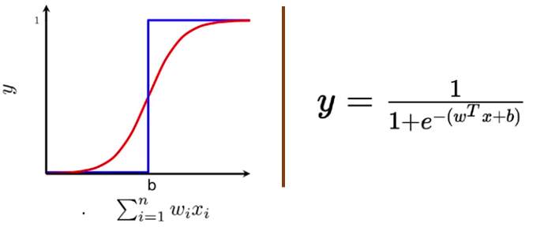

title: NPFL129, Lecture 4
class: title, cc-by-nc-sa
style: .algorithm { background-color: #eee; padding: .5em }
# Multiclass Logistic Regression, Multilayer Perceptron

## Milan Straka

### October 26, 2020

---
section: Refresh
# Logistic Regression

An extension of perceptron, which models the conditional probabilities
of $p(C_0|→x)$ and of $p(C_1|→x)$. Logistic regression can in fact
handle also more than two classes, which we will see shortly.

~~~
Logistic regression employs the following parametrization of the conditional
class probabilities:
$$\begin{aligned}
  p(C_1 | →x) &= σ(→x^t →w + b) \\
  p(C_0 | →x) &= 1 - p(C_1 | →x),
\end{aligned}$$

where $σ$ is a **sigmoid function**
$$σ(x) = \frac{1}{1+e^{-x}}.$$

~~~
It can be trained using the SGD algorithm.

---
# Logistic Regression

To give some meaning to the sigmoid function, starting with
$$p(C_1 | →x) = σ(y(→x; →w)) = \frac{1}{1 + e^{-y(→x; →w)}}$$
~~~
we can arrive at
$$y(→x; →w) = \log\left(\frac{p(C_1 | →x)}{p(C_0 | →x)}\right),$$
where the prediction of the model $y(→x; →w)$ is called a **logit**
and it is a logarithm of odds of the two classes probabilities.

---
# Logistic Regression

To train the logistic regression $y(→x; →w) = →x^T →w$, we use MLE (the maximum likelihood
estimation). Note that $p(C_1 | →x; →w) = σ(y(→x; →w))$.

~~~
Therefore, the loss for a batch $𝕏=\{(→x_1, t_1), (→x_2, t_2), …, (→x_N, t_N)\}$
is
$$\begin{aligned}
𝓛(𝕏) = \frac{1}{N} ∑_i -\log(p(C_{t_i} | →x_i; →w)). \\
\end{aligned}$$

**Input**: Input dataset ($⇉X ∈ ℝ^{N×D}$, $→t ∈ \{0, +1\}^N$), learning rate $α ∈ ℝ^+$. 

- $→w ← 0$
- until convergence (or until patience is over), process batch of $N$ examples:
  - $g ← - \tfrac{1}{N} ∑_i ∇_→w \log(p(C_{t_i} | →x_i; →w)$
  - $→w ← →w - α→g$

---
# Linearity in Logistic Regression

---
section: GLM
class: tablewide
# Generalized Linear Models

The logistic regression is in fact an extended linear regression. A linear
regression model, which is followed by some **activation function** $a$, is
called **generalized linear model**:
$$p(t | →x; →w, b) = a\big(y(→x; →w, b)\big) = a(x^T→w + b).$$

~~~
| Name | Activation | Distribution | Loss | Gradient |
|------|------------|--------------|------|----------|
| linear regression | identity | ? | $\textrm{MSE} ∝ ∑ (t - y(→x))^2$ | $\big(t - y(→x)\big) ⋅ →x$ |
~~~
| logistic regression | $σ(x)$ | Bernoulli | $\textrm{NLL} ∝ ∑ -\log(p(t \vert →x))$ | ? |
~~~ ~~
| logistic regression | $σ(x)$ | Bernoulli | $\textrm{NLL} ∝ ∑ -\log(p(t \vert →x))$ | $\color{red}\big(t - a(y(→x))\big) ⋅ →x$ |

---
section: MSE as MLE
# Mean Square Error as MLE

During regression, we predict a number, not a real probability distribution.
In order to generate a distribution, we might consider a distribution with
the mean of the predicted value and a fixed variance $σ^2$ – the most general
such a distribution is the normal distribution.

---
# Mean Square Error as MLE

Therefore, assume our model generates a distribution
$p(t | →x; →w) = 𝓝(t; y(→x; →w), σ^2)$.

~~~
Now we can apply MLE and get
$$\begin{aligned}
\argmax_→w p(𝕏; →w) =& \argmin_→w ∑_{i=1}^N -\log p(t_i | →x_i ; →w) \\
                         =& -\argmin_→w ∑_{i=1}^N \log \sqrt{\frac{1}{2πσ^2}}
                            e ^ {\normalsize -\frac{(t_i - y(→x_i; →w))^2}{2σ^2}} \\
                         =& -\argmin_→w {\color{gray} N \log (2πσ^2)^{-1/2} +}
                            ∑_{i=1}^N -\frac{(t_i - y(→x_i; →w))^2}{2σ^2} \\
                         =& \argmin_→w ∑_{i=1}^N \frac{(t_i - y(→x_i; →w))^2}{2σ^2} = \argmin_→w \tfrac{1}{N} ∑_{i=1}^N (t_i - y(→x_i; →w))^2.
\end{aligned}$$

---
class: tablewide
# Generalized Linear Models

We have therefore extended the GLM table to

| Name | Activation | Distribution | Loss | Gradient |
|------|------------|--------------|------|----------|
| linear regression | identity | $\color{red}\textrm{Normal}$ | $\color{red}\textrm{NLL} ∝ \textrm{MSE}$ | $\big(t - y(→x)\big) ⋅ →x$ |
| logistic regression | $σ(x)$ | Bernoulli | $\textrm{NLL} ∝ ∑_i -\log(p(t \vert →x))$ | $\big(t - a(y(→x))\big) ⋅ →x$ |

---
section: MulticlassLogisticReg
# Multiclass Logistic Regression

To extend the binary logistic regression to a multiclass case with $K$ classes, we:
- generate multiple outputs, notably $K$ outputs, each with its own set of
  weights, so that
  $$→y(→x; ⇉W) = ⇉W →x,\textrm{~~~or in other words~~~}→y(→x; ⇉W)_i = →W_i^T →x,$$

~~~
- generalize the sigmoid function to a $\softmax$ function, such that
  $$\softmax(→y)_i = \frac{e^{y_i}}{∑_j e^{y_j}}.$$

~~~
  Note that the original sigmoid function can be written as
  $$σ(x) = \softmax\big([x~~0]\big)_0 = \frac{e^x}{e^x + e^0} = \frac{1}{1 + e^{-x}}.$$

~~~
The resulting classifier is also known as **multinomial logistic regression**,
**maximum entropy classifier** or **softmax regression**.

---
# Multiclass Logistic Regression

From the definition of the $\softmax$ function
$$\softmax(→y)_i = \frac{e^{y_i}}{∑_j e^{y_j}},$$
it is natural to obtain the interpretation of the model outputs
$→y(→x; ⇉W)$ as **logits**:
$$→y(→x; ⇉W)_i = \log(p(C_i | →x; ⇉W)) + c.$$

~~~
The constant $c$ is present, because the output of the model is
_overparametrized_ (the probability of for example the last class could be
computed from the remaining ones). This is connected to the fact that softmax
is invariant to addition of a constant:
$$\softmax(→y + c)_i = \frac{e^{y_i + c}}{∑_j e^{y_j + c}} = \frac{e^{y_i}}{∑_j e^{y_j}}⋅\frac{e^c}{e^c} = \softmax(→y)_i.$$

---
# Multiclass Logistic Regression

The difference between softmax and sigmoid output can be compared on the binary
case, where the binary logistic regression model outputs are
$$y(→x; →w) = \log\left(\frac{p(C_1 | →x; →w)}{p(C_0 | →x; →w)}\right),$$
while the outputs of the softmax variant with two outputs can be interpreted as 
$→y(→x; ⇉W)_0 = \log(p(C_0 | →x; ⇉W)) + c$ and $→y(→x; ⇉W)_1 = \log(p(C_1 | →x; ⇉W)) + c$.

~~~
If we consider $→y(→x; ⇉W)_0$ to be zero, the model can then predict only the
probability $p(C_1 | →x)$, and the constant $c$ is fixed to $-\log(p(C_0 | →x; ⇉W))$, recovering
the original interpretation.

~~~
Therefore, we could produce only $K-1$ outputs for $K$-class classification and
define $y_K=0$, resulting in the interpretation of the model outputs analogous to the
binary case:

$$→y(→x; ⇉W)_i = \log\left(\frac{p(C_i | →x; ⇉W)}{p(C_K | →x; ⇉W)}\right).$$

---
# Multiclass Logistic Regression

Using the $\softmax$ function, we naturally define that
$$p(C_i | →x; ⇉W) = \softmax(⇉W_i^T →x)_i = \frac{e^{⇉W_i^T →x}}{∑_j e^{⇉W_j^T →x}}.$$

~~~
We can then use MLE and train the model using stochastic gradient descent.

**Input**: Input dataset ($⇉X ∈ ℝ^{N×D}$, $→t ∈ \{0, 1, …, K-1\}^N$), learning rate $α ∈ ℝ^+$. 

- $→w ← 0$
- until convergence (or until patience is over), process batch of $N$ examples:
  - $g ← - \tfrac{1}{N} ∑_i ∇_→w \log(p(C_{t_i} | →x_i; →w)$
  - $→w ← →w - α→g$

---
# Multiclass Logistic Regression

Note that the decision regions of the binary/multiclass logistic regression are
convex (and therefore connected).

~~~
To see this, consider $→x_A$ and $→x_B$ in the same decision region $R_k$.

~~~
Any point $→x$ lying on the line connecting them is their linear combination,
$→x = λ→x_A + (1-λ)→x_B$,
~~~
and from the linearity of $→y(→x) = ⇉W→x$ it follows that
$$→y(→x) = λ→y(→x_A) + (1-λ)→y(→x_B).$$

~~~
Given that $f_k(→x_A)$ was the largest among $→y(→x_A)$ and also
given that $f_k(→x_B)$ was the largest among $→y(→x_B)$, it must
be the case that $f_k(→x)$ is the largest among all $→y(→x)$.

---
class: tablewide
# Generalized Linear Models

The multiclass logistic regression can now be added to the GLM table:

| Name | Activation | Distribution | Loss | Gradient |
|------|------------|--------------|------|----------|
| linear regression | identity | Normal | $\textrm{NLL} ∝ \textrm{MSE}$ | $\big(t - y(→x)\big) ⋅ →x$ |
| logistic regression | $σ(x)$ | Bernoulli | $\textrm{NLL} ∝ ∑ -\log(p(t \vert →x))$ | $\big(t - a(y(→x))\big) ⋅ →x$ |
| multiclass logistic regression | $\small\operatorname{softmax}(x)$ | categorical | $\textrm{NLL} ∝ ∑ -\log(p(t \vert →x))$ | $\big(t - a(y(→x))\big) ⋅ →x$ |

---
section: PoissonReg
class: tablewide
# Poisson Regression

There exist several others GLMs, we now describe a last one, this time for
regression and not for classification. Compared to regular linear regression,
where we assume the output distribution is normal, we turn our attention to
**Poisson distribution**.

~~~
## Poisson Distribution

Poisson distribution is a discrete distribution suitable for modeling the
probability of a given number of events occurring in a fixed time interval,
if these events occur with a known rate and independently of each other.

~~~

$$P(⁇x = k; λ) = \frac{λ^k e^{-λ}}{k!}$$

~~~
It is easy to show that if $⁇x$ has Poisson distribution,
$$\begin{gathered}
  𝔼[x] = λ\\
  \Var(x) = λ
\end{gathered}$$

---
# Poisson Distribution

An important difference to normal distribution is that the latter assumes the
variance does not depend on the mean, i.e., that the model “makes errors of the
same magnitude everywhere”.

~~~
On the other hand, the variance of a Poisson distribution increases with the
mean.

---
# Poisson Regression

Poisson regression is a generalized linear model producing a Poisson
distribution (i.e., the mean rate $λ$).

~~~
Again, we use NLL as the loss. To choose a suitable activation, we might be
interested in obtaining the same gradient as for other GLMs – solving for
an activation function while requiring the gradient to be $\big(t - a(y(→x))\big) ⋅ →x$
yields $\exp(x)$, which means the linear part of the model is predicting $\log(λ)$.

| Name | Activation | Distribution | Loss | Gradient |
|------|------------|--------------|------|----------|
| linear regression | identity | Normal | $\textrm{NLL} ∝ \textrm{MSE}$ | $\big(t - y(→x)\big) ⋅ →x$ |
| logistic regression | $σ(x)$ | Bernoulli | $\textrm{NLL} ∝ ∑ -\log(p(t \vert →x))$ | $\big(t - a(y(→x))\big) ⋅ →x$ |
| multiclass logistic regression | $\small\operatorname{softmax}(x)$ | categorical | $\textrm{NLL} ∝ ∑ -\log(p(t \vert →x))$ | $\big(t - a(y(→x))\big) ⋅ →x$ |
| Poisson regression | $\small\exp(x)$ | Poisson | $\textrm{NLL} ∝ ∑ -\log(p(t \vert →x))$ | $\big(t - a(y(→x))\big) ⋅ →x$ |

---
section: MLP
# Multilayer Perceptron

We can reformulate the generalized linear models in the following framework.

~~~
- Assume we have an input node for every input feature.

~~~
- Additionaly, we have an output node for every model output (one for linear
  regression or binary classification, $K$ for classification in $K$ classes).

~~~
- Every input node and output node are connected with an directed edge, and
  every edge has an associated weight.

~~~
- Value of every (output) node is computed by summing the values of predecessors
  multiplied by the corresponding weights, added to a bias of this node, and
  finally passed through an activation function $a$:
  $$y_i = a\left(∑\nolimits_j w_{i,j} x_j + b_i\right)$$
  or in matrix form $→y = a(⇉W→x+→b)$.

---
# Multilayer Perceptron

We now extend the model by adding a **hidden layer** with activation $f$.

~~~
- The computation is performed analogically:
  $$\begin{aligned}
    h_i &= f\left(∑\nolimits_j w^h_{i,j} x_j + b^h_i\right), \\
    y_i &= a\left(∑\nolimits_j w^y_{i,j} h_j + b^y_i\right),
  \end{aligned}$$
  or in matrix form
  $$\begin{aligned}
    →h &= f\Big(⇉W^h →x + →b^h\Big), \\
    →y &= a\Big(⇉W^y →h + →b^y\Big).
  \end{aligned}$$

---
# Multilayer Perceptron

Note that:
- the structure of the _input_ layer depends on the input features;

~~~
- the structure and the _activation_ function of the _output_ layer depends
  on the target data;
~~~
- however, the _hidden_ layer has no pre-image in the data and is completely arbitrary
  – which is the reason why it is called a _hidden_ layer.

~~~

Also note that we can absorb biases into weights analogously to the generalized
linear models.

---
# Output Layer Activation Functions
## Output Layer Activation Functions
- regression:

  - identity activation: we model normal distribution on output (linear
    regression)
~~~
  - $\exp(x)$: we model Poisson distribution on output (Poison regression)

~~~
- binary classification:
  - $σ(x)$: we model the Bernoulli distribution (the model predicts
    a probability)
    $$σ(x) ≝ \frac{1}{1 + e^{-x}}$$

~~~
- $K$-class classification:
  - $\softmax(→y)$: we model the (usually overparametrized) categorical distribution
    $$\softmax(→y) ∝ e^→y,~~~\softmax(→y)_i ≝ \frac{e^{y_i}}{∑_j e^{y_j}}$$

---
# Hidden Layer Activation Functions
## Hidden Layer Activation Functions
- no activation (identity): does not help, composition of linear mapping is a linear mapping

~~~
- $σ$ (but works suboptimally – nonsymmetrical, $\frac{dσ}{dx}(0) = 1/4$)

~~~
- 

  $\tanh$

  - result of making $σ$ symmetrical and making derivation in zero 1
  - $\tanh(x) = 2σ(2x) - 1$

~~~
- ReLU
  - $\max(0, x)$
  - the most common non-linear activation used nowadays

---
# Training MLP

The multilayer perceptron can be trained using an SGD algorithm:

**Input**: Input dataset ($⇉X ∈ ℝ^{N×D}$, $→t$ targets), learning rate $α ∈ ℝ^+$. 

- $→w ← 0$
- until convergence (or until patience is over), process batch of $N$ examples:
  - $g ← ∇_→w \frac{1}{N} ∑_j - \log p(t_j | →x_j; →w)$
  - $→w ← →w - α→g$

---
# Training MLP – Computing the Derivatives

Assume we have an MLP with input of size $N$, weights $⇉W^h ∈ ℝ^{N × H}$,
$→b^h ∈ ℝ^H$, hidden layer of size $H$ and activation $f$ with weights
$⇉W^y ∈ ℝ^{H × K}$, $→b^y ∈ ℝ^K$, and finally an output layer of size $K$ with
activation $a$.

~~~
In order to compute the gradient of the loss $L$ with respect to all weights, you
should proceed gradually:
- first compute $\frac{∂L}{∂→y}$,

~~~
- then compute $\frac{∂→y}{∂→y_\mathit{in}}$, where $y_\mathit{in}$ are the
  inputs to the output layer (i.e., before applying activation function $a$;
  in other words, $→y = a(→y_\mathit{in})$),
~~~
- then compute $\frac{∂→y_\mathit{in}}{∂⇉W^y}$ and $\frac{∂→y_\mathit{in}}{∂→b^y}$,
  which allows us to obtain $\frac{∂L}{∂⇉W^y} = \frac{∂L}{∂→y}
  ⋅ \frac{∂→y}{∂→y_\mathit{in}} ⋅ \frac{∂→y_\mathit{in}}{∂⇉W^y}$ and analogously
  $\frac{∂L}{∂→b^y}$,
~~~
- followed by $\frac{∂→y_\mathit{in}}{∂→h}$ and $\frac{∂→h}{∂→h_\mathit{in}}$,
~~~
- and finally using $\frac{∂→h_\mathit{in}}{∂⇉W^h}$ and
  $\frac{∂→h_\mathit{in}}{∂→b^h}$ to compute $\frac{∂L}{∂⇉W^h}$ and
  $\frac{∂L}{∂→b^h}$.

---
# Hidden Layer Interpretation and Initialization

One way how to interpret the hidden layer is:
- the part from the hidden layer to the output layer is the previously
  used generalized linear model (linear regression, logistic regression, …);

~~~
- the part from the inputs to the hidden layer can be considered automatically
  constructed features. The features are a linear mapping of the input values
  followed by a non-linearity, and the theorem on the next slide proves they can
  always be constructed to achieve as good fit of the training data as required.

~~~
Note that the weights in an MLP must be initialized randomly. If we used just
zeros, all the constructed features (hidden layer nodes) would behave
identically and we would never distinguish them.

Using random weights corresponds to using random features, which allows the SGD
to make progress (improve the individual featues).

---
section: UniversalApproximation
# Universal Approximation Theorem '89

Let $φ(x)$ be a nonconstant, bounded and nondecreasing continuous function.
 (Later a proof was given also for $φ = \ReLU$.)

Then for any $ε > 0$ and any continuous function $f$ on $[0, 1]^m$ there exists
an $N ∈ ℕ, v_i ∈ ℝ, b_i ∈ ℝ$ and $→{w_i} ∈ ℝ^m$, such that if we denote
$$F(→x) = ∑_{i=1}^N v_i φ(→{w_i} \cdot →x + b_i),$$
then for all $x ∈ [0, 1]^m$:
$$|F(→x) - f(→x)| < ε.$$

---
class: dbend
# Universal Approximation Theorem for ReLUs

Sketch of the proof:

~~~
- If a function is continuous on a closed interval, it can be approximated by
  a sequence of lines to arbitrary precision.

~~~
- However, we can create a sequence of $k$ linear segments as a sum of $k$ ReLU
  units – on every endpoint a new ReLU starts (i.e., the input ReLU value is
  zero at the endpoint), with a tangent which is the difference between the
  target tanget and the tangent of the approximation until this point.

---
class: dbend
# Universal Approximation Theorem for Squashes

Sketch of the proof for a squashing function $φ(x)$ (i.e., nonconstant, bounded and
nondecreasing continuous function like sigmoid):

~~~
- We can prove $φ$ can be arbitrarily close to a hard threshold by compressing
  it horizontally.

~~~
- Then we approximate the original function using a series of straight line
  segments

