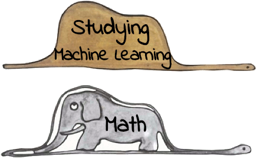
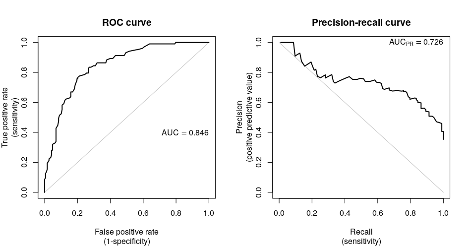

title: NPFL129, Lecture 5
class: title, cc-by-nc-sa
style: .algorithm { background-color: #eee; padding: .5em }
# Derivation of Softmax, F1, k-NN

## Milan Straka

### October 31, 2022

---
# Where Are We

We have seen the gradual development of machine learning systems to neural networks.
- linear regression $→$ Perceptron $→$ (multinomial) logistic regression $→$ MLP

~~~

---
class: middle
# Where Are We

~~~

---
section: LagrangeM
# Constrained Optimization

Given a function $f(→x)$, we can find a minimum/maximum with respect to a vector
$→x ∈ ℝ^D$, by investigating the critical points $∇_{→x} f(→x) = 0$.

~~~
Consider now finding a minimum subject to a constraint $g(→x) = 0$.

~~~

\
\
\
On the left, there is an example with $f(x, y) = x + y$ and
the constraint $x^2 + y^2 = 1$, which can be represented
as $g(x, y) = x^2 + y^2 - 1$.

---
# Lagrange Multipliers – Equality Constraints

 

Let $f(→x): ℝ^D → ℝ$ be a function. We seek its minimum subject
to an equality constraint $g(→x) = 0$ for $g(→x): ℝ^D → ℝ$.

~~~
- Note that $∇_{→x} g(→x)$ is orthogonal to the surface of the constraint, because
  if $→x$ and a nearby point $→x+→ε$ lie on the surface, from the Taylor
  expansion $g(→x+→ε) ≈ g(→x) + →ε^T ∇_{→x} g(→x)$ we get $→ε^T ∇_{→x} g(→x) ≈ 0$.

~~~
- For the desired minimum, $∇_{→x} f(→x)$ must also be orthogonal to the constraint
  surface (or else moving in the direction of the derivative would increase the
  value).

~~~
- Therefore, there must exist $λ$ such that $∇_{→x} f = λ∇_{→x} g$.

~~~
Consequently, the sought minimum either fulfills $∇_{→x} f - λ∇_{→x} g = 0$ for some $λ$,
or it is an unconstrained minimum – in that case, the equation also holds with
$λ=0$.

---
# Minimization – Equality Constraint

Let $f(→x): ℝ^D → ℝ$ be a function which has a minimum (or a maximum) in $→x$
subject to equality constraint $g(→x) = 0$. Assume that both $f$ and $g$ have
continuous partial derivatives and that $\frac{∂g}{∂x}(→x) ≠ 0$.

~~~
Then there exists a $λ ∈ ℝ$, such that the **Lagrangian function**
$$𝓛(→x, λ) ≝ f(→x) - λg(→x)$$
has a zero gradient in both $→x$ and $λ$.

~~~
In detail,
- $\frac{∂𝓛}{∂λ} = 0$ leads to $g(→x)=0$;
~~~
- $∇_{→x} 𝓛 = 0$ is the previously derived $∇_{→x} f - λ∇_{→x} g = 0$.

---
# Minimization – Multiple Equality Constraints

_We can use induction if there are multiple equality constraints, resulting in
the following generalization._

Let $f(→x): ℝ^D → ℝ$ be a function which has a minimum (or a maximum) in $→x$
subject to equality constraints $g_1(→x) = 0, …, g_m(→x) = 0$. Assume that
$f, g_1, …, g_m$ have continuous partial derivatives and that the gradients
$∇_{→x} g_1(→x), …, ∇_{→x} g_m(→x)$ are linearly independent.

~~~
Then there exist $λ_1 ∈ ℝ, …, λ_m ∈ ℝ$, such that the **Lagrangian function**
$$𝓛(→x, →λ) ≝ f(→x) - ∑_{i=1}^m λ_i g_i(→x)$$
has a zero gradient in both $→x$ and $→λ$.

~~~
This strategy of finding constrained minima is known as the **method of Lagrange
multipliers**.

---
# Example of Minimization with Equality Constraint

Assume we want to find a categorical distribution $→p = (p_1, …, p_n)$ with maximum
entropy.

~~~
Then we want to minimize $\textcolor{red}{-H(→p)}$ under the constraints
- $p_i ≥ 0$ for all $i$,
~~~
- $\textcolor{darkgreen}{∑_{i=1}^n p_i = 1}$.

~~~
Ignoring the first constraint for the time being, we form a Lagrangian
$$𝓛 = \textcolor{red}{\bigg(∑_i p_i \log p_i\bigg)} - \textcolor{darkgreen}{λ\bigg(∑_i p_i - 1\bigg)}.$$

~~~
Computing the derivative with respect to $p_i$ and setting it equal to zero, we get
$$0 = \frac{∂𝓛}{∂p_i} = \textcolor{red}{1⋅\log(p_i) + p_i ⋅ \frac{1}{p_i}} - \textcolor{darkgreen}{λ}
    = \textcolor{red}{\log(p_i) + 1} - \textcolor{darkgreen}{λ}.$$

~~~
Therefore, all $p_i = e^{λ-1}$ must be the same, and the constraint $∑_{i=1}^n p_i = 1$
yields $p_i = \frac{1}{n}$.

---
section: NAsMaxEnt
class: dbend
# Minimization – With Respect to a Function

So far, we minimized a function with respect to a finite number of variables.

~~~
A function of a function, $J[f]$, is known as a **functional**, for example
the entropy $H[⋅]$. To minimize a functional with respect to a function,
we can turn to the _calculus of variations_.

~~~
Consider a functional
$$J[f] = ∫_a^b g\big(→x, f(→x)\big) \d→x,$$
where $f(→x)$ and $g(→x, y=f(→x))$ are twice continuously differentiable with respect to all
arguments.

~~~
If $J$ has a minimum (or a maximum) in function $f$, then for all $→x$
$$\frac{∂g(→x, y=f(→x))}{∂y} = 0.$$

---
class: dbend
# Function with Maximum Entropy

What distribution over $ℝ$ maximizes entropy $H[p] = -𝔼_x [\log p(x)]$?

~~~
For continuous values, the entropy is an integral $H[p] = -∫p(x) \log p(x) \d x$.

~~~
We cannot just maximize $H$ with respect to a function $p$, because:
- the result might not be a probability distribution – we need to add
  a constraint that $∫p(x) \d x=1$;
~~~
- the problem is underspecified because a distribution can be shifted without
  changing the entropy – we add a constraint $𝔼[x] = μ$;
~~~
- because entropy increases as variance increases, we ask which distribution
  with a _fixed_ variance $σ^2$ has maximum entropy – adding a constraint
  $\Var(x) = σ^2$.

---
class: dbend
# Function with Maximum Entropy

Lagrangian $𝓛(p(x), x, →λ; μ, σ^2)$ of all the constraints and the entropy function is
$$𝓛 = -\textcolor{red}{H[p]} - \textcolor{darkgreen}{λ_1 \Big(∫p(x) \d x - 1\Big)}
      -\textcolor{blue}{λ_2 \big(𝔼[x] - μ\big)} - \textcolor{magenta}{λ_3\big(\Var(x) - σ^2\big)}.$$

~~~
By expanding all definitions to integrals, we get
$$\begin{aligned}
𝓛(p(x), x, →λ; μ, σ^2) =& ∫\Big(\textcolor{red}{p(x)\log p(x)} - \textcolor{darkgreen}{λ_1 p(x)}
                          -\textcolor{blue}{λ_2 p(x) x} - \textcolor{magenta}{λ_3 p(x) (x - μ)^2}\Big) \d x \\
                        & +\textcolor{darkgreen}{λ_1} + \textcolor{blue}{μ λ_2} + \textcolor{magenta}{σ^2 λ_3}.
\end{aligned}$$

~~~
We now set the derivative of the integrand with respect to $p(x)$ equal to zero:
$$0 = \textcolor{red}{\log p(x) + 1} - \textcolor{darkgreen}{λ_1} - \textcolor{blue}{λ_2 x} - \textcolor{magenta}{λ_3 (x - μ)^2},$$

~~~
obtaining $\displaystyle p(x) = \exp\Big(λ_1 + λ_2 x + λ_3 (x-μ)^2 - 1\Big)$.

---
class: dbend
# Function with Maximum Entropy

We can verify that setting $\textcolor{darkgreen}{λ_1 = 1 - \log \sqrt{2πσ^2}}$,
$\textcolor{blue}{λ_2=0}$ and $\textcolor{magenta}{λ_3=-1/(2σ^2)}$
fulfills all the constraints, arriving at
~~~
$$\begin{aligned}
  p(x) &= \exp\Big(\textcolor{darkgreen}{λ_1} + \textcolor{blue}{λ_2} x + \textcolor{magenta}{λ_3} (x-μ)^2 - 1\Big) \\
       &= \exp\left(\textcolor{darkgreen}{1 - \log \sqrt{2πσ^2}} + \textcolor{magenta}{-1/(2σ^2)} (x-μ)^2 - 1\right) \\
       &= \frac{1}{\sqrt{2πσ^2}} \exp \left(-\frac{(x-μ)^2}{2σ^2}\right) \\
       &= 𝓝(x; μ, σ^2).
\end{aligned}$$

---
section: SoftMax
# Derivation of Softmax using Maximum Entropy

Let $⇉X = \{(→x_1, t_1), (→x_2, t_2), …, (→x_N, t_N)\}$ be training data
of a $K$-class classification, with $→x_i ∈ ℝ^D$ and $t_i ∈ \{1, 2, …, K\}$.

~~~
We want to model it using a function $π: ℝ^D → ℝ^K$
so that $π(→x)$ gives a distribution of classes for input $→x$.

~~~
We impose the following conditions on $π$:
- $\displaystyle ∀\,1 ≤ k ≤ K: π(→x)_k ≥ 0,$

~~~
- $\displaystyle \phantom{∀\,1 ≤ k ≤ K:} ∑_{k=1}^K π(→x)_k = 1,$
~~~
- $\displaystyle ∀\,1 ≤ k ≤ K: ∑_{i=1}^{\smash N} π(→x_i)_k →x_i = ∑_{i=1}^{\smash N} \Big[t_i = k\Big] →x_i.$

---
# Derivation of Softmax using Maximum Entropy

There are many such $π$, one particularly bad is
$$π(→x) = \begin{cases}
  →1_{t_i}&\textrm{if there exists }i: →x_i = →x, \\
  →1_1&\textrm{otherwise},\end{cases}$$
where $→1_i$ is a one-hot encoding of $i$ (vector of zeros, except for position $i$, which is equal to 1).

~~~
Therefore, we want to find a more **general** $π$ – consequently, we turn to the principle of maximum
entropy and search for $π$ with maximum entropy.

---
# Derivation of Softmax using Maximum Entropy

We want to minimize $-\textcolor{red}{∑_{i=1}^N H(π(→x_i))}$
given
- $∀\,1 ≤ i ≤ N, ∀\,1 ≤ k ≤ K: π(→x_i)_k ≥ 0$,
- $∀\,1 ≤ i ≤ N\hphantom{, ∀\,1 ≤ k ≤ K}: \textcolor{darkgreen}{∑_{k=1}^K π(→x_i)_k = 1}$,
- $∀\,1 ≤ j ≤ D, ∀\,1 ≤ k ≤ K: \textcolor{magenta}{∑_{i=1}^N π(→x_i)_k x_{i,j} = ∑_{i=1}^N \big[t_i = k\big] x_{i,j}}$.

~~~
We therefore form a Lagrangian (ignoring the first inequality constraint):
$$\begin{aligned}
𝓛 =& \textcolor{red}{∑_{i=1}^N ∑_{k=1}^K π(→x_i)_k \log(π(→x_i)_k)} \\
   & -\textcolor{magenta}{∑_{j=1}^D ∑_{k=1}^K λ_{j,k} \Big(∑_{i=1}^N π(→x_i)_k x_{i,j} - \big[t_i = k\big] x_{i,j}\Big)} \\
   & -\textcolor{darkgreen}{∑_{i=1}^N β_i \Big(∑_{k=1}^K π(→x_i)_k - 1\Big)}.
\end{aligned}$$

---
class: dbend
# Derivation of Softmax using Maximum Entropy

We now compute partial derivatives of the Lagrangian, notably the values
$$\frac{∂}{∂π(→x_i)_k}𝓛.$$

~~~
We arrive at
$$\frac{∂}{∂π(→x_i)_k}𝓛 = \textcolor{red}{\log(π(→x_i)_k) + 1} - \textcolor{magenta}{→x_i^T →λ_{*,k}} - \textcolor{darkgreen}{β_i}.$$

~~~
Setting the derivative of the Lagrangian to zero, we obtain
$$π(→x_i)_k = \textcolor{red}{e}^{\textcolor{magenta}{→x_i^T →λ_{*,k}} + \textcolor{darkgreen}{β_i} - \textcolor{red}{1}}.$$

~~~
Such a form guarantees $π(→x_i)_k > 0$, which we did not include in the
conditions.

---
class: dbend
# Derivation of Softmax using Maximum Entropy

In order to find out the $β_i$ values, we turn to the constraint
$$∑_k π(→x_i)_k = ∑_k e^{→x_i^T →λ_{*,k} +β_i-1} = 1,$$
~~~
from which we get
$$e^{β_i} = \frac{1}{∑_k e^{→x_i^T →λ_{*,k} - 1}},$$

~~~
yielding
$$π(→x_i)_k = e^{→x_i^T →λ_{*,k} + β_i - 1} = \frac{e^{→x_i^T →λ_{*,k}}}{∑_{k'} e^{→x_i^T →λ_{*,k'}}} = \softmax(→x_i^T ⇉λ)_k.$$

---
section: F-score
# $F_1$-score

When evaluating binary classification, we have used **accuracy** so far.

~~~

However, there are other metrics we might want to consider. One of them is
$F_1$-score.

~~~
Consider the following **confusion matrix**:
| |Target positive|Target negative|
|-|---------------|---------------|
|Predicted positive| **True Positive** (**TP**) | **False Positive** (**FP**) |
|Predicted negative| **False Negative** (**FN**) | **True Negative** (**TN**) |

~~~
Accuracy can be computed as
$$\accuracy = \frac{\TP+\TN}{\TP+\TN+\FP+\FN}.$$

---
# $F_1$-score

| |Target positive|Target negative|
|-|---------------|---------------|
|Predicted positive| **True Positive** (**TP**) | **False Positive** (**FP**) |
|Predicted negative| **False Negative** (**FN**) | **True Negative** (**TN**) |

In some cases, we are mostly interested in positive examples.

~~~

We define **precision** (percentage of correct predictions in predicted examples)
and **recall** (percentage of correct predictions in the gold examples) as
$$\begin{aligned}
  \precision =& \frac{\TP}{\TP+\FP}, \\
  \recall =& \frac{\TP}{\TP+\FN}.
\end{aligned}$$

---
# $F_1$-score

The precision and recall go “against each other”: decreasing the classifier
threshold usually increases recall and decreases precision, and vice versa.

~~~
We therefore define a single **$\boldsymbol{F_1}$-score** as a harmonic mean of precision and recall:
$$\begin{aligned}
  F_1 =& \frac{2}{\precision^{-1} + \recall^{-1}} \\
      =& \frac{2 ⋅ \precision ⋅ \recall}{\precision + \recall} \\
      =&\frac{\TP~~~~~+~~~~~\TP}{\TP+\FP+\TP+\FN}.
\end{aligned}$$

---
# $F_1$-score and Other Means of Precision and Recall

Arithmetic mean of precision&recall is
$$\mathit{AM}(p, r) ≝ \frac{p + r}{2}.$$

As any mean, it is ”between“ the input values
$$\begin{gathered} \min(p, r) ≤ \mathit{AM}(p, r), \\ \mathit{AM}(p, r) ≤ \max(p, r).\end{gathered}$$

However,
$$\mathit{AM}(1\%, 100\%) = 50.5\%.$$

---
# $F_1$-score and Other Means of Precision and Recall

Geometric mean of precision&recall is
$$\mathit{GM}(p, r) ≝ \sqrt{p ⋅ r}.$$

It is better than the arithmetic mean, but still
$$\mathit{GM}(1\%, 100\%) = 10\%.$$

---
# $F_1$-score and Other Means of Precision and Recall

Harmonic mean of precision&recall is
$$\mathit{HM}(p, r) ≝ \frac{2}{\frac{1}{p} + \frac{1}{r}}.$$

In addition to being bounded by the input values, $\mathit{HM}$ is also
dominated by the minimum of its input values:
$$\begin{gathered} \min(p, r) ≤ \mathit{HM}(p, r), \\ \mathit{HM}(p, r) ≤ \max(p, r), \\ \mathit{HM}(p, r) ≤ 2\min(p, r).\end{gathered}$$

For example,
$$\mathit{HM}(1\%, 100\%) ≈ 2\%.$$

---
# General $F_β$-score

The $F_1$ score can be generalized to $F_β$ score, which can be used as a metric
when recall is $β$ times more important than precision; $F_2$ favoring recall
and $F_{0.5}$ favoring precision are commonly used.

~~~
The formula for $F_β$ is

$$\begin{aligned}
  F_β =& \frac{1+β^2}{\precision^{-1} + β^2⋅\recall^{-1}} \\
      =& \frac{(1 + β^2) ⋅ \precision ⋅ \recall}{β^2 ⋅ \precision + \recall} \\
      =& \frac{\TP~~~~~+~~~~~\hphantom{()}β^2⋅\TP}{\TP+\FP+β^2⋅(\TP+\FN)}.
\end{aligned}$$

---
# General $F_β$-score

You may wonder why is $β^2$ used in the formula
$$F_β = \frac{1+β^2}{\precision^{-1} + β^2⋅\recall^{-1}}$$
instead of just $β$.

~~~
Quoting C. J. van Rijsbergen from his book _Information Retrieval_, 1979:
> _What we want is therefore a parameter $β$ to characterise the measurement function in such a way that we can say: it measures the effectiveness of retrieval with respect to a user who attaches $β$ times as much importance to recall as precision. The simplest way I know of quantifying this is to specify the $\recall/\precision$ ratio at which the user is willing to trade an increment in precision for an equal loss in recall._

~~~
It is straightforward to verify that indeed $\frac{∂F_β}{∂\precision} = \frac{∂F_β}{∂\recall}$
implies $\frac{\recall}{\precision} = β$.

---
class: middle
# $F_1$-score and Other Means of Precision and Recall

---
# Precision-Recall Curve

Changing the threshold in logistic regression allows us to trade off precision
for recall, and vice versa. Therefore, we can tune it on the development set to
achieve the highest possible $F_1$ score, if required.

~~~
Also, if we want to evaluate $F_1$-score without considering a specific
threshold, the **area under curve** (AUC) is sometimes used as a metric.

---
# $F_1$-Score in Multiclass Classification

To extend $F_1$-score to multiclass classification, we expect one of the classes
to be _negative_ and the others to be _different kinds of positive_. For each of the
positive classes, we compute the same confusion matrix as in the binary case
(considering all other labels as negative ones), and then combine the results
in one of the following ways:

~~~
- **micro-averaged** $F_1$ (or just **micro** $F_1$): we first sum all the TP,
  FP and FN of the individual binary classifications and compute the final
  $F_1$-score (this way, the frequency of the individual classes is taken into
  account);

~~~
- **macro-averaged** $F_1$ (or just **macro** $F_1$): we first compute the
  $F_1$-scores of the individual binary classifications and then compute
  an unweighted average (therefore, the frequency of the classes is more
  or less ignored).

---
# Metrics for Exemplary Tasks

- **Part-of-speech tagging**: assign a part-of-speech to every word in the input
  text.

~~~
  - **accuracy** on such a task is the same as micro-averaged precision, recall, and $F_1$-score,
    because exactly one class is predicted for every word (i.e., TP+FP = TP+FN).

~~~
- **Named entity recognition**: recognize personal names, organizations, and
  locations in the input text.

~~~
  - **accuracy** is artificially high, because many words are not a named entity;
~~~
  - **micro-averaged** $F_1$ considers all named entities, with classes used
    only to decide if a prediction is correct;
    _“how good are we at recognizing all present named entities”_;
~~~
  - **macro-averaged** $F_1$
    _“how good are we at recognizing all named entities **types**”_.

~~~
Consider **multi-label classification**, where you can generate any number of
classes for an input example (while in the multiclass classification you generate
always exactly one).

~~~
- For example **text classification**: choose domains (sports/politics/…) for input documents.
~~~
- Can be solved analogously to softmax classification, only using sigmoid
  activation.
~~~
- Accuracy is very strict (all predicted classes must be exactly the same).
~~~
- Commonly evaluated using micro-averaged or macro-averaged $F_1$-score.

---
section: ROC
# ROC Curve

The precision-recall curve is useful when we are interested
in the positive examples (i.e., we are ignoring true negative instances).
In case we want to consider also the true negatives, we might instead
use the **Receiver Operating Characteristic** (ROC) curve.

~~~
In the ROC curve, we consider two measures of a binary classifier under changing
threshold:
- **true positive rate** or **sensitivity** (probability of detection):
  $\frac{\TP}{\textrm{target positives}} = \frac{\TP}{\TP + \FN}$;
- **false positive rate** or **1-specificity** (probability of false alarm):
  $\frac{\FP}{\textrm{target negatives}} = \frac{\FP}{\FP + \TN}$;

---
#  Binary Confusion Metric Measures Overview

| |Target positive|Target negative| |
|-|---------------|---------------|-|
|Predicted positive| **True Positive** (**TP**) | **False Positive** (**FP**) Type I Error | **precision** $\frac{\TP}{\TP+\FP}$ $\begin{smallmatrix}\colorbox{darkgreen}{\color{red}1}\colorbox{darkgreen}{\phantom{0}}\\\colorbox{gray}{\phantom{0}}\colorbox{gray}{\phantom{0}}\end{smallmatrix}$ |
|Predicted negative| **False Negative** (**FN**) Type II Error | **True Negative** (**TN**) |
|                     | **true positive rate**, **recall**,  **sensitivity** $\frac{\TP}{\TP+\FN}$ $\begin{smallmatrix}\colorbox{darkgreen}{\color{red}1}\colorbox{gray}{\phantom{0}}\\\colorbox{darkgreen}{\phantom{0}}\colorbox{gray}{\phantom{0}}\end{smallmatrix}$ | **false positive rate** $\frac{\FP}{\FP+\TN}$ $\begin{smallmatrix}\colorbox{gray}{\phantom{0}}\colorbox{darkgreen}{\color{red}1}\\\colorbox{gray}{\phantom{0}}\colorbox{darkgreen}{\phantom{0}}\end{smallmatrix}$ **specificity** $\frac{\TN}{\TN+\FP}$ $\begin{smallmatrix}\colorbox{gray}{\phantom{0}}\colorbox{darkgreen}{\phantom{0}}\\\colorbox{gray}{\phantom{0}}\colorbox{darkgreen}{\color{red}1}\end{smallmatrix}$ |

- $F_1$-score = $\frac{2 ⋅ \precision ⋅ \recall}{\precision + \recall} = \frac{\TP~~~~+~~~~\TP}{\TP+\FP+\TP+\FN}$ $\begin{smallmatrix}\colorbox{darkgreen}{\color{red}2}\colorbox{darkgreen}{\phantom{0}}\\\colorbox{darkgreen}{\phantom{0}}\colorbox{gray}{\phantom{0}}\end{smallmatrix}$

- accuracy = $\frac{\TP+\TN}{\TP+\FP+\FN+\TN}$ $\begin{smallmatrix}\colorbox{darkgreen}{\color{red}1}\colorbox{darkgreen}{\phantom{0}}\\\colorbox{darkgreen}{\phantom{0}}\colorbox{darkgreen}{\color{red}1}\end{smallmatrix}$

---
section: (Non)ParametricModels
# Parametric and Nonparametric Models

All machine learning models which we have discussed so far are **parametric**,
because they use a _fixed_ number of parameters (usually depending on the
number of features, $K$ for multiclass classification, hidden layer in MLPs, …).

~~~
However, there also exist **nonparametric** models. Even if the name seems to
suggest they do not have any parameters, they have a non-fixed number of
parameters, because the number of parameters usually depends on the size of the
training data – therefore, the model size usually grows with the size of the
training data.

---
section: k-NN
# k-Nearest Neighbors

A simple but sometimes effective nonparametric method for both classification
and regression is **$\boldsymbol k$-nearest neighbors** algorithm.

~~~
The training phase of the $k$-nearest neighbors algorithm is trivial, it consists of
only storing the whole train set (the so-called **lazy learning**).

~~~
For a given test example, the main idea is to use the targets of the most
similar training data to perform the prediction.

---
# k-Nearest Neighbors

Several hyperparameters influence the behavior of the prediction phase:

~~~
- **k**: consider $k$ most similar training examples (higher $k$ usually
  decreases variance, but increases bias);

~~~
- **metric**: a function used to find the nearest neighbors; common choices
  are metrics based on $L^p$ norms (with usual values of $p$ being $1$, $2$, $3$, $∞$).
  For $→x, →y ∈ ℝ^D$, the distance is measured as $\|→x-→y\|_p$, where
  $$\|→x\|_p = \Big(∑\nolimits_i |x_i|^p\Big)^{1/p};$$
~~~
- **weights**: optionally, more similar examples can be considered with bigger
  weights:
  - _uniform_: all $k$ nearest neighbors are considered equally;
  - _inverse_: the weight of an example is proportional to the inverse of distance;
  - _softmax_: the weights are proportional to the $\softmax$ of negative distances.

---
# k-Nearest Neighbors

### Regression

To perform regression when $k$ nearest neighbors have values $t_i$ and weights
$w_i$, we predict
$$t = ∑_i \frac{w_i}{∑\nolimits_j w_j} ⋅ t_i.$$

~~~
### Classification

For uniform weights, we can use **voting** during prediction – the most
frequent class is predicted (with ties broken arbitrarily).

~~~
Otherwise, we weight the categorical distributions $→t_i ∈ ℝ^K$ (with the
training target classes represented using one-hot encoding),
predicting a distribution
$$→t = ∑_i \frac{w_i}{∑\nolimits_j w_j} ⋅ →t_i.$$
The predicted class is then the one with the largest probability, i.e.,
$\argmax\nolimits_k ∑_i w_i t_{i,k}$.

---
# k-Nearest Neighbors

A trivial implementation of the $k$-nearest neighbors algorithm is extremely
demanding during the inference, requiring to measure distances of a given
example to all training instances.

~~~
However, several data structures capable of speeding up the $k$-nearest neighbor
search exist, like
- $k$-$d$ trees, which allow both a static or dynamic construction and can perform
  nearest neighbor queries of uniformly random points in logarithmic time on
  average, but which become inefficient for high-dimensional data;

- ball trees, R-trees, …
