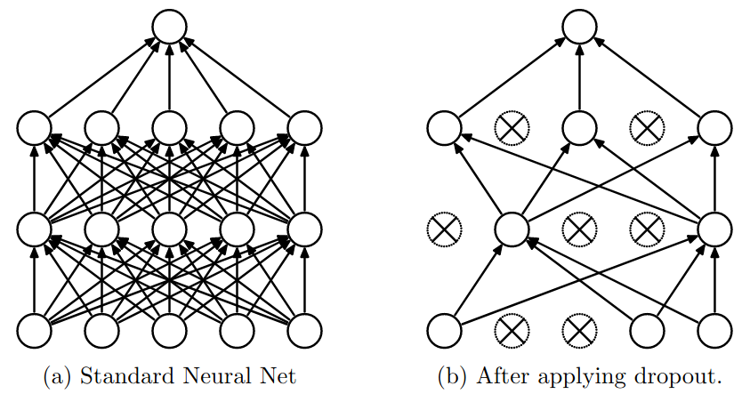
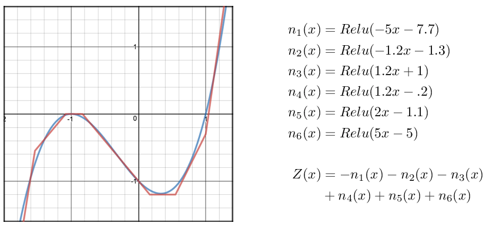

title: NPFL129, Lecture 5
class: title, cc-by-sa
style: .algorithm { background-color: #eee; padding: .5em }
# MLP, Softmax as MaxEnt classifier, F1 Score

## Jindřich Libovický <small>(reusing materials by Milan Straka)</small>

### October 29, 2024

---
class: middle
# Today's Lecture Objectives

After this lecture you should be able to

- Implement training of multi-layer perceptron using SGD

- Explain the theoretical foundation behind the softmax activation function
  (including the necessary math)

- Choose a suitable evaluation metric for various classification tasks

---
section: MLP
class: section
# Multilayer Perceptron

---
# Multilayer Perceptron

- The computation is performed analogously:
  $$\begin{aligned}
    h_i &= f\left(∑\nolimits_j x_j w^{(h)}_{j,i} + b^{(h)}_i\right), \\
    y_i &= a\left(∑\nolimits_j h_j w^{(y)}_{j,i} + b^{(y)}_i\right),
  \end{aligned}$$
  or in matrix form
  $$\begin{aligned}
    →h &= f\Big(→x^T ⇉W^{(h)} + →b^{(h)}\Big), \\
    →y &= a\Big(→h^T ⇉W^{(y)} + →b^{(y)}\Big),
  \end{aligned}$$
  and for a batch of inputs $⇉H = f\Big(⇉X ⇉W^{(h)} + →b^{(h)}\Big)$ and $⇉Y = a\Big(⇉H ⇉W^{(y)} + →b^{(y)}\Big)$.

---
# Training MLP – Computing the Derivatives

Assume we have an MLP with input of size $D$, weights $⇉W^{(h)} ∈ ℝ^{D × H}$,
$→b^{(h)} ∈ ℝ^H$, hidden layer of size $H$ and activation $f$ with weights
$⇉W^{(y)} ∈ ℝ^{H × K}$, $→b^{(y)} ∈ ℝ^K$, and finally an output layer of size $K$ with
activation $a$.

~~~
To compute the gradient of the loss $L$ with respect to all weights, proceed gradually:
- first compute $\frac{∂L}{∂→y}$,

~~~
- then compute $\frac{∂→y}{∂→y^\mathit{(in)}}$, where $→y^\mathit{(in)}$ are the
  inputs to the output layer (i.e., before applying activation function $a$;
  in other words, $→y = a(→y^\mathit{(in)})$),
~~~
- then compute $\frac{∂→y^\mathit{(in)}}{∂⇉W^{(y)}}$ and $\frac{∂→y^\mathit{(in)}}{∂→b^{(y)}}$,
  which allows us to obtain $\frac{∂L}{∂⇉W^{(y)}} = \frac{∂L}{∂→y}
  ⋅ \frac{∂→y}{∂→y^\mathit{(in)}} ⋅ \frac{∂→y^\mathit{(in)}}{∂⇉W^{(y)}}$ and analogously
  $\frac{∂L}{∂→b^{(y)}}$,
~~~
- followed by $\frac{∂→y^\mathit{(in)}}{∂→h}$ and $\frac{∂→h}{∂→h^\mathit{(in)}}$,
~~~
- and finally using $\frac{∂→h^\mathit{(in)}}{∂⇉W^{(h)}}$ and
  $\frac{∂→h^\mathit{(in)}}{∂→b^{(h)}}$ compute $\frac{∂L}{∂⇉W^{(h)}}$ and
  $\frac{∂L}{∂→b^{(h)}}$.

---
# General Backpropagation Algorithm

- The computation can be represented as a graph with tensors and operations.

- Computing the gradients corresponds to a backward path in the graph, nodes
  replaced with their derivatives.

---
# Hidden Layer Interpretation and Initialization

One way how to interpret the hidden layer is:
- the part from the hidden layer to the output layer is the previously
  used generalized linear model (linear regression, logistic regression, …);

~~~
- the part from the inputs to the hidden layer can be considered as automatically
  constructed features. The features are a linear mapping of the input values
  followed by a nonlinearity, and the theorem on an upcoming slide proves they can
  always be constructed to achieve as good a fit of the training data as is required.

~~~
Note that the weights in an MLP must be initialized randomly. If we used just
zeros, all the constructed features (hidden layer nodes) would behave
identically and we would never distinguish them.

Using random weights corresponds to starting with random features, which allows the SGD
to make progress (improve the individual features).

---
# Regularization Using Dropout

- A trick by Srivastava et al., 2014 – randomly zero-out neurons during
  training, typically 10–50%.

- Decreases the efficient capacity during training, keeps the capacity at test
  time.

- Intuition: more robust features because the information needs to survive
  damaging a part of the network.

---
section: UniversalApproximation
class: section
# Universal Approximation Theorem

---
# Universal Approximation Theorem '89

Let $φ(x):ℝ → ℝ$ be a nonconstant, bounded and nondecreasing continuous function. \
(Later a proof was given also for $φ = \ReLU$ and even for any nonpolynomial
function.)

~~~
For any $ε > 0$ and any continuous function $f: [0, 1]^D → ℝ$, there exists
$H ∈ ℕ$, $→v ∈ ℝ^H$, $→b ∈ ℝ^H$ and $⇉W ∈ ℝ^{D×H}$ such that if we denote
$$F(→x) = →v^T φ(→x^T ⇉W + →b) = ∑_{i=1}^H v_i φ(→x^T →{W_{*, i}} + b_i),$$
where $φ$ is applied elementwise,
~~~
then for all $→x ∈ [0, 1]^D$:
$$|F(→x) - f(→x)| < ε.$$

---
class: dbend
# Universal Approximation Theorem for ReLUs

Sketch of the proof:

~~~
- If a function is continuous on a closed interval, it can be approximated by
  a sequence of lines to arbitrary precision.

~~~
- However, we can create a sequence of $k$ linear segments as a sum of $k$ ReLU
  units – on every endpoint, a new ReLU starts (i.e., the input ReLU value is
  zero at the endpoint) with a tangent which is the difference between the
  target tangent and the tangent of the approximation until this point.

---
# Where We Are

We have seen the gradual development of machine learning systems to neural networks.
- linear regression $→$ Perceptron $→$ (multinomial) logistic regression $→$ MLP

~~~

---
section: LagrangeM
class: section
# Lagrange Multipliers

---
# Constrained Optimization

Given a function $f(→x)$, we can find a minimum/maximum with respect to a vector
$→x ∈ ℝ^D$ by investigating the critical points $∇_{→x} f(→x) = 0$.

~~~
Consider now finding a minimum subject to a constraint $g(→x) = 0$.

~~~

\
\
\
On the left, there is an example with $f(x, y) = x + y$ and
the constraint $x^2 + y^2 = 1$, which can be represented
as $g(x, y) = x^2 + y^2 - 1$.

---
# Lagrange Multipliers – Equality Constraints

 

Let $f(→x): ℝ^D → ℝ$ be a function. We seek its minimum subject
to an equality constraint $g(→x) = 0$ for $g(→x): ℝ^D → ℝ$.

~~~
- Note that $∇_{→x} g(→x)$ is orthogonal to the surface of the constraint, because
  if $→x$ and a nearby point $→x+→ε$ lie on the surface, from the Taylor
  expansion $g(→x+→ε) ≈ g(→x) + →ε^T ∇_{→x} g(→x)$ we get $→ε^T ∇_{→x} g(→x) ≈ 0$.

~~~
- For the desired minimum, $∇_{→x} f(→x)$ must also be orthogonal to the constraint
  surface (or else moving in the direction opposite to the derivative would decrease the
  value).

~~~
- Therefore, there must exist $λ$ such that $∇_{→x} f = λ∇_{→x} g$.

~~~
Consequently, the sought minimum either fulfills $∇_{→x} f - λ∇_{→x} g = 0$ for some $λ$,
or it is an unconstrained minimum – in that case, the equation also holds with
$λ=0$.

---
# Minimization – Equality Constraint

Let $f(→x): ℝ^D → ℝ$ be a function that has a minimum (or a maximum) in $→x$
subject to the equality constraint $g(→x) = 0$. Assume that both $f$ and $g$ have
continuous partial derivatives and that $∇_{→x} g(→x) ≠ 0$.

~~~
Then there exists a $λ ∈ ℝ$, such that the **Lagrangian function**
$$𝓛(→x, λ) ≝ f(→x) - λg(→x)$$
has a zero gradient in both $→x$ and $λ$.

~~~
In detail,
- $\frac{∂𝓛}{∂λ} = 0$ leads to $g(→x)=0$;
~~~
- $∇_{→x} 𝓛 = 0$ is the previously derived $∇_{→x} f - λ∇_{→x} g = 0$.

---
# Minimization – Multiple Equality Constraints

_We can use induction if there are multiple equality constraints, resulting in
the following generalization._

Let $f(→x): ℝ^D → ℝ$ be a function that has a minimum (or a maximum) in $→x$
subject to equality constraints $g_1(→x) = 0, …, g_m(→x) = 0$. Assume that
$f, g_1, …, g_m$ have continuous partial derivatives and that the gradients
$∇_{→x} g_1(→x), …, ∇_{→x} g_m(→x)$ are linearly independent.

~~~
Then there exist $λ_1 ∈ ℝ, …, λ_m ∈ ℝ$, such that the **Lagrangian function**
$$𝓛(→x, →λ) ≝ f(→x) - ∑_{i=1}^m λ_i g_i(→x)$$
has a zero gradient in both $→x$ and $→λ$.

~~~
This strategy of finding constrained minima is known as the **method of Lagrange
multipliers**.

---
# Example of Minimization with Equality Constraint

Assume we want to find a categorical distribution $→p = (p_1, …, p_n)$ with maximum
entropy.

~~~
Then we want to minimize $\textcolor{red}{-H(→p)}$ under the constraints
- $p_i ≥ 0$ for all $i$,
~~~
- $\textcolor{darkgreen}{∑_{i=1}^n p_i = 1}$.

~~~
Ignoring the first constraint for the time being, we form the Lagrangian
$$𝓛 = \textcolor{red}{\bigg(∑_i p_i \log p_i\bigg)} - \textcolor{darkgreen}{λ\bigg(∑_i p_i - 1\bigg)}.$$

~~~
Computing the derivative with respect to $p_i$ and setting it equal to zero, we get
$$0 = \frac{∂𝓛}{∂p_i} = \textcolor{red}{1⋅\log(p_i) + p_i ⋅ \frac{1}{p_i}} - \textcolor{darkgreen}{λ}
    = \textcolor{red}{\log(p_i) + 1} - \textcolor{darkgreen}{λ}.$$

~~~
Therefore, all $p_i = e^{λ-1}$ must be the same, and the constraint $∑_{i=1}^n p_i = 1$
yields $p_i = \frac{1}{n}$.

---
section: Softmax
class: section
# Softmax as Maximum Entropy Classifier

---
# Derivation of Softmax using Maximum Entropy

Let $𝕏 = \{(→x_1, t_1), (→x_2, t_2), …, (→x_N, t_N)\}$ be training data
of a $K$-class classification, with $→x_i ∈ ℝ^D$ and $t_i ∈ \{1, 2, …, K\}$.

~~~
We want to model it using a function $π: ℝ^D → ℝ^K$
so that $π(→x)$ gives a distribution of classes for input $→x$.

~~~
We impose the following conditions on $π$:
- $\displaystyle \textrm{for~}1 ≤ k ≤ K\!:~ π(→x)_k ≥ 0,$

~~~
- $\displaystyle \phantom{\textrm{for~}1 ≤ k ≤ K\!:~} ∑_{k=1}^K π(→x)_k = 1,$
~~~
- $\displaystyle \textrm{for~}1 ≤ k ≤ K\!:~ ∑_{i=1}^{\smash N} π(→x_i)_k →x_i = ∑_{i=1}^{\smash N} \Big[t_i = k\Big] →x_i.$

---
# Derivation of Softmax using Maximum Entropy

There are many such $π$, one particularly bad is
$$π(→x) = \begin{cases}
  →1_{t_i}&\textrm{if there exists }i: →x_i = →x, \\
  →1_1&\textrm{otherwise},\end{cases}$$
where $→1_i$ is a one-hot encoding of $i$ (vector of zeros, except for position $i$, which is equal to 1).

~~~
Therefore, we want to find a more **general** $π$ – consequently, we turn to the principle of maximum
entropy and search for $π$ with maximum entropy.

---
# Derivation of Softmax using Maximum Entropy

We want to minimize $\textcolor{red}{-∑_{i=1}^N H(π(→x_i))}$
given
- $\textrm{for~}1 ≤ i ≤ N,~ 1 ≤ k ≤ K\!:~ π(→x_i)_k ≥ 0$,
- $\textrm{for~}1 ≤ i ≤ N: \hphantom{,~ 1 ≤ k ≤ K\!}~ \textcolor{darkgreen}{∑_{k=1}^K π(→x_i)_k = 1}$,
- $\textrm{for~}1 ≤ j ≤ D,~ 1 ≤ k ≤ K\!:~ \textcolor{magenta}{∑_{i=1}^N π(→x_i)_k x_{i,j} = ∑_{i=1}^N \big[t_i = k\big] x_{i,j}}$.

~~~
We therefore form a Lagrangian (ignoring the first inequality constraint):
$$\begin{aligned}
𝓛 =& \textcolor{red}{∑_{i=1}^N ∑_{k=1}^K π(→x_i)_k \log(π(→x_i)_k)} \\
   & -\textcolor{magenta}{∑_{j=1}^D ∑_{k=1}^K λ_{j,k} \Big(∑_{i=1}^N π(→x_i)_k x_{i,j} - \big[t_i = k\big] x_{i,j}\Big)} \\
   & -\textcolor{darkgreen}{∑_{i=1}^N β_i \Big(∑_{k=1}^K π(→x_i)_k - 1\Big)}.
\end{aligned}$$

---
class: dbend
# Derivation of Softmax using Maximum Entropy

We now compute partial derivatives of the Lagrangian, notably the values
$$\frac{∂}{∂π(→x_i)_k}𝓛.$$

~~~
We arrive at
$$\frac{∂}{∂π(→x_i)_k}𝓛 = \textcolor{red}{\log(π(→x_i)_k) + 1} - \textcolor{magenta}{→x_i^T →λ_{*,k}} - \textcolor{darkgreen}{β_i}.$$

~~~
Setting the derivative of the Lagrangian to zero, we obtain
$$π(→x_i)_k = \textcolor{red}{e}^{\textcolor{magenta}{→x_i^T →λ_{*,k}} + \textcolor{darkgreen}{β_i} - \textcolor{red}{1}}.$$

~~~
Such a form guarantees $π(→x_i)_k > 0$, which we did not include in the
conditions.

---
class: dbend
# Derivation of Softmax using Maximum Entropy

In order to find the $β_i$ values, we turn to the constraint
$$∑_k π(→x_i)_k = ∑_k e^{→x_i^T →λ_{*,k} +β_i-1} = 1,$$
~~~
from which we get
$$e^{β_i} = \frac{1}{∑_k e^{→x_i^T →λ_{*,k} - 1}},$$

~~~
yielding
$$π(→x_i)_k = e^{→x_i^T →λ_{*,k} + β_i - 1} = \frac{e^{→x_i^T →λ_{*,k}}}{∑_{k'} e^{→x_i^T →λ_{*,k'}}} = \softmax(→x_i^T ⇉λ)_k.$$

---
section: F-score
class: section
# F-Score

---
# $F_1$-score

When evaluating binary classification, we have used **accuracy** so far.

~~~

However, there are other metrics we might want to consider. One of them is
$F_1$-score.

~~~
Consider the following **confusion matrix**:
| |Target positive|Target negative|
|-|---------------|---------------|
|Predicted positive| **True Positive** (**TP**) | **False Positive** (**FP**) |
|Predicted negative| **False Negative** (**FN**) | **True Negative** (**TN**) |

~~~
Accuracy can be computed as
$$\accuracy = \frac{\TP+\TN}{\TP+\TN+\FP+\FN}.$$

---
# $F_1$-score

| |Target positive|Target negative|
|-|---------------|---------------|
|Predicted positive| **True Positive** (**TP**) | **False Positive** (**FP**) |
|Predicted negative| **False Negative** (**FN**) | **True Negative** (**TN**) |

In some cases, we are mostly interested in positive examples.

~~~

We define **precision** (the percentage of correct predictions in predicted examples)
and **recall** (the percentage of correct predictions in the gold examples) as
$$\begin{aligned}
  \precision =& \frac{\TP}{\TP+\FP}, \\
  \recall =& \frac{\TP}{\TP+\FN}.
\end{aligned}$$

---
# $F_1$-score

Precision and recall go “against each other”: decreasing the classifier
threshold usually increases recall and decreases precision, and vice versa.

~~~
We therefore define a single metric, the **$\boldsymbol{F_1}$-score**, as the harmonic mean of precision and recall:
$$\begin{aligned}
  F_1 =& \frac{2}{\precision^{-1} + \recall^{-1}} \\
      =& \frac{2 ⋅ \precision ⋅ \recall}{\precision + \recall} \\
      =&\frac{\TP~~~~~+~~~~~\TP}{\TP+\FP+\TP+\FN}.
\end{aligned}$$

---
# $F_1$-score and Other Means of Precision and Recall

Arithmetic mean of precision&recall is
$$\mathit{AM}(p, r) ≝ \frac{p + r}{2}.$$

As any mean, it is ”between“ the input values
$$\begin{gathered} \min(p, r) ≤ \mathit{AM}(p, r), \\ \mathit{AM}(p, r) ≤ \max(p, r).\end{gathered}$$

However,
$$\mathit{AM}(1\%, 100\%) = 50.5\%.$$

---
# $F_1$-score and Other Means of Precision and Recall

Geometric mean of precision&recall is
$$\mathit{GM}(p, r) ≝ \sqrt{p ⋅ r}.$$

It is better than the arithmetic mean, but still
$$\mathit{GM}(1\%, 100\%) = 10\%.$$

---
# $F_1$-score and Other Means of Precision and Recall

Harmonic mean of precision&recall is
$$\mathit{HM}(p, r) ≝ \frac{2}{\frac{1}{p} + \frac{1}{r}}.$$

In addition to being bounded by the input values, $\mathit{HM}$ is also
dominated by the minimum of its input values:
$$\begin{gathered} \min(p, r) ≤ \mathit{HM}(p, r), \\ \mathit{HM}(p, r) ≤ \max(p, r), \\ \mathit{HM}(p, r) ≤ 2\min(p, r).\end{gathered}$$

For example,
$$\mathit{HM}(1\%, 100\%) ≈ 2\%.$$

---
# General $F_β$-score

The $F_1$-score can be generalized to the $F_β$-score, which can be used as a metric
when recall is $β$ times more important than precision; $F_2$ favoring recall
and $F_{0.5}$ favoring precision are commonly used.

~~~
The formula for $F_β$ is

$$\begin{aligned}
  F_β =& \frac{1+β^2}{\precision^{-1} + β^2⋅\recall^{-1}} \\
      =& \frac{(1 + β^2) ⋅ \precision ⋅ \recall}{β^2 ⋅ \precision + \recall} \\
      =& \frac{\TP~~~~~+~~~~~\hphantom{()}β^2⋅\TP}{\TP+\FP+β^2⋅(\TP+\FN)}.
\end{aligned}$$

---
class: middle
# $F_1$-score and Other Means of Precision and Recall

---
# Precision–Recall Curve

Changing the threshold in logistic regression allows us to trade off precision
for recall, and vice versa. Therefore, we can tune it on the development set to
achieve the highest possible $F_1$-score, if required.

~~~
Also, if we want to evaluate $F_1$-score without considering a specific
threshold, the **area under curve** (AUC) is sometimes used as a metric.

---
# $F_1$-Score in Multiclass Classification

To extend $F_1$-score to multiclass classification, we expect one of the classes
to be _negative_ and the others to be _different kinds of positive_. For each of the
positive classes, we compute the same confusion matrix as in the binary case
(considering all other labels as negative ones), and then combine the results
in one of the following ways:

~~~
- **micro-averaged** $F_1$ (or just **micro** $F_1$): we first sum all the TP,
  FP and FN of the individual binary classifications and compute the final
  $F_1$-score (this way, the frequency of individual classes is taken into
  account);

~~~
- **macro-averaged** $F_1$ (or just **macro** $F_1$): we first compute
  $F_1$-scores of individual binary classifications and then compute
  an unweighted average (therefore, the frequency of classes is more
  or less ignored).

---
#  Binary Confusion Metric Measures Overview

| |Target positive|Target negative| |
|-|---------------|---------------|-|
|Predicted positive| **True Positive** (**TP**) | **False Positive** (**FP**) Type I Error | **precision** $\frac{\TP}{\TP+\FP}$ $\begin{smallmatrix}\colorbox{darkgreen}{\color{red}1}\colorbox{darkgreen}{\phantom{0}}\\\colorbox{gray}{\phantom{0}}\colorbox{gray}{\phantom{0}}\end{smallmatrix}$ |
|Predicted negative| **False Negative** (**FN**) Type II Error | **True Negative** (**TN**) |
|                     | **true positive rate**, **recall**,  **sensitivity** $\frac{\TP}{\TP+\FN}$ $\begin{smallmatrix}\colorbox{darkgreen}{\color{red}1}\colorbox{gray}{\phantom{0}}\\\colorbox{darkgreen}{\phantom{0}}\colorbox{gray}{\phantom{0}}\end{smallmatrix}$ | **false positive rate** $\frac{\FP}{\FP+\TN}$ $\begin{smallmatrix}\colorbox{gray}{\phantom{0}}\colorbox{darkgreen}{\color{red}1}\\\colorbox{gray}{\phantom{0}}\colorbox{darkgreen}{\phantom{0}}\end{smallmatrix}$ **specificity** $\frac{\TN}{\TN+\FP}$ $\begin{smallmatrix}\colorbox{gray}{\phantom{0}}\colorbox{darkgreen}{\phantom{0}}\\\colorbox{gray}{\phantom{0}}\colorbox{darkgreen}{\color{red}1}\end{smallmatrix}$ |

- $F_1$-score = $\frac{2 ⋅ \precision ⋅ \recall}{\precision + \recall} = \frac{\TP~~~~+~~~~\TP}{\TP+\FP+\TP+\FN}$ $\begin{smallmatrix}\colorbox{darkgreen}{\color{red}2}\colorbox{darkgreen}{\phantom{0}}\\\colorbox{darkgreen}{\phantom{0}}\colorbox{gray}{\phantom{0}}\end{smallmatrix}$

- accuracy = $\frac{\TP+\TN}{\TP+\FP+\FN+\TN}$ $\begin{smallmatrix}\colorbox{darkgreen}{\color{red}1}\colorbox{darkgreen}{\phantom{0}}\\\colorbox{darkgreen}{\phantom{0}}\colorbox{darkgreen}{\color{red}1}\end{smallmatrix}$

---
class: summary
# Today's Lecture Objectives

After this lecture you should be able to

- Implement training of multi-layer perceptron using SGD

- Explain the theoretical foundation behind the softmax activation function
  (including the necessary math)

- Choose a suitable evaluation metric for various classification tasks

