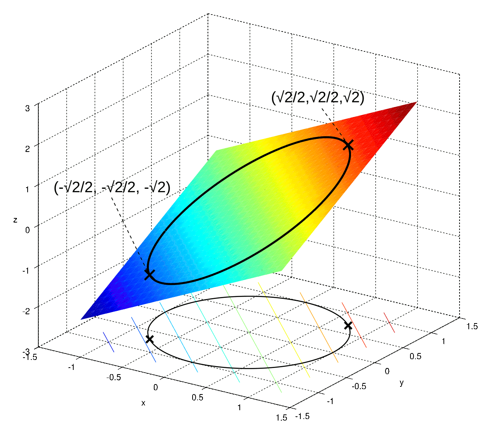

title: NPFL129, Lecture 6
class: title, cc-by-nc-sa
style: .algorithm { background-color: #eee; padding: .5em }
# Kernel Methods, SVM

## Milan Straka

### November 08, 2021

---
section: KernelLR
# Kernel Linear Regression

Consider linear regression with linear, quadratic and cubic features (for
simplicity we consider $x_i$, $x_i x_j$ and $x_i x_j x_k$ for any indices)
computed by feature mapping $φ: ℝ^D → ℝ^{1+D+D^2+D^3}$:
$$φ(→x) = \scriptsize\begin{bmatrix} 1 \\ x_1 \\ x_2 \\ … \\ x_1^2 \\ x_1x_2 \\ … \\ x_2x_1 \\ … \\ x_1^3 \\ x_1^2x_2 \\ … \end{bmatrix}.$$

~~~
The SGD update of a linear regression using a minibatch of examples with indices $→b$ is then
$$→w ← →w - \frac{α}{|→b|}∑\nolimits_{i ∈ →b}\big(φ(→x_i)^T →w - t_i\big) φ(→x_i).$$

---
# Kernel Linear Regression

When the dimensionality of the input is $D$, one step of SGD takes $𝓞(D^3)$ per
example.

~~~
Surprisingly, we can do better under some circumstances. We start by
noting that we can write the parameters $→w$ as a linear combination
of the input feature vectors $φ(→x_i)$.

~~~
By induction, we can start with $→w = 0 = ∑_i 0 ⋅ φ(→x_i)$,
~~~
and assuming $→w = ∑_i β_i ⋅ φ(→x_i)$,
after an SGD update we get
$$\begin{aligned}
→w &← →w - \frac{α}{|→b|}∑_{i ∈ →b} \big(φ(→x_i)^T →w - t_i\big) φ(→x_i)\\
   &← ∑_i \Big(β_i - \big[i ∈ →b\big] ⋅ \frac{α}{|→b|} \big(φ(→x_i)^T →w - t_i\big)\Big) φ(→x_i).
\end{aligned}$$

~~~
Every $β_i$ for $i ∈ →b$ changes to $β_i - \frac{α}{|→b|}\Big(φ(→x_i)^T →w - t_i\Big)$, so after
substituting for $→w$ we get
$$β_i ← β_i - \frac{α}{|→b|}\Big(∑\nolimits_j \big(β_j φ(→x_i)^T φ(→x_j)\big) - t_i\Big).$$

---
# Kernel Linear Regression

We can formulate an alternative linear regression algorithm (a so-called
**dual formulation**):

**Input**: Dataset ($⇉X = \{→x_1, →x_2, …, →x_N\} ∈ ℝ^{N×D}$, $→t ∈ ℝ^N$), learning rate $α ∈ ℝ^+$. 

- set $β_i ← 0$
- compute all values $⇉K_{i,j} = φ(→x_i)^T φ(→x_j)$
- until convergence (or patience runs out), process a minibatch of examples with indices $→b$:
  - simultaneously for all $i ∈ →b$ (the $β_j$ on the right side must
    not be modified during the batch update):
    - $β_i ← β_i - \frac{α}{|→b|}\Big(∑\nolimits_j \big(β_j ⇉K_{i,j}\big) - t_i\Big)$

~~~
The predictions are then performed by computing
$$y(→z) = φ(→z)^T →w = ∑\nolimits_i β_i →φ(→z)^T →φ(→x_i).$$

---
# Bias in Kernel Linear Regression

Until now we did not consider _bias_. Unlike the usual formulation, where we can
“hide” it in the weights, we usually handle it manually in the dual formulation.

~~~
Specifically, if we want to include bias in kernel linear regression, we modify
the predictions to
$$y(→z) = φ(→z)^T →w + b = ∑\nolimits_i β_i →φ(→z)^T →φ(→x_i) + b$$
and update the bias $b$ separately.

~~~
The bias can be updated by SGD, which is what we did in the algorithms until
now; however, if we are considering a bias of an _output layer_, we can
even estimate it as the mean of the training targets before the training
of the rest of the weights.

---
section: Kernels
# Kernel Trick

A single SGD update of a dual-formulation kernel linear regression takes $𝓞(N)$
per example, if we pre-compute all the $𝓞(N^2)$ dot products $φ(→x_i)^T φ(→x_j)$.
Furthermore, inference requires evaluating $𝓞(N)$ dot products $φ(→z)^T φ(→x_i)$.

~~~
Therefore, we need to compute a dot product $φ(→x)^T φ(→z)$ quickly.

~~~
Using the previously-defined $φ$, we get
$$\begin{aligned}
φ(→x)^T φ(→z) &= 1 + ∑_i x_i z_i + ∑_{i,j} x_i x_j z_i z_j + ∑_{i,j,k} x_i x_j x_k z_i z_j z_k \\
              &= 1 + ∑_i x_i z_i + \Big(∑_i x_i z_i\Big)^2 + \Big(∑_i x_i z_i\Big)^3 \\
              &= 1 + →x^T →z + \big(→x^T →z\big)^2 + \big(→x^T →z\big)^3.
\end{aligned}$$

~~~
Therefore, we can compute the dot product $φ(→x)^T φ(→z)$ in $𝓞(D)$ instead of
$𝓞(D^3)$.

---
# Kernels

We define a **kernel** corresponding to a feature map $φ$ as a function
$$K(→x, →z) ≝ φ(→x)^T φ(→z).$$

~~~
There exist quite a lot of kernels, but the most commonly used are the following:

~~~
- **Polynomial kernel of degree $d$**, also called _homogenous polynomial kernel_
  $$K(→x, →z) = (γ →x^T→z)^d,$$
  corresponds to a feature map returning all combinations of exactly $d$ input
  features.
~~~
  \
  Using $(a_1 + … + a_k)^d = ∑_{n_i≥0, ∑n_i=d} \binom{d}{n_1,…,n_k} a_1^{n_1}\cdots a_k^{n_k}$,
  we can verify that
  $$φ(→x) = \left(\sqrt{γ^d\tbinom{d}{n_1,…,n_D}}x_1^{n_1}\cdots x_D^{n_D}\right)_{n_i≥0,\,∑n_i=d}.$$
~~~
  For example, for $d=2$, $φ(x_1, x_2) = γ(x_1^2, \sqrt 2 x_1 x_2, x_2^2)$.

---
# Kernels

- **Polynomial kernel of degree at most $d$**, also called _nonhomogenous
  polynomial kernel_
  $$K(→x, →z) = (γ →x^T→z + 1)^d,$$
  corresponds to a feature map generating all combinations of up to $d$ input
  features.

~~~
  Given that $(γ →x^T→z + 1)^d = ∑_i \binom{d}{i} (γ →x^T→z)^i$, it is not
  difficult to derive that
  $$φ(→x) = \left(\sqrt{γ^{d-n_{D+1}}\binom{d}{n_1,…,n_{D+1}}}x_1^{n_1}\cdots x_D^{n_D}\right)_{n_i≥0,\,∑_{i=1}^{D+1} n_i=d}.$$
~~~
  For example, for $d=2$, $φ(x_1, x_2) = (1, \sqrt{2γ} x_1, \sqrt{2γ} x_2, γx_1^2, \sqrt 2 γ x_1 x_2, γx_2^2)$.

---
# Kernels

- **Gaussian Radial basis function (RBF)** kernel
  $$K(→x, →z) = e^{-γ\|→x-→z\|^2},$$
  corresponds to a scalar product in an infinite-dimensional space; it is
  a combination of polynomial kernels of all degrees.
~~~
  Assuming $γ=1$ for simplicity, we get
  $$e^{-\|→x-→z\|^2}
    = e^{-\|→x\|^2 + 2→x^T →z -\|→z\|^2}
    = ∑_{d=0}^∞ \frac{(2→x^T →z)^d}{d!} e^{-\|→x\|^2 -\|→z\|^2}
    = ∑_{d=0}^∞ \frac{2^d e^{-\|→x\|^2-\|→z\|^2}}{d!} \Big(→x^T →z \Big)^d,$$
~~~
  which is a combination of polynomial kernels; therefore, the feature map
  corresponding to the RBF kernel is
  $$φ(→x) = \left(e^{-γ\|→x\|^2}\sqrt{\frac{(2γ)^d}{d!}\binom{d}{n_1,…,n_D}}x_1^{n_1}\cdots x_D^{n_D}\right)_{d∈\{0,1,2,…\},\,n_i≥0,\,∑_{i=1}^D n_i=d}.$$

---
# Kernels

Note that the RBF kernel is a function of distance – it “weights” more similar
examples more strongly. We could interpret it as an extended version of
k-nearest neighbor algorithm, one which considers all examples, each weighted by
similarity.

~~~
For illustration, we plot RBF kernel values of three points $(0, -1)$, $(1, 1)$
and $(1, -1)$ with different values of $γ$:

---
section: SVM
# Support Vector Machines

Let us return to a binary classification task. The perceptron algorithm
guaranteed finding some separating hyperplane if it existed (but it could
find quite a bad one).

~~~
We now consider finding the one with **maximum margin**.

---
# Support Vector Machines

Assume we have a dataset $⇉X ∈ ℝ^{N×D}$, $→t ∈ \{-1, 1\}^N$, a feature map $φ$
and a model
$$y(→x) ≝ →φ(→x)^T →w + b.$$

~~~

We already know that the distance of a point $→x_i$ to the decision boundary is
$$\frac{|y(→x_i)|}{\|→w\|}
  \stackrel{\substack{\textrm{assuming~}y\textrm{~classifies}\\\textrm{all~}→x_i\textrm{~correctly}}}
    {=\mathrel{\mkern-2.5mu}=\mathrel{\mkern-2.5mu}=\mathrel{\mkern-2.5mu}=\mathrel{\mkern-2.5mu}=\mathrel{\mkern-2.5mu}=\mathrel{\mkern-2.5mu}=}
  \frac{t_i y(→x_i)}{\|→w\|}.$$

~~~
We therefore want to maximize
$$\argmax_{→w,b} \frac{1}{\|→w\|} \min_i \Big[t_i \big(→φ(→x_i)^T →w + b\big)\Big].$$

However, this problem is difficult to optimize directly.

---
# Support Vector Machines

Because the model is invariant to multiplying $→w$ and $b$ by a constant, we can
decide that for the points closest to the decision boundary, it will hold that
$$t_i y(→x_i) = 1.$$

~~~
Then for all the points we will have $t_i y(→x_i) ≥ 1$ and we can simplify
$$\argmax_{→w,b} \frac{1}{\|→w\|} \min_i \Big[t_i \big(→φ(→x_i)^T →w + b\big)\Big].$$
to
$$\argmin_{→w,b} \frac{1}{2} \|→w\|^2 \textrm{~~given that~~}t_i y(→x_i) ≥ 1.$$

---
section: KKT
# Constrained Optimization – Inequality Constraints

Given a function $f(→x)$, we can find its minimum with respect to a vector
$→x ∈ ℝ^d$, by investigating the critical points $∇_{→x} f(→x) = 0$.

~~~
We even we can incorporate constraints of form $g(→x) = 0$ by forming a Lagrangian
$$𝓛(→x, λ) = f(→x) - λg(→x)$$
and again investigating the critical points $∇_{→x,λ} 𝓛(→x, λ) = 0$.

~~~
We now describe how to include inequality constraints $g(→x) ≥ 0$.

---
# Constrained Optimization – Inequality Constraints

 

Our goal is to find a minimum of $f(→x)$ subject to a constraint $g(→x) ≥ 0$.

We start by again forming a Lagrangian $f(→x) - λg(→x)$.

~~~
The optimum can either be attained for $g(→x) > 0$, when the constraint is said
to be **inactive**, or for $g(→x) = 0$, when the constraint is said to be
**active**.
~~~
In the inactive case, the minimum is again a critical point of the Lagrangian
with the condition $λ=0$.

~~~
When minimum is on a boundary, it corresponds to a critical point
with $λ≠0$ – but note that this time the sign of the multiplier matters, because
minimum is attained only when gradient of $f(→x)$ is oriented **into** the region
$g(→x) ≥ 0$. We therefore require $∇f(→x) = λ∇g(→x)$ for $λ>0$.

~~~
In both cases, $λ g(→x) = 0$.

---
# Minimization – Inequality Constraint

Let $f(→x): ℝ^d → ℝ$ be a function, which has a minimum in $→x$ subject to
an inequality constraint $g(→x) ≥ 0$. Assume that both $f$ and $g$ have continuous
partial derivatives and that $\frac{∂g}{∂x}(→x) ≠ 0$.

~~~

Then there exists a $λ ∈ ℝ$, such that the **Lagrangian function**
$$𝓛(→x, λ) ≝ f(→x) - λg(→x)$$
has zero gradient in $→x$ and the following conditions hold:
$$\begin{aligned}
g(→x) &≥ 0, \\
λ &≥ 0, \\
λ g(→x) &= 0.
\end{aligned}$$

These conditions are known as **Karush-Kuhn-Tucker (KKT)** conditions.

---
# Minimization – Inequality Constraint

It is easy to verify that if we have the minimum $→x$ and $λ$ fulfilling
the KKT conditions $g(→x) ≥ 0, λ ≥ 0, λ g(→x) = 0,$
the Langrangian $𝓛$ has a **maximum** in $λ$:
~~~
- if $g(→x) = 0$, then $𝓛$ does not change when changing $λ$,
~~~
- if $g(→x) > 0$, then $λ=0$ from the KKT conditions, which is a maximum of $𝓛$.

~~~
On the other hand, if we have the minimum $→x$, $λ ≥ 0$ and $𝓛$ has a maximum
in $λ$, all the KKT conditions must hold:
~~~
- if $g(→x) < 0$, then increasing $λ$ would increase $𝓛$,
~~~
- if $g(→x) > 0$, then decreasing $λ$ increase $𝓛$, so $λ = 0$.

~~~
#### Maximizing Given $f(→x)$

If we instead want to find constrained maximum of $f(→x)$, we can search for
the minimum of $-f(→x)$, which results in the Lagrangian $f(→x) + λg(→x)$,
which we _minimize_ with respect to $λ$.

---
# Necessary and Sufficient KKT Conditions

The KKT conditions are necessary conditions for a minimum (resp. a maximum).

~~~
However, it can be proven that in the following settings, the conditions are
also **sufficient**:
- if the objective to optimize is a _convex_ function (resp. _concave_ for maximization)
  with respect to $→x$;
~~~
- the inequality constraints are continuously differentiable convex functions;
~~~
- the equality constraints are affine functions (linear functions with an
  offset).

~~~
Therefore, if the above holds and if we find $→x$ and $λ$ such that:
- $\frac{∂𝓛}{∂→x} = 0$,
~~~
- either
  - $g(→x) ≥ 0$, $λ ≥ 0$, $λ g(→x) = 0$,
~~~
  - or $λ ≥ 0$ and $𝓛$ has a _maximum_ in 𝓛,

~~~
then $→x$ is a minimum of the function $f(→x)$ subject to an inequality
constraint $g(→x) ≥ 0$.

~~~
It is easy to verify that these conditions hold for the SVM optimization
problem.

---
section: Dual SVM Formulation
# Support Vector Machines

In order to solve the constrained problem of
$$\argmin_{→w,b} \frac{1}{2} \|→w\|^2 \textrm{~~given that~~}t_i y(→x_i) ≥ 1,$$
~~~
we write the Lagrangian with multipliers $→a=(a_1, …, a_N)$ as
$$𝓛 = \frac{1}{2} \|→w\|^2 - ∑_i a_i \big[t_i y(→x_i) - 1\big].$$

~~~
Setting the derivatives with respect to $→w$ and $b$ to zero, we get
$$\begin{aligned}
→w =& ∑_i a_i t_iφ(→x_i), \\
 0 =& ∑_i a_i t_i. \\
\end{aligned}$$

---
# Support Vector Machines

Substituting these to the Lagrangian, we get
$$𝓛 = ∑\nolimits_i a_i -  \frac{1}{2} ∑\nolimits_i ∑\nolimits_j a_i a_j t_i t_j K(→x_i, →x_j)$$
with respect to the constraints $a_i ≥ 0$, $∑_i a_i t_i = 0$
and a kernel $K(→x, →z) = φ(→x)^T φ(→z).$

~~~
The solution of this Lagrangian will fulfil the KKT conditions, meaning that
$$\begin{aligned}
a_i &≥ 0, \\
t_i y(→x_i) - 1 &≥ 0, \\
a_i \big(t_i y(→x_i) - 1\big) &= 0.
\end{aligned}$$

~~~
Therefore, either a point $→x_i$ is on a boundary, or $a_i=0$. Given that the
prediction for $→x$ is $y(→x) = ∑_i a_i t_i K(→x, →x_i) + b$,
we only need to keep the training points $→x_i$ that are on the boundary, the
so-called **support vectors**. Therefore, even though SVM is a nonparametric
model, it needs to store only a subset of the training data.

---
# Support Vector Machines

The dual formulation allows us to use non-linear kernels.

