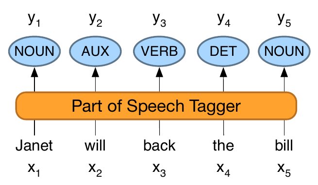
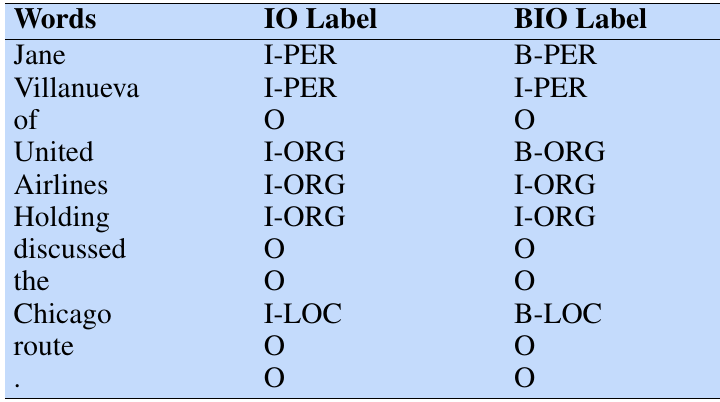
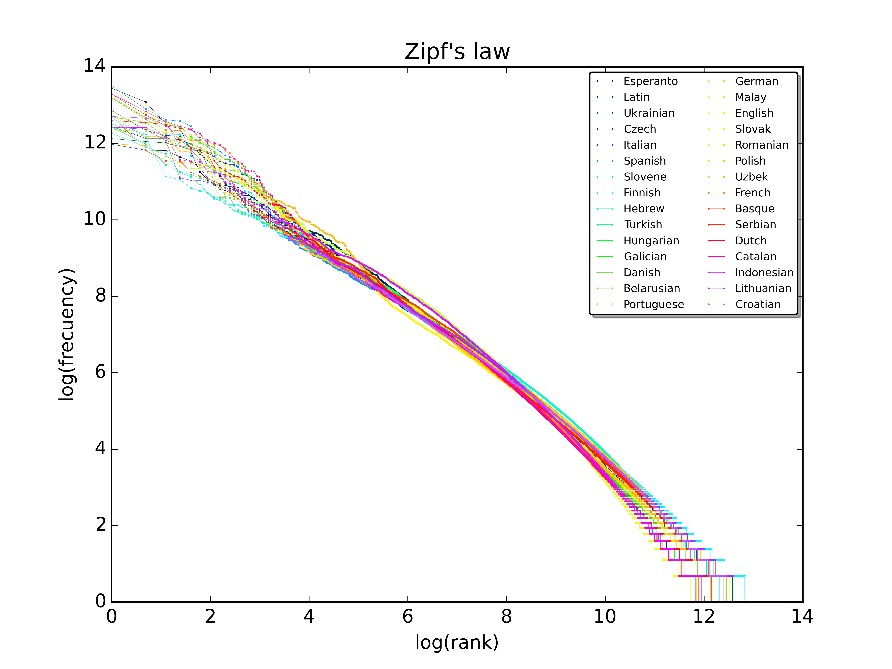
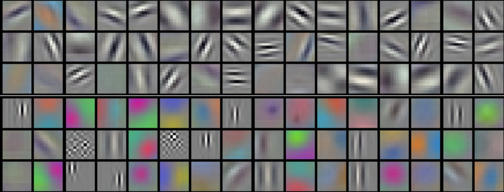
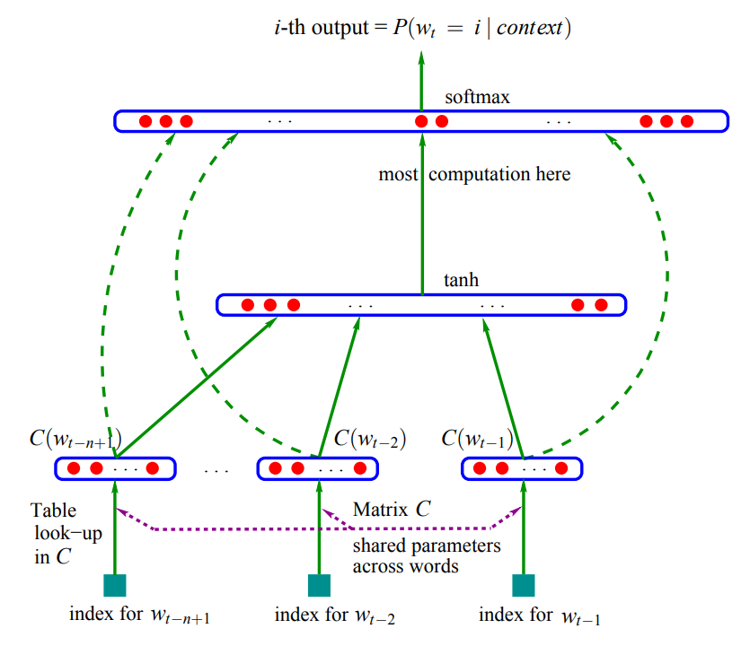

title: NPFL129, Lecture 6
class: title, cc-by-sa
style: .algorithm { background-color: #eee; padding: .5em }

# Representing Text (TF-IDF, Word2vec)

## Zdeněk Kasner  <small style="color: #666"><i>reusing materials by Jindřich Libovický and Milan Straka</i></small>

### November 11, 2025

---
class: middle
# Today's Lecture Objectives

After this lecture you should be able to

- Use TF-IDF for representing documents and explain its information-theoretical
  interpretation.

- Explain training of Word2Vec as a special case of logistic regression.

- Use pre-trained word embeddings for simple NLP tasks.

---
section: EvalNLP
class: section
# Evaluation in Natural Language Processing

---
# Metrics for Exemplary NLP Tasks

**Part-of-speech tagging**: assign a part-of-speech to every word in the input text.
~~~

Exactly one class is predicted for every word.

~~~

*Accuracy* is the same as micro-averaged precision, recall, and $F_1$-score,
    because TP+FP = TP+FN.

~~~

**Named entity recognition**: recognize personal names, 
organizations, and locations in the input text.

~~~

Many words are not a named entity → *accuracy* is artificially high.

~~~

*Micro-averaged* $F_1$ considers all named entities:
    “how good are we at recognizing all present named entities”.

~~~
*Macro-averaged* $F_1$:
    “how good are we at recognizing all named entities **types**”.

---
class: middle
# Metrics for Exemplary NLP Tasks

**Document classification**: assign the document to relevant categories (topics).
~~~

An input example can be categorized into multiple topics → multi-label classification.

~~~

Accuracy is very strict (all predicted classes must be exactly the same).

~~~

Commonly evaluated using micro-averaged or macro-averaged $F_1$-score.

---
section: TF-IDF
class: section
# TF-IDF

---
class: middle
# Document Representation

We already know how to represent images and categorical variables (classes,
letters, words, …).

~~~
Now consider the problem of representing a whole _document_.

~~~
An elementary approach is to represent a document as a **bag of words** – we
create a feature space with a dimension for every unique word (or for character
sequences), called a **term**.

~~~
However, there are many ways in which the values of the terms can be set.

---
# Term Frequency – Inverse Document Frequency

Commonly used ways of setting the term values:

- **binary indicators**: 1/0 depending on whether a term is present in
  a document or not;

~~~
- **term frequency (TF)**: relative frequency of a term in a document;
  $$\mathit{TF}(t; d) = \frac{\textrm{number of occurrences of $t$ in the document $d$}}{\textrm{number of terms in the document $d$}}$$
~~~
- **inverse document frequency (IDF)**: we could also represent a term using
  self-information of a probability of a random document containing it (therefore,
  terms with lower document probability have higher weights);
  $$\mathit{IDF}(t)
    = \log \frac{\textrm{number of documents}}{\textrm{number of documents containing $t$ }\big(\textrm{optionally} + 1)}
    = I\big(P(t ∈ d)\big)
  $$
~~~
- **TF-IDF**: empirically, product $\mathit{TF} ⋅ \mathit{IDF}$
  reflects quite well how important a term is to a document in a corpus
  (used by the majority of text-based recommender systems in 2010s).

---
class: middle
# Original Motivation

Jones (1972) provided only intuitive justification.

**Zipf's law**: empirically, word frequencies follow

$$\text{word frequency} \propto \frac{1}{\text{word rank}}$$

I.e., $\frac{\normalsize |𝓓|}{\normalsize |\{d∈𝓓:t∈d\}|}$ would be extremely
low for frequent words, and high for infrequent ones. 

Logarithm normalizes that.

---
section: MutualInformation
class: section
# Mutual Information

---
# Mutual Information

Consider two random variables $⁇x$ and $⁇y$ with distributions $⁇x ∼ X$ and $⁇y ∼ Y$.
~~~

The conditional entropy $H(Y | X)$ can be naturally considered an expectation of
a self-information of $Y | X$, so in the discrete case,
~~~
$$H(Y | X) = 𝔼_{⁇x,⁇y} \big[I(y|x)\big] = -∑_{x,y} P(x, y) \log P(y | x).$$

~~~
In order to assess the amount of information _shared_ between the two
random variables, we might consider the difference
$$\textcolor{red}{H(Y)} - \textcolor{blue}{H(Y | X)}
  = 𝔼_{⁇x,⁇y} \big[\textcolor{red}{-\log P(y)}\big] - 𝔼_{⁇x,⁇y} \big[\textcolor{blue}{-\log P(y|x)}\big]
  = 𝔼_{⁇x,⁇y} \left[\log\frac{\textcolor{blue}{P(x, y)}}{\textcolor{blue}{P(x)} \textcolor{red}{P(y)}}\right].$$

~~~
We can interpret this value as

> _How many bits of information will we learn about $Y$ when we find out $X$?_

---
# Mutual Information

Let us denote this quantity as the **mutual information** $I(X; Y)$:
$$I(X; Y) = 𝔼_{⁇x,⁇y} \left[\log\frac{P(x, y)}{P(x)P(y)}\right].$$

~~~
- The mutual information is symmetrical, so
  $$I(X; Y) = I(Y; X) = H(Y) - H(Y|X) = H(X) - H(X | Y).$$

~~~
- It is easy to verify that
  $$I(X; Y) = D_\textrm{KL}\big(P(X, Y) \| P(X) P(Y)\big).$$

~~~
  Therefore,
  - $I(X; Y) ≥ 0$,
  - $I(X; Y) = 0$ iff $P(X, Y) = P(X) P(Y)$ iff the random variables are
    independent.

---
# TF-IDF as Mutual Information

Let $𝓓$ be a collection of documents and $𝓣$ a collection of terms.

~~~
We assume that whenever we need to draw a document, we do it
uniformly randomly. Then,
~~~
- $P(d) = 1/|𝓓|$ and $I(d) = H(𝓓) = \log |𝓓|$,

~~~
- $P(d|t∈d) = 1/|\{d∈𝓓:t∈d\}|$,
~~~
- $I(d|t∈d) = H(𝓓|t) = \log |\{d∈𝓓:t∈d\}|$, assuming $0 ⋅ \log 0 = 0$ in $H$ as usual,
~~~
- $I(d) - I(d|t∈d) = H(𝓓) - H(𝓓|t) = \log \frac{\normalsize |𝓓|}{\normalsize |\{d∈𝓓:t∈d\}|} = \mathit{IDF}(t).$

~~~
Finally, we can compute the mutual information $I(𝓓; 𝓣)$ as
$$I(𝓓; 𝓣)
  = ∑_{d,\,t∈d} \textcolor{red}{P(d)} ⋅ \textcolor{blue}{P(t|d)} ⋅ \textcolor{darkgreen}{\big(I(d) - I(d|t)\big)}
  = \textcolor{red}{\frac{1}{|𝓓|}} ∑_{d,\,t∈d} \textcolor{blue}{\mathit{TF}(t;d)} ⋅ \textcolor{darkgreen}{\mathit{IDF(t)}}.
$$

~~~
Therefore, summing all TF-IDF terms recovers the mutual information between $𝓓$
and $𝓣$, and we can say that each TF-IDF carries a “bit of information” attached
to a document-term pair.

---
section: Word2Vec
class: section
# Word2Vec

---
# Representation Learning

We interpreted MLP as automatic feature extraction for a generalized linear
  model.
~~~

Representation learning: learning using a proxy task that leads to reusable
  features.

~~~

Famous example: pre-training image representations using **object classification**:

~~~
\
Can we learn such features for **representing text**?

---
# Word Embeddings

We represent an input word with a one-hot
  vector (assuming a limited vocabulary).

~~~

Multiplying the one-hot vector with a weight matrix = picking a row from the weight
  matrix.

~~~

We call this row a <b>word embedding</b>.

---
# Origins of Word Embeddings

In 2003, Bengio et al. used MLP for language modeling: predicting a probability of the next word.

They reused the embedding matrix for all input words (regardless of their position).

---
# Origins of Word Embeddings

Collobert et al. (2011) first reused word embeddings as features for other NLP tasks.

Geometric properties: neighbors in the embedding space are semantically similar words.

In a downstream task, we can learn something also for words that **were not in training data** but are similar to some that were.

---
# Word2Vec

<big>How to get the word embeddings without training a computationally expensive model?</big>

~~~

1. Simplify the **input context**: treat it as a bag of words.

2. Simplify the **model architecture**: turn it to a linear model.

~~~

---
class: middle
# Word2Vec: Skip-gram Sampling

---
# SkipGram: Basic Formulation

For each word $w$ from the vocabulary $V$, we want to learn a $d$-dimensional embedding vector $\boldsymbol{e}_w \in \mathbb{R}^d$.

~~~

We train a feed-forward model with two layers:

~~~ 

- The first layer is the input embedding matrix $\boldsymbol{E} \in \mathbb{R}^{|V| \times  d}$ (without any non-linearity).

~~~

- The second layer is the output matrix $\boldsymbol{W} \in \mathbb{R}^{d \times |V|}$ followed by the $\operatorname{softmax}$ activation function.

~~~

The model computes the probability of words $c \in V$ appearing in the context of $w$.

~~~

After training, we use the rows of the embedding matrix $\boldsymbol{E}$ as word embeddings (in Word2Vec, the output matrix gets discarded).

~~~

---
# SkipGram: Towards Better Efficiency
The vocabulary $V$ contains $\sim 10^5-10^6$ word forms
  $\Rightarrow$ computing the $\operatorname{softmax}$ would be expensive.

~~~

To solve this, we turn the problem into **binary classification**: we predict the probability for each pair of words independently using logistic regression.

~~~

For the input word $w$ with an embedding $\boldsymbol{e}_w \in \boldsymbol{E}$ and the context word $c_i$ with an output embedding $\boldsymbol{v}_{c_i} \in \boldsymbol{W}$, we compute the probability of their co-occurence as:
$$P(c | w) = \sigma (\boldsymbol{e}_w^T\boldsymbol{v}_c).$$

~~~
We compute the loss as $-\log \sigma (\boldsymbol{e}_w^T\boldsymbol{v}_{c_i})$.

~~~
\
More generally, we say that $\sigma\left( EW \right)_{i,j}$ estimates a table of $|V| \times |V|$ with probabilities that $j$-th word is in the neighbor window of $i$-th word.

---
# SkipGram: Negative Sampling

In the previous formulation, our model was given only  positive examples: each pair of words $w$ and $c$ **do** occur in the same context.

~~~

To present the model with negative examples, we also sample $K$ words $c_j$ that are **not** in the context window.

~~~

These words contribute to the loss function:
$$L = \textcolor{green}{-\log \sigma (\boldsymbol{e}_w^T\boldsymbol{v}_{c_i})} \textcolor{magenta}{- \sum_{j=1}^K \log( 1 - \sigma (\boldsymbol{e}_w^T \boldsymbol{v}_{c_j} ))}.$$

~~~
The usual value of negative samples is $K=5$, but it can be even $K=2$ for extremely large corpora.

---
class: middle,center
# Interesting Properties of Word2Vec

Vector arithmetics seems to capture lexical semantics.

 

---
# Using Word Embeddings

We can use word embeddings for downstream NLP tasks.

~~~
**Text classification**
- Tasks: topic classification, sentiment analysis, natural language inference.

- Problem: we need a fixed-length representation for a text variable length.

- Solution: compute an average or sum over the sequence of embeddings.

~~~

**Token classification** (also called sequence labeling):
- Tasks: POS tagging, named entity recognition, extractive summarization.

- Problem: we would like to integrate a context for each word.

- Solution: use a sliding window over embeddings and classify the middle one.

---
class: middle
# More Recent Word Embeddings

- [GloVe](https://nlp.stanford.edu/projects/glove/) (Global Vectors): Takes into account global co-occurences of words.

- [FastText](https://fasttext.cc): Word embedding is a sum of substring embeddings → can generate embeddings of unseen words.

- [Backpack Language Models](https://arxiv.org/abs/2305.16765) (Hewitt et al., 2023): combining multiple sense vectors for each word.

- State of the art: contextual embeddings ([BERT](https://arxiv.org/abs/1810.04805)), large language models ([LLM2Vec](https://mcgill-nlp.github.io/llm2vec/)).

---
class: summary
# Today's Lecture Objectives

After this lecture you should be able to:

- Use TF-IDF for representing documents and explain its information-theoretical
  interpretation.

- Explain training of Word2Vec as a special case of logistic regression.

- Use pre-trained word embeddings for simple NLP tasks.

