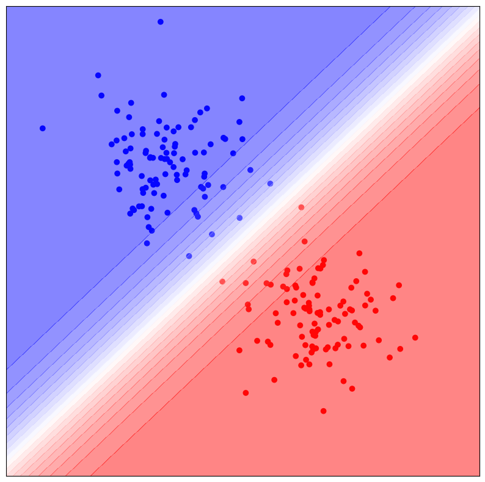
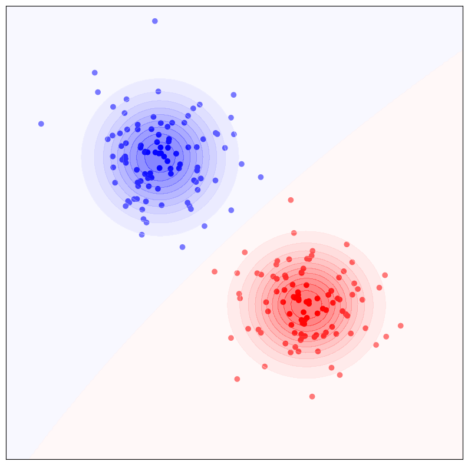

title: NPFL129, Lecture 7
class: title, cc-by-sa
style: .algorithm { background-color: #eee; padding: .5em }
# k-NN, Naive Bayes

## Jindřich Libovický <small>(reusing materials by Milan Straka)</small>

### November 18, 2024

---
class: middle
# Today's Lecture Objectives

After this lecture you should be able to

- Implement and use $k$-nearest neighbors for classification and regression

- Explain the very basic principles of Bayesian thinking

- Implement and use Naive Bayes Classifier

---
section: k-NN
class: section
# k-Nearest Neighbors

---
# k-Nearest Neighbors

A simple but sometimes effective nonparametric method for both classification
and regression is **$\boldsymbol k$-nearest neighbors** algorithm.

~~~
The training phase of the $k$-nearest neighbors algorithm is trivial:
only storing the whole train set (the so-called **lazy learning**).

~~~
For a given test example, the main idea is to use the targets of the most
similar training data to perform the prediction.

---
# k-Nearest Neighbors: Hyperparameters

Several hyperparameters influence the behavior of the prediction phase:

~~~
- **k**: consider $k$ most similar training examples (higher $k$ usually
  decreases variance, but increases bias);

~~~
- **metric**: a function used to find the nearest neighbors; common choices
  are metrics based on $L^p$ norms (usual values of $p$: $1$, $2$, $3$, $∞$).
  For $→x, →y ∈ ℝ^D$, the distance is measured as $\|→x-→y\|_p$, where
  $$\|→x\|_p = \Big(∑\nolimits_i |x_i|^p\Big)^{1/p};$$
~~~
- **weights**: optionally, more similar examples get higher weights:
  - _uniform_: all $k$ nearest neighbors weighted equally;
  - _inverse_: the weights are proportional to the inverse of distance;
  - _softmax_: the weights are proportional to the $\softmax$ of negative distances.

---
# k-Nearest Neighbors

### Regression

To perform regression when $k$ nearest neighbors have values $t_i$ and weights
$w_i$, we predict
$$t = ∑_i \frac{w_i}{∑\nolimits_j w_j} ⋅ t_i.$$

~~~
### Classification

For uniform weights, we can use **voting** during prediction – the most
frequent class is predicted (with ties broken arbitrarily).

~~~

Otherwise, we weight the categorical distributions $→t_i ∈ ℝ^K$ (classification
into $K$ target classes represented using one-hot encoding), predicting a
distribution

$$→t = ∑_i \frac{w_i}{∑\nolimits_j w_j} ⋅ →t_i.$$
The predicted class is the one with the largest probability, i.e.,
$\argmax\nolimits_k ∑_i w_i t_{i,k}$.

---
# k-Nearest Neighbors

A trivial implementation of the $k$-nearest neighbors algorithm is extremely
demanding during the inference, requiring to measure distances of a given
example to all training instances.

~~~
However, there exist several data structures that can speed up the $k$-nearest
neighbor search, such as
- $k$-$d$ trees, which allow both a static or dynamic construction and can perform
  nearest neighbor queries of uniformly random points in logarithmic time on
  average, but which become inefficient for high-dimensional data;

- ball trees, R-trees, …

---
class: middle
# Applications of Nearest Neighbors

- Typically in combination with representation learning
- Recommendation systems (e.g., for similar videos)
- Anonymous face recognition in photo collections

---
section: BayesianProbability
class: section
# Bayesian Probability

---
# Bayesian Probability

Until now, we considered the so-called _frequentist probability_, where the
probability of an event is considered a limit of its frequency.

~~~
In _Bayesian probability_ interpretation, probability is a quantification
of **uncertainty**.
~~~
Bayesian probability is the so-called _evidential_ probability, where hypotheses
have some initial **prior probability**, which is then updated in light of _new
data_ into **posterior probability**.

~~~
This update of prior probability into posterior probability is performed using
the Bayes theorem
$$P(A | B) = \frac{P(B | A) P(A)}{P(B)}.$$

---
# Textbook Example

1 of 10,000 products has a rare defect. We can detect it with both sensitivity and specificity of 99%. What is $P(\text{defect}|\text{positive})$?

~~~

$$
P(\text{def} | \text{pos}) = \frac{\overbrace{P(\text{pos}|\text{def})}^\text{sensitivity}P(\text{def})}{P(\text{pos})}
$$

~~~

Now, we need to compute the denomniator $P(\text{pos})$ by splitting into joint probabilities:

$
P(\text{pos}, \text{def}) + P(\text{pos}, \neg\text{def}) = P(\text{pos}|\text{def})P(\text{def}) + (1 - \underbrace{P(\neg\text{pos} | \neg\text{def})}_\text{specificity})(1 - P(\text{def}))
$

~~~

Together

$$P(\text{def}|\text{pos}) = \frac{.99 \cdot 10^{-4}}{.99 \cdot 10^{-4} + (1 - .99)(1 - 10^{-4})} \approx 0.98\%

---
class: center
# Textbook Example: How accurate do we need to be?

 

~~~

Moral: seemingly high-performing classifier might not be that high-performing.

---
# Librarian or Farmer

> _As you consider the next question, please assume that Steve was selected at
> random from a representative sample. An individual has been described by
> a neighbor as follows: “Steve is very shy and withdrawn, invariably helpful
> but with little interest in people or in the world of reality. A meek and tidy
> soul, he has a need for order and structure, and a passion for detail.” Is
> Steve more likely to be a librarian or a farmer?_

~~~
The given description corresponds more to a librarian than to a farmer.

~~~
However, there are many more farmers than librarians (for example, in 2016
there were 4.33k librarians and 130.3k regular agricultural workers in the Czech
Republic, a 30:1 ratio).

~~~
The description being more fitting for a librarian is in fact a _likelihood_,
while the base rates of librarians and farmers play the role of a _prior_,
and the whole question asks about the _posterior_:
$$P(\textit{librarian} | \textit{description}) ∝ P(\textit{description} | \textit{librarian}) ⋅ P(\textit{librarian}).$$

 
<small>The example is taken from the Thinking, Fast and Slow by D. Kahneman</small>

---
section: MAP
class: section
# Maximum A Posteriori Estimation

---
# Maximum A Posteriori Estimation

We demonstrate the Bayesian probability on model fitting.

~~~
Recall the maximum likelihood estimation
$$→w_\mathrm{MLE} = \argmax_{→w} p(⇉X; →w) = \argmax_{→w} p(⇉X | →w).$$

~~~
In the Bayesian interpretation, we capture our initial assumptions about $→w$
using a prior probability $p(→w)$.
~~~
The effect of observing the data $⇉X$ can be then expressed as
$$p(→w | ⇉X) = \frac{p(⇉X | →w) p(→w)}{p(⇉X)}.$$

~~~
The quantity $p(⇉X | →w)$ is evaluated using fixed data $⇉X$ and quantifies how
probable the observed data is with respect to various values of the parameter
$→w$. It is therefore a **likelihood**, because it is a function of $⇉w$.

---
# Maximum A Posteriori Estimation

Therefore, we get that
$$\underbrace{p(→w | ⇉X)}_\textrm{posterior} ∝ \underbrace{p(⇉X | →w)}_\textrm{likelihood} ⋅ \underbrace{p(→w)}_\textrm{prior},$$
where the symbol $∝$ means “up to a multiplicative factor”.

~~~
Using the above Bayesian inference formula, we can define
**maximum a posteriori (MAP)** estimate as
$$→w_\mathrm{MAP} = \argmax_{→w} p(→w | ⇉X) = \argmax_{→w} p(⇉X | →w) p(→w).$$

~~~
To utilize the MAP estimate for model training, we need to specify the
parameter prior $p(→w)$, our _preference_ among models.

~~~
Bayesian view on overfitting: it is just a problem of not using priors and that
suitable priors would avoid it.

---
# L2 Regularization as MAP

Frequently, the mean is assumed to be zero, and the variance is assumed to be
$σ^2$. Given that we have no further information, we employ the maximum entropy
principle, which provides us with $p(w_i) = 𝓝(w_i; 0, σ^2)$, so that $p(→w)
= ∏_{i=1}^D 𝓝(w_i; 0, σ^2) = 𝓝(→w; ⇉0, σ^2 ⇉I).$
~~~
Then
$$\begin{aligned}
→w_\mathrm{MAP} &= \argmax_{→w} p(⇉X | →w) p(→w) \\
                &= \argmax_{→w} ∏\nolimits_{i=1}^N p(→x_i | →w) p(→w) \\
                &= \argmin_{→w} ∑\nolimits_{i=1}^N \Big(-\log p(→x_i | →w) - \log p(→w)\Big). \\
\end{aligned}$$
~~~

By substituting the probability of the Gaussian prior, we get
$$→w_\mathrm{MAP} = \argmin_{→w} ∑\nolimits_{i=1}^N \Big(-\log p(→x_i | →w) {\color{gray} + \frac{D}{2} \log(2πσ^2)} + \frac{\|→w\|^2}{2σ^2}\Big),$$

which is in fact the $L^2$-regularization.

---
# Conjugate Distributions

- In Bayesian thinking, we typically think about distribution over parameters.
~~~
- After one coin toss (Bernoulli distribution), we do not believe there is a 100% probability of what happened because we had a prior belief of how a coin behaves.
~~~
- We believed the parameter $p$ was distributed somehow and after the observation we believe in something else (by applying the Bayes theorem).
~~~
- Conjugate distribution: prior and posterior are of the same family.
~~~
- Instead of confidence intervals, credibility intervals over the parameters.

---
section: NaiveBayes
class: section
# Naive Bayes Classifier

---
# Naive Bayes Classifier: Overview

So far, our classifiers were so-called **discriminative** and had a form
$$p(C_k|→x) = p(C_k | x_1, x_2, …, x_D).$$

~~~
Instead, we might use the Bayes' theorem, and rewrite the conditional
probability to
$$p(C_k|→x) = \frac{p(→x | C_k) p(C_k)}{p(→x)}.$$

~~~
Then, classification could be performed as
$$\argmax_k p(C_k|→x) = \argmax_k \frac{p(→x | C_k) p(C_k)}{p(→x)} = \argmax_k p(→x | C_k) p(C_k).$$

~~~
Therefore, instead of modeling $p(C_k|→x)$, we model
- the prior $p(C_k)$ according to the distribution of classes in the data, and
- the distribution $p(→x | C_k)$.

---
# Naive Bayes Classifier: The Naive Assumption

Modeling the distribution $p(→x | C_k)$ is difficult – $→x$ can be
high-dimensional structured data.

~~~
Therefore, the so-called **Naive Bayes classifier** assumes that
> _all $x_d$ are independent given $C_k$,_

~~~
so we can rewrite
$$p(→x | C_k) = p(x_1 | C_k) p(x_2 | C_k, x_1) p(x_3 | C_k, x_1, x_2) ⋯ p(x_D | C_k, x_1, x_2, …)$$
to
$$p(→x | C_k) = ∏\nolimits_{d=1}^D p(x_d | C_k).$$

~~~
Modeling $p(x_d | C_k)$ is substantially easier because it is
a distribution over a single-dimensional quantity.

---
# Naive Bayes Classifier

There are in fact several naive Bayes classifiers, depending on the distribution
$p(x_d | C_k)$.

### Gaussian Naive Bayes

In Gaussian naive Bayes, we expect a continuous feature to have normal
distribution for a given $C_k$, and model $p(x_d | C_k)$ as a normal
distribution $𝓝(μ_{d, k}, σ_{d, k}^2)$.

~~~
Assuming we have the training data $⇉X$ together with $K$-class classification targets $→t$,
the “training” phase consists of estimating the parameters $μ_{d,k}$ and
$σ_{d,k}^2$ of the distributions $𝓝(μ_{d, k}, σ_{d, k}^2)$ for $1 ≤ d ≤ D$,
$1 ≤ k ≤K$, employing the maximum likelihood estimation.

~~~
Now let feature $d$ and class $k$ be fixed and let $→x_1, →x_2, …, →x_{N_k}$ be the
training data _corresponding to the class $k$_.
~~~
We already know that maximum likelihood estimation using ${N_k}$ samples drawn from
a Gaussian distribution $𝓝(μ_{d, k}, σ_{d, k}^2)$ amounts to
$$\argmin_{μ_{d, k}, σ_{d, k}} \frac{N_k}{2} \log (2 π σ_{d,k}^2) + ∑_{i=1}^{N_k} \frac{(x_{i,d}- μ_{d,k})^2}{2σ_{d,k}^2}.$$

---
# Gaussian Naive Bayes

Setting the derivative with respect to $μ_{d,k}$ to zero results in
$$0 = ∑\nolimits_{i=1}^{N_k} \frac{-2 (x_{i,d} - μ_{d,k})}{2σ_{d,k}^2},$$
~~~
which we can rewrite to $μ_{d,k} = \frac{1}{N_k} ∑_{i=1}^{N_k} x_{i,d}$.

~~~
Similarly, zeroing out the derivative with respect to $σ_{d,k}^2$ gives
$$0 = \frac{N_k}{2σ_{d,k}^2} - \frac{1}{2(σ_{d,k}^2)^2} ∑\nolimits_{i=1}^{N_k} (x_{i,d} - μ_{d,k})^2,$$

~~~
from which we obtain $σ_{d,k}^2 = \frac{1}{N_k} ∑_{i=1}^{N_k} (x_{i,d} - μ_{d,k})^2$.

~~~
However, the variances are usually smoothed (increased) by a given constant $α$
to avoid too sharp distributions (in Scikit-learn, the default value of $α$ is
$10^{-9}$ times the largest variance of all features).

---
# Gaussian Naive Bayes Example

---
# Bernoulli Naive Bayes

When the input features are binary, the $p(x_d | C_k)$ might be modeled using a Bernoulli
distribution
$$p(x_d | C_k) = p_{d, k}^{x_d} ⋅ (1 - p_{d, k})^{(1-x_d)}.$$

~~~
We can therefore write

$$p(C_k | →x) ∝ \Big(∏\nolimits_{d=1}^D p_{d, k}^{x_d} ⋅ (1 - p_{d, k})^{(1-x_d)}\Big) p(C_k),$$

~~~
and by computing a logarithm we get

$$\log p(C_k | →x) + c = \log p(C_k) + ∑\nolimits_d \big(x_d \log \tfrac{p_{d, k}}{1-p_{d,k}} + \log(1-p_{d,k})\big) = b_k + →x^T →w_k,$$

~~~
where the constant $c$ does not depend on $C_k$ and is therefore not needed for
prediction
$$\argmax\nolimits_k \log p(C_k|→x) = \argmax\nolimits_k b_k + →x^T →w_k.$$

---
# Bernoulli Naive Bayes Estimation: Derivation

To estimate the probabilities $p_{d, k}$, we turn again to the maximum
likelihood estimation.
~~~
The log-likelihood of ${N_k}$ samples drawn from Bernoulli distribution
with parameter $p_{d,k}$ is
$$∑\nolimits_{i=1}^{N_k} \log\big(p_{d,k}^{x_{i,d}} (1 - p_{d,k})^{1-x_{i,d}}\big)
= ∑\nolimits_{i=1}^{N_k} \big(x_{i,d} \log p_{d,k} + (1 - x_{i,d}) \log (1 - p_{d,k})\big).$$

~~~
Setting the derivative with respect to $p_{d,k}$ to zero, we obtain
$$0
= ∑\nolimits_{i=1}^{N_k} \left(\frac{x_{i,d}}{p_{d,k}} - \frac{1 - x_{i,d}}{1 - p_{d,k}}\right)
= \frac{1}{p_{d,k} (1 - p_{d,k})} ∑\nolimits_{i=1}^{N_k} \Big((1 - p_{d,k}) x_{i,d} - p_{d,k} (1 - x_{i,d})\Big),$$
giving us $p_{d,k} = \frac{1}{N_k} ∑_{i=1}^{N_k} x_{i,d}$.

---
# Bernoulli Naive Bayes Estimation: Smoothing

We could therefore estimate the probabilities $p_{d,k}$ as
$$p_{d, k} = \frac{\textrm{number of documents of class $k$ with nonzero feature $d$}}{\textrm{number of documents of class $k$}}.$$

~~~
However, if a feature $d$ is always set to one (or zero) for a given
class $k$, then $p_{d,k} = 1$ (or 0). That is impractical because
the resulting classifier would give probability zero to inputs with the
opposite value of such a feature.

~~~
Therefore, **Laplace** or **additive smoothing** is used, and the probability
$p_{d,k}$ estimated as
$$p_{d, k} = \frac{\textrm{number of documents of class $k$ with nonzero feature $d$ + α}}{\textrm{number of documents of class $k$ + 2α}}$$
for some pseudo-count $α > 0$.

~~~
Note that even if this technique has a special name, it corresponds to using
a _maximum a posteriori_ estimate, using $\operatorname{Beta}(α+1, α+1)$ as
a prior distribution.

---
class: dbend
# Multinomial Naive Bayes

The last variant of naive Bayes we will describe is the **multinomial naive
Bayes**, where $p(→x | C_k)$ is modeled to be multinomial distribution, $p(→x | C_k) ∝ ∏_d p_{d,k}^{x_d}$.

~~~
Similarly to the Bernoulli NB case, we can write the log-likelihood as
$$\log p(C_k | →x) + c = \log p(C_k) + ∑\nolimits_d x_d \log p_{d, k} = b_k + →x^T →w_k.$$

---
class: dbend
# Multinomial Naive Bayes Estimation

As in the previous cases, we turn to the maximum likelihood estimation
in order to find out the values of $p_{d, k}$.
~~~
We start with the log-likelihood
$$∑\nolimits_{i=1}^{N_k} \log\Big(∏\nolimits_d p_{d,k}^{x_{i,d}}\Big)
= ∑\nolimits_{i, d} x_{i,d} \log p_{d,k}.$$

~~~
To maximize this quantity with respect to a probability distribution
$∑_d p_{d,k} = 1$, we need to form a _Lagrangian_

$$𝓛 = ∑\nolimits_{i, d} x_{i,d} \log p_{d,k} + \textcolor{red}{λ}\Big(1 - ∑\nolimits_d p_{d,k}\Big).$$

~~~
Setting the derivative with respect to $p_{d,k}$ to zero results in
$0 = ∑\nolimits_{i=1}^{N_k} \frac{x_{i,d}}{p_{d,k}} - \textcolor{red}{λ}$,
so
$$p_{d,k}
  = \frac{1}{\textcolor{red}{λ}} ∑\nolimits_{i=1}^{N_k} x_{i,d}
  = \frac{∑\nolimits_{i=1}^{N_k} x_{i,d}}{\textcolor{red}{∑\nolimits_{i=1}^{N_k} ∑_{d'=1}^D x_{i,d'}}},
  \textrm{ where $λ$ is set to fulfill }∑\nolimits_d p_{d,k} = 1.$$

---
class: dbend
# Multinomial Naive Bayes Estimation: Smoothing

Denoting $n_{d, k}$ as the sum of features $x_d$ for a class $C_k$, the
probabilities $p_{d, k}$ could be therefore estimated as
$$p_{d, k} = \frac{n_{d,k}}{∑_{d'=1}^D n_{d'\!,k}}.$$

~~~
However, for the same reasons as in the Bernoulli NB case, we also use the
Laplace smoothing, i.e., utilize a Dirichlet prior $\operatorname{Dir}(α+1)$,
and instead use
$$p_{d, k} = \frac{n_{d,k} + α}{∑_{d'=1}^D (n_{d'\!,k} + α)} = \frac{n_{d,k} + α}{\big(∑_{d'=1}^D n_{d'\!,k}\big) + αD} $$
with pseudo-count $α > 0$.

---
# Naive Bayes Example

---
# Naive Bayes Conclusions

The choice among the Gaussian, Bernoulli and multinomial naive Bayes depends on
the feature values.

~~~
- If we expect the individual feature values to be roughly normally distributed,
  Gaussian NB is an obvious choice.

~~~
- To use multinomial NB, the features should roughly follow the multinomial
  distribution – they must be nonnegative, be interpretable as “counts”, and
  “compete” with each other.

~~~
- In order to use Bernoulli NB, the features _must_ be binary. However, an
  important difference is that contrary to the multinomial NB, the **absence
  of features** is also modeled by the $(1-p_{d,k})$ term; the multinomial
  NB uses $p_{d,k}^0=1$ in such a case.

---
section: Gen&Disc
class: section
# Generative and Discriminative Models

---
# Generative and Discriminative Models

So far, all our classification models (except for the naive Bayes) have been
**discriminative**, modeling a _conditional distribution_ $p(t | →x)$.

~~~
On the other hand, the **generative models** estimate _joint distribution_
$p(t, →x)$, often by employing Bayes' theorem and estimating
$p(→x | t) ⋅ p(t)$. They therefore model the probability of the data being
generated by an outcome and only transform it to $p(t|→x)$ during prediction.

---
class: tablefull
style: td:nth-child(2), td:nth-child(3) { width: 43% }
# Generative and Discriminative Models

| | Discriminative Model | Generative Model |
|-|----------------------|------------------|
| Goal | Estimate $P(t\vert→x)$ | Estimate $P(t,→x) = P(→x\vert t) P(t)$ |
| What's learned | Decision boundary | Probability distribution of the data |
| Illustration |  |  |

---
# Generative and Discriminative Models: Remarks

- Big topic in 2000's: Generative models are better with very little data, with enough data discriminative models are always better.

- What is now called generative (LLMs, Diffusion models) is disputable

---
class: summary
# Today's Lecture Objectives

After this lecture you should be able to

- Implement and use $k$-nearest neighbors for classification and regression

- Explain the very basic principles of Bayesian thinking

- Implement and use Naive Bayes Classifier
