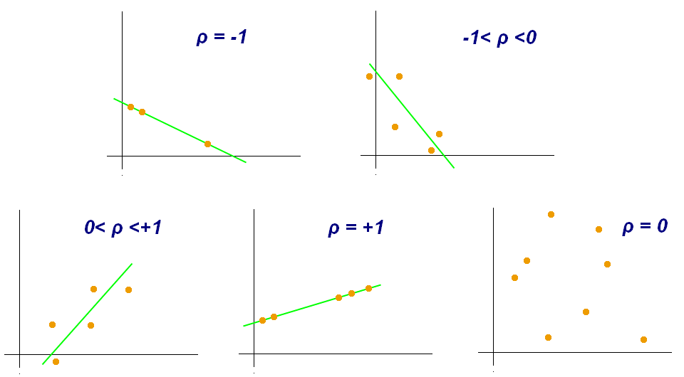

title: NPFL129, Lecture 8
class: title, cc-by-sa
style: .algorithm { background-color: #eee; padding: .5em }
# Correlation, Model Combination

## Jindřich Libovický <small>(reusing materials by Milan Straka)</small>

### November 20, 2025

---
class: middle
# Today's Lecture Objectives

After this lecture you should be able to

- Explain and implement different ways of measuring correlation: Pearson's
  correlation, Spearman's correlation, Kendall's $\tau$.

- Decide if correlation is a good metric for your model.

- Measure inter-annotator agreement and draw conclusions for data
  cleaning and for limits of your models.

- Use correlation with human judgment to validate evaluation metrics.

---
section: Covariance
class: section
# Covariance

---
# Covariance

Given a collection of random variables $⁇x_1, …, ⁇x_N$, we know that
$$𝔼\left[∑\nolimits_i ⁇x_i\right] = ∑_i 𝔼 \big[⁇x_i\big].$$

~~~
But how about $\Var\big(∑_i ⁇x_i\big)$?

~~~
$\displaystyle \kern5em\Var\left(∑\nolimits_i ⁇x_i\right)
 = 𝔼\left[\left(∑\nolimits_i ⁇x_i - ∑\nolimits_i 𝔼[⁇x_i]\right)^2\right]$

~~~
$\displaystyle \phantom{\kern5em\Var\left(∑\nolimits_i ⁇x_i\right)}
 = 𝔼\left[\left(∑\nolimits_i \big(⁇x_i - 𝔼[⁇x_i]\big)\right)^2\right]$

~~~
$\displaystyle \phantom{\kern5em\Var\left(∑\nolimits_i ⁇x_i\right)}
 = 𝔼\left[∑\nolimits_i ∑\nolimits_j \big(⁇x_i - 𝔼[⁇x_i]\big) \big(⁇x_j - 𝔼[⁇x_j]\big)\right]$

~~~
$\displaystyle \phantom{\kern5em\Var\left(∑\nolimits_i ⁇x_i\right)}
 = ∑_i ∑_j 𝔼\left[\big(⁇x_i - 𝔼[⁇x_i]\big) \big(⁇x_j - 𝔼[⁇x_j]\big)\right].$

---
# Covariance

We define **covariance** of two random variables $⁇x, ⁇y$ as
$$\Cov(⁇x, ⁇y) = 𝔼\Big[\big(⁇x - 𝔼[⁇x]\big) \big(⁇y - 𝔼[⁇y]\big)\Big].$$

~~~
Then,
$$\Var\left(∑\nolimits_i ⁇x_i\right) = ∑_i ∑_j \Cov(⁇x_i, ⁇x_j).$$

~~~
Note that $\Cov(⁇x, ⁇x) = \Var(⁇x)$ and that we can write covariance as
$$\begin{aligned}
  \Cov(⁇x, ⁇y)
   &= 𝔼\Big[\big(⁇x - 𝔼[⁇x]\big) \big(⁇y - 𝔼[⁇y]\big)\Big] \\
   &= 𝔼\big[⁇x ⁇y - ⁇x 𝔼[⁇y] - 𝔼[⁇x] ⁇y + 𝔼[⁇x] 𝔼[⁇y]\big] \\
   &= 𝔼\big[⁇x ⁇y\big] - 𝔼\big[⁇x\big] 𝔼\big[⁇y\big].
\end{aligned}$$

---
section: Correlation
class: section
# Correlation

---
# Correlation

Random variables $⁇x, ⁇y$ are **uncorrelated** if $\Cov(⁇x, ⁇y) = 0$;
otherwise, they are **correlated**.

~~~
Note that two _independent_ random variables are uncorrelated, because

$\displaystyle \kern10em\mathllap{\Cov(⁇x, ⁇y)} = 𝔼\Big[\big(⁇x - 𝔼[⁇x]\big) \big(⁇y - 𝔼[⁇y]\big)\Big]$

~~~
$\displaystyle \kern10em{} = ∑_{x,y} P(x, y) \big(x - 𝔼[x]\big) \big(y - 𝔼[y]\big)$

~~~
$\displaystyle \kern10em{} = ∑_{x,y} P(x) \big(x - 𝔼[x]\big) P(y) \big(y - 𝔼[y]\big)$

~~~
$\displaystyle \kern10em{} = \left(∑_x P(x) \big(x - 𝔼[x]\big)\right) \left(∑_y P(y) \big(y - 𝔼[y]\big)\right)$

~~~
$\displaystyle \kern10em{} = 𝔼_⁇x \big[⁇x - 𝔼[⁇x]\big] 𝔼_⁇y \big[⁇y - 𝔼[⁇y]\big] = 0.$

~~~
However, dependent random variables can be uncorrelated – random
uniform $⁇x$ on $[-1, 1]$ and $⁇y = |⁇x|$ are not independent ($⁇y$ is
completely determined by $⁇x$), but they are uncorrelated.

---
# Pearson correlation coefficient

There are several ways to measure correlation of random variables $⁇x, ⁇y$.

**Pearson correlation coefficient**, denoted as $ρ$ or $r$, is defined as
$$\begin{aligned}
  ρ &≝ \frac{\Cov(⁇x, ⁇y)}{\sqrt{\Var(⁇x)} \sqrt{\Var(⁇y)}} \\
  r &≝ \frac{∑_i (x_i - x̄) (y_i - ȳ)}{\sqrt{∑_i (x_i - x̄)^2} \sqrt{∑_i (y_i - ȳ)^2}},
\end{aligned}$$
where:
~~~
- $ρ$ is used when the full expectation is computed (population Pearson
  correlation coefficient);
~~~
- $r$ is used when estimating the coefficient from data (sample Pearson
  correlation coefficient);
  - $x̄$ and $ȳ$ are sample estimates of the respective means.

---
class: dbend
# Pearson correlation coefficient

The value of Pearson correlation coefficient is in fact normalized covariance,
because its value is always bounded by $-1 ≤ ρ ≤ 1$ (and the same holds for $r$).

~~~
The bound can be derived from

$\displaystyle \kern5em\mathllap{0} ≤ 𝔼\bigg[\bigg(\frac{(⁇x - 𝔼[⁇x])}{\sqrt{\Var(⁇x)}} - ρ\frac{(⁇y - 𝔼[⁇y])}{\sqrt{\Var(⁇y)}}\bigg)^2\bigg]$

~~~
$\displaystyle \kern5em{} = 𝔼\bigg[\frac{(⁇x - 𝔼[⁇x])^2}{\Var(⁇x)}\bigg]
                            - 2ρ𝔼\bigg[\frac{(⁇x - 𝔼[⁇x])}{\sqrt{\Var(⁇x)}}\frac{(⁇y - 𝔼[⁇y])}{\sqrt{\Var(⁇y)}}\bigg]
                            + ρ^2 𝔼\bigg[\frac{(⁇y - 𝔼[⁇y])^2}{\Var(⁇y)}\bigg]$

~~~
$\displaystyle \kern5em{} = \frac{\Var(⁇x)}{\Var(⁇x)} - 2ρ⋅ρ + ρ^2 \frac{\Var(⁇y)}{\Var(⁇y)} = 1 - ρ^2,$

~~~
which yields $ρ^2 ≤ 1$.

---
# Pearson correlation coefficient

Pearson correlation coefficient quantifies **linear dependence** of the two
random variables.

---
# Pearson correlation coefficient

Pearson correlation coefficient quantifies **linear dependence** of the two
random variables.

---
# Pearson correlation coefficient

The four displayed variables have the same mean 7.5, variance 4.12,
Pearson correlation coefficient 0.816 and regression line $3 + \frac{1}{2}x$.

---
# Nonlinear Correlation – Spearman's $ρ$

To measure also nonlinear correlation, two coefficients are commonly used.

### Spearman's rank correlation coefficient $ρ$
Spearman's $ρ$ is Pearson correlation coefficient measured on **ranks** of the
original data, where a rank of an element is its index in sorted ascending
order.

---
# Nonlinear Correlation – Kendall's $τ$

### Kendall rank correlation coefficient $τ$
Kendall's $τ$ measures the amount of _concordant pairs_ (pairs where $y$
increases/decreases when $x$ does), minus the _discordant pairs_
(where $y$ increases/decreases when $x$ does the opposite):

$$\begin{aligned}
  τ &≝ \frac{|\{\mathrm{pairs}~i ≠ j: x_j > x_i, y_j > y_i\}| - |\{\mathrm{pairs}~i ≠ j: x_j > x_i, y_j < y_i\}|}{\binom{n}{2}} \\
    &= \frac{∑_{i < j} \sign(x_j - x_i) \sign(y_j - y_i)}{\binom{n}{2}}.
\end{aligned}$$

~~~
There is no clear consensus on whether to use Spearman's $ρ$ or Kendall's $τ$.
When there are no/few ties in the data, Kendall's $τ$ offers two minor
advantages – $\frac{1+τ}{2}$ can be interpreted as a probability of
a concordant pair, and Kendall's $τ$ converges to a normal distribution faster.

~~~
As defined, the range of Kendall's $τ ∈ [-1, 1]$. However, if there are ties,
its range is smaller – therefore, several corrections (not discussed here) exist
to adjust its value in case of ties.

---
class: middle
# Correlation is not causation

---
section: Correlation in ML
class: section
# Correlation in Machine Learning

---
# Use of Correlation in Machine Learning

In ML, correlation is commonly used as

- Evaluation metric for some tasks;

- Measuring data annotation quality;

- Assessing the quality of automatic metrics by comparing them to human judgment.

---
# Correlation as evaluation metric

- Learning to rank (e.g., document retrieval): we do not care about the actual values

   - Kendall's $\tau$, Spearman's correlation

   - When we want the correct items to rank before incorrect ones: precision
     (assuming fixed top-$k$, typically at 5, 10), recall (often ill-defined),
     mean reciprocal rank

   $$\operatorname{MRR} = \frac{1}{N}\sum_{i=1}^{N}\frac{1}{\text{rank of the first relevant item}}$$
~~~
- Evaluating pair similarity: word embeddings, sentence embeddings

   - Similarity estimates from psycholinguistic experiments: scores for word/sentence pairs

   - Measure Pearson/Spearman correlation between embedding distances and similarity scores

---
# Inter-annotator agreement (1)

- Inter-annotator agreement can tell us

   - How well defined the task is

   - How reliable annotators/user ratings are

   - What data items are suspicious / difficult

 
~~~

- For continuous target values: Pearson's/Spearman's correlation

~~~

- For classification tasks: Cohen's $\kappa$ \
    $p_O$ is observed agreement, $p_E$ expected agreement by chance

$$\kappa = \frac{p_O - p_E}{1 - p_E}$$

---
# Inter-annotator agreement (2)

- Can be used to filter out confusing data points and unreliable annotators

- Not all outliers are noise! Low IAA can reveal cultural differences.

 
 

~~~
IAA sets natural upper boundary for ML performance. Performance over IAA is
suspicious!

 

~~~
* Trivial baseline for classification: majority class, for regression average,
  or something based on simple rules

* Performance over IAA is more likely overfitting for the way the data is
  curated than super-human performance.

---
# Correlation with human judgment

For some tasks, it might not be clear how to measure the model performance:

**Grammar checking**: the $\beta$ parameter

~~~

**Machine translation**: evaluation is subjective by definition, we design
metrics to correlate with human judgment.

- SoTA machine translation metrics are typically machine-learned.

- Different metrics might be suitable for different tiers of translation quality.

- There is an annual competition in MT quality and MT metric quality.

---
class: summary
# Today's Lecture Objectives

After this lecture you should be able to

- Explain and implement different ways of measuring correlation: Pearson's
  correlation, Spearman's correlation, Kendall's $\tau$

- Decide if correlation is a good metric for your model

- Measure inter-annotator agreement and draw conclusions for data cleaning and
  for limits of your models

- Use correlation with human judgment to validate evaluation metrics
