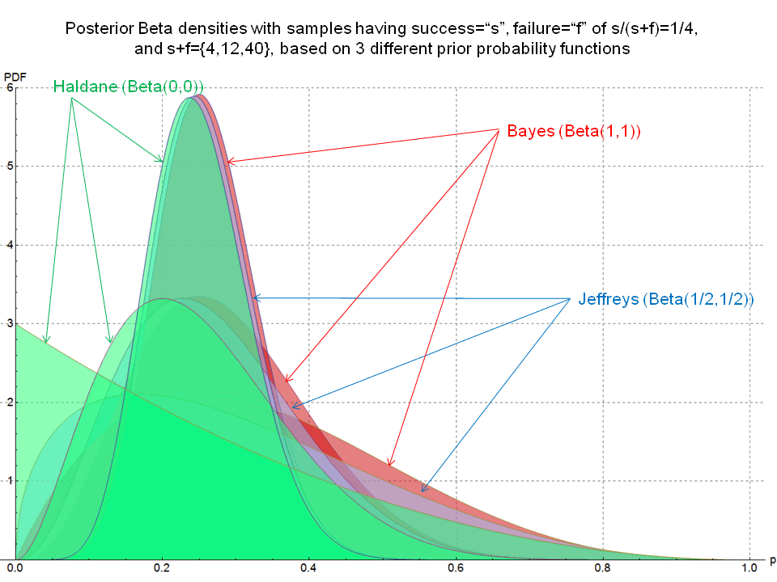

title: NPFL129, Lecture 8
class: title, cc-by-nc-sa
style: .algorithm { background-color: #eee; padding: .5em }
# TF-IDF, Naive Bayes

## Milan Straka

### November 22, 2021

---
section: TF-IDF
# Document Representation

We already know how to represent images and categorical variables (classes,
letters, words, …).

~~~
Now consider a problem of representing a whole _document_.

~~~
We usually represent a document as a **bag of words** – we create a feature
space with a dimension for every unique word (or for character sequences),
called **term**.

~~~
However, there are many possible ways how the values of the terms might be
set.

---
# Term Frequency – Inverse Document Frequency

Commonly used ways of setting the term values:

- **binary indicators**: 1/0 depending on whether a term is present in
  a document or not;

~~~
- **term frequency (TF)**: relative frequency of a term in a document;
  $$\mathit{TF}(t; d) = \frac{\textrm{number of occurrences of $t$ in the document $d$}}{\textrm{number of terms in the document $d$}}$$
~~~
- **inverse document frequency (IDF)**: we could also represent a term using
  self-information of a probability of a random document containing it (therefore,
  terms with lower document probability have higher weights);
  $$\mathit{IDF}(t)
    = \log \frac{\textrm{number of documents}}{\textrm{number of documents containing $t$ }\big(\textrm{optionally} + 1)}
    = I\big(P(d ∋ t)\big)
  $$
~~~
- **TF-IDF**: empirically, product $\mathit{TF} ⋅ \mathit{IDF}$ is a feature
  reflecting quite well how important is a term to a document in a corpus
  (used by 83\% text-based recommender systems in 2015).

---
section: MutualInformation
# Mutual Information

Consider two random variables $⁇x$ and $⁇y$ with distributions $⁇x ∼ X$ and $⁇y ∼ Y$.
~~~

The conditional entropy $H(Y | X)$ can be naturally considered an expectation of
a self-information of $Y | X$, so in the discrete case,
~~~
$$H(Y | X) = 𝔼_{x,y} \big[I(y|x)\big] = -∑_{x,y} P(x, y) \log P(y | x).$$

~~~
In order to assess the amount of information _shared_ between the two
random variables, we might consider the difference
$$\textcolor{red}{H(Y)} - \textcolor{blue}{H(Y | X)}
  = 𝔼_{x,y} \big[\textcolor{red}{-\log P(y)}\big] - 𝔼_{x,y} \big[\textcolor{blue}{-\log P(y|x)}\big]
  = 𝔼_{x,y} \left[\log\frac{\textcolor{blue}{P(x, y)}}{\textcolor{blue}{P(x)} \textcolor{red}{P(y)}}\right].$$

~~~
We can interpret this value as

> _How many bits of information will we learn about $Y$ when we find out $X$?_

---
# Mutual Information

Let us denote this quantity as the **mutual information** $I(X; Y)$:
$$I(X; Y) = 𝔼_{x,y} \left[\log\frac{P(x, y)}{P(x)P(y)}\right].$$

~~~
- The mutual information is symmetrical, so
  $$I(X; Y) = I(Y; X) = H(Y) - H(Y|X) = H(X) - H(X | Y).$$

~~~
- It is easy to verify that
  $$I(X; Y) = D_\textrm{KL}\big(P(X, Y) \| P(X) P(Y)\big).$$

~~~
  Therefore,
  - $I(X; Y) ≥ 0$,
  - $I(X; Y) = 0$ iff $P(X, Y) = P(X) P(Y)$ iff the random variables are
    independent.

---
section: TF-IDF
# TF-IDF as Mutual Information

Let $𝓓$ be a collection of $N$ documents and $𝓣$ collections of terms.

~~~
Our assumption is that whenever we need to draw a document, we do it
uniformly randomly. Therefore,
~~~
- $P(d) = 1/|𝓓|$ and $I(d) = H(𝓓) = \log |𝓓|$,

~~~
- $P(d|t) = 1/|\{d∈𝓓:t∈d\}|$ and $I(d|t) = H(𝓓|𝓣=t) = \log |\{d∈𝓓:t∈d\}|$,
~~~
- $\displaystyle I(d) - I(d|t) = H(𝓓) - H(𝓓|𝓣=t) = \log \frac{|𝓓|}{|\{d∈𝓓:t∈d\}|} = \mathit{IDF}(t).$

~~~
Finally, we can compute the mutual information $I(𝓓; 𝓣)$ as
$$I(𝓓; 𝓣)
  = ∑_{d,t} \textcolor{red}{P(d)} ⋅ \textcolor{blue}{P(t|d)} ⋅ \textcolor{darkgreen}{\big(I(d) - I(d|t)\big)}
  = \textcolor{red}{\frac{1}{|𝓓|}} ∑_{d,t} \textcolor{blue}{\mathit{TF}(t;d)} ⋅ \textcolor{darkgreen}{\mathit{IDF(t)}}.
$$

~~~
Therefore, summing all TF-IDF terms recovers the mutual information between $𝓓$
and $𝓣$, and we can say that each TF-IDF carries a “bit of information” attached
to a document-term pair.

---
section: BayesianProbability
# Bayesian Probability

Until now, we considered the so-called _frequentist probability_, where
probability of an event is considered a limit of its frequency.

~~~
In _Bayesian probability_ interpretation, probability is a quantification
of uncertainty instead. Bayesian probability can be considered an extension of
propositional logic, where hypotheses (that must be true or false in frequentist
probability) can be assigned probabilities.

~~~
Bayesian probability is the so-called _evidential_ probability, where hypotheses
have some initial **prior probability**, which is then updated in light of _new
data_ into **posterior probability**.

~~~
This update of prior probability into posterior probability is performed using
the Bayes theorem
$$P(A | B) = \frac{P(B | A) P(A)}{P(B)}.$$

---
# Librarian or Farmer

The following problem is from the Thinking, Fast and Slow:

> _As you consider the next question, please assume that Steve was selected at
> random from a representative sample. An individual has been described by
> a neighbor as follows: “Steve is very shy and withdrawn, invariably helpful
> but with little interest in people or in the world of reality. A meek and tidy
> soul, he has a need for order and structure, and a passion for detail.” Is
> Steve more likely to be a librarian or a farmer?_

~~~
The given description corresponds more to a librarian than to a farmer.

~~~
However, there are many more farmers than librarians (for example, in 2016
there were 4.33k librarians and 130.3k regular agricultural workers in the Czech
Republic, a 30:1 ratio).

~~~
The description being more fitting for a librarian is in fact a _likelihood_,
while the base rates of librarians and farmers play the role of a _prior_,
and the whole question asks about the _posterior_:
$$P(\textit{librarian} | \textit{description}) ∝ P(\textit{description} | \textit{librarian}) ⋅ P(\textit{librarian}).$$

---
section: MAP
# Maximum A Posteriori Estimation

We demonstrate the Bayesian probability on model fitting.

~~~
Recall the maximum likelihood estimation
$$→w_\mathrm{MLE} = \argmax_{→w} p(⇉X; →w) = \argmax_{→w} p(⇉X | →w).$$

~~~
In the Bayesian interpretation, we capture our initial assumptions about $→w$
using a prior probability $p(→w)$.
~~~
The effect of observing the data $⇉X$ can be then expressed as
$$p(→w | ⇉X) = \frac{p(⇉X | →w) p(→w)}{p(⇉X)}.$$

~~~
The quantity $p(⇉X | →w)$ is evaluated using fixed data $⇉X$ and quantifies how
probable the observed data is with respect to various values of the parameter
$→w$. It is therefore a **likelihood**, because it is a function of $⇉w$.

---
# Maximum A Posteriori Estimation

Therefore, we get that
$$\underbrace{p(→w | ⇉X)}_\textrm{posterior} ∝ \underbrace{p(⇉X | →w)}_\textrm{likelihood} ⋅ \underbrace{p(→w)}_\textrm{prior},$$
where the symbol $∝$ means “up to a multiplicative factor”.

~~~
Using the above Bayesian inference formula, we can define
**maximum a posteriori (MAP)** estimate as
$$→w_\mathrm{MAP} = \argmax_{→w} p(→w | ⇉X) = \argmax_{→w} p(⇉X | →w) p(→w).$$

~~~
To utilize the MAP estimate for model training, we need to specify the
parameter prior $p(→w)$, our _preference_ among models.

~~~
Note that a possible view is that overfitting is just a problem of not using
priors and that suitable priors would avoid it.

---
# L2 Regularization as MAP

Frequently, the mean is assumed to be zero, and the variance is assumed to be
$σ^2$. Given that we have no further information, we employ the maximum entropy
principle, which provides us with $p(→w) = 𝓝(→w; 0, σ^2)$.
~~~
Then
$$\begin{aligned}
→w_\mathrm{MAP} &= \argmax_{→w} p(⇉X | →w) p(→w) \\
                &= \argmax_{→w} ∏\nolimits_{i=1}^N p(→x_i | →w) p(→w) \\
                &= \argmin_{→w} ∑\nolimits_{i=1}^N \big(-\log p(→x_i | →w) - \log p(→w)\big). \\
\end{aligned}$$
~~~

By substituting the probability of the Gaussian prior, we get
$$→w_\mathrm{MAP} = \argmin_{→w} ∑\nolimits_{i=1}^N -\log p(→x_i | →w) {\color{gray} - \frac{1}{2} \log(2πσ^2)} + \frac{\|→w\|^2}{2σ^2},$$

which is in fact the $L_2$-regularization.

---
section: Beta
# Bernoulli and Binomial Distribution

We have already discussed the Bernoulli distribution, which is
a distribution over a binary random variable with a single parameter
$φ ∈ [0, 1]$, which specifies the probability of the random variable being equal
to 1.

~~~
If the Bernoulli trial is repeated multiple times $n$, the resulting outcome
is the number of successes $∈ \{0, 1, …, n\}$ and has a **binomial
distribution** $B(n, φ)$.

~~~
If $⁇x ∼ B(n, φ)$, then
$$P(⁇x = k) = \binom{n}{k} φ^k (1-φ)^{n-k},$$
where $\binom{n}{k}$ is the binomial coefficient $\binom{n}{k} = \frac{n!}{k! (n-k)!}$.

---
# Bernoulli and Binomial Distribution

If we observe $N$ outcomes of a Bernoulli trial (or equivalently a single
outcome of a binomially-distributed $N$-trial random variable), we can use MLE
to estimate the parameter $φ$.

~~~
In the context of Bayesian inference, we would start with some prior $p(φ)$
and then compute a posterior after any amount of observed data – be it a single
trial or several trials at once. In the extreme case, we can compute
a posterior after every single observed data.

~~~
This sequential nature of Bayesian inference makes it practical, if for a given
prior and likelihood, the posterior comes from the same distribution family as the prior.
Such a distribution is then called a **conjugate prior** of a given likelihood
function.

---
class: dbend
# Conjugate Prior of a Bernoulli Distribution

To derive a conjugate prior of a Bernoulli distribution, recall that for
a Bernoulli-distributed random variable $P(x) = φ^x (1-φ)^{1-x}.$

~~~
Therefore, if the prior would be a product of the $φ$ and $(1-φ)$ factors,
it would keep the same form after being multiplied by the likelihood. Therefore,
we seek for a prior of a form
$$\operatorname{Beta}(x; α, β) ∝ x^{α-1} (1-x)^{β-1}.$$

~~~
We still need to compute a normalization constant so that the distribution will
integrate to 1. Its value is called the **Beta function**
$$B(α, β) = ∫_0^1 x^{α-1} (1-x)^{β-1} \d x = \frac{Γ(α) Γ(β)}{Γ(α+β)}$$
and the conjugate prior **Beta** of a Bernoulli distribution is
$$\operatorname{Beta}(x; α, β) = \frac{1}{B(α, β)} x^{α-1} (1-x)^{β-1}.$$

---
class: dbend
# Gamma Function

The $Γ(x)$ used in the beta function is the **Gamma function**, which is the
commonly-used extension of factorial to complex numbers fulfilling
$$Γ(n) = (n - 1)!\textrm{~~for~any~~}n ∈ ℕ.$$

~~~

It is defined as
$$Γ(z) = ∫_0^∞ x^{z-1} e^{-x} \d x$$
and we can verify that
~~~
- $Γ(1) = ∫_0^∞ e^{-x} \d x = \big[ -e^{-x} \big]_0^∞ = \lim_{x → ∞} \big(-e^{-x}\big) - \big(-e^0\big) = 0 + 1 = 1,$
~~~
- $Γ(z+1) = ∫_0^∞ x^z e^{-x} \d x$ and using integration by parts,
  $Γ(z+1) = \big[ - x^z e^{-x} \big]_0^∞ - ∫_0^∞ - z x^{z-1} e^{-x} \d x = 0 + z∫_0^∞ x^{z-1} e^{-x} \d x = z Γ(z).$

---
# Conjugate Prior of a Bernoulli Distribution

If we have a prior $\operatorname{Beta}(α, β)$ and we observe $k$ successed and
$l$ failures, the posterior distribution is $\operatorname{Beta}(α + k, β + l)$.

~~~
Therefore, the $α$ and $β$ parameters can be considered “counts” of successes
and failures.

~~~
Therefore, the prior corresponds to adding some number of “pseudo-observations”.

~~~
Note that $\operatorname{Beta}(1, 1)$ is uniform, $\operatorname{Beta}(α, β)$
corresponds to $α-1$ successes and $β-1$ failures and the mode ($\argmax$)
of $\operatorname{Beta}(α, β)$ for $α, β > 1$ is $(α-1) / (α + β - 2)$.

---
# Conjugate Prior of a Bernoulli Distribution

---
section: Dir
# Multinomial and Dirichlet Distribution

Similarly to how the binomial distribution models outcomes of $n$ independent
Bernoulli trials, the **multinomial distribution** generalizes the categorical
distribution by considering $n$ trials.

~~~
The multinomial distribution is again parametrized with a probability
distribution $→p ∈ [0, 1]^K$ and a number of trials $n ∈ ℕ$, and the probability
of $x_k$ outcomes of category $k$ is
$$P(→x) = \binom{n}{x_1\,x_2\,…\,x_K} p_1^{x_1} p_2^{x_2} \cdots p_K^{x_K},$$
where $\binom{n}{x_1\,x_2\,…\,x_K}$ is the multinomial coefficient
$\binom{n}{x_1\,x_2\,…\,x_K} = \frac{n!}{x_1! x_2! ⋯ x_K!}$.

~~~
The conjugate prior of the categorical distribution is a generalization of the
beta distribution – the **Dirichlet distribution**
$$\operatorname{Dir}(→x; →α) = \frac{Γ(Σ_i\, α_i)}{Π_i\, Γ(α_i)} ⋅ ∏\nolimits_i x_i^{α_i-1},$$
where the $→α$ play again the role of the (pseudo-)counts of the individual classes.

---
section: NaiveBayes
# Naive Bayes Classifier

So far, our classifiers were so-called **discriminative** and had a form
$$p(C_k|→x) = p(C_k | x_1, x_2, …, x_D).$$

~~~
Instead, we might use the Bayes' theorem and rewrite to
$$p(C_k|→x) = \frac{p(→x | C_k) p(C_k)}{p(→x)}.$$

~~~
Then, classification could be performed as
$$\argmax_k p(C_k|→x) = \argmax_k \frac{p(→x | C_k) p(C_k)}{p(→x)} = \argmax_k p(→x | C_k) p(C_k).$$

~~~
Therefore, instead of modeling $p(C_k|→x)$, we model
- the prior $p(C_k)$ according to the distribution of classes in the data, and
- the distribution $p(→x | C_k)$.

---
# Naive Bayes Classifier

Modeling the distribution $p(→x | C_k)$ is however difficult – $→x$ can be
high-dimensional high-structured data.

~~~
Therefore, the so-called **Naive Bayes classifier** assumes that
> _all $x_d$ are independent given $C_k$,_

~~~
so we can rewrite
$$p(→x | C_k) = p(x_1 | C_k) p(x_2 | C_k, x_1) p(x_3 | C_k, x_1, x_2) ⋯ p(x_D | C_k, x_1, x_2, …)$$
to
$$p(→x | C_k) = ∏\nolimits_{d=1}^D p(x_d | C_k).$$

~~~
Notice that modeling $p(x_d | C_k)$ is substantially easier because it is
a distribution over a single-dimensional quantity.

---
# Naive Bayes Classifier

There are in fact several naive Bayes classifiers, depending on the distribution
$p(x_d | C_k)$.

### Gaussian Naive Bayes

In Gaussian naive Bayes, we expect a continuous feature to have normal
distribution for a given $C_k$, and model $p(x_d | C_k)$ is modeled as a normal
distribution $𝓝(μ_{d, k}, σ_{d, k}^2)$.

~~~
Assuming we have the training data $⇉X$ together with $K$-class classification targets $→t$,
the “training” phase consists of estimating the parameters $μ_{d,k}$ and
$σ_{d,k}^2$ of the distributions $𝓝(μ_{d, k}, σ_{d, k}^2)$ for $1 ≤ d ≤ D$,
$1 ≤ k ≤K$, employing the maximum likelihood estimation.

~~~
Now let feature $d$ and class $k$ be fixed and let $→x_1, →x_2, …, →x_{N_k}$ be the
training data _corresponding to the class $k$_.
~~~
We already know that maximum likelihood estimation using ${N_k}$ samples drawn from
a Gaussian distribution $𝓝(μ_{d, k}, σ_{d, k}^2)$ amounts to
$$\argmin_{μ_{d, k}, σ_{d, k}} \frac{N_k}{2} \log (2 π σ_{d,k}^2) + ∑_{i=1}^{N_k} \frac{(x_{i,d}- μ_{d,k})^2}{2σ_{d,k}^2}.$$

---
# Gaussian Naive Bayes

Setting the derivative with respect to $μ_{d,k}$ to zero results in
$$0 = ∑\nolimits_{i=1}^{N_k} \frac{-2 (x_{i,d} - μ_{d,k})}{2σ_{d,k}^2},$$
~~~
which we can rewrite to $μ_{d,k} = \frac{1}{N_k} ∑_{i=1}^{N_k} x_{i,d}$.

~~~
Similarly, zeroing out the derivative with respect to $σ_{d,k}^2$ gives
$$0 = \frac{N_k}{2σ_{d,k}^2} - \frac{1}{2(σ_{d,k}^2)^2} ∑\nolimits_{i=1}^{N_k} (x_{i,d} - μ_{d,k})^2,$$

~~~
from which we obtain $σ_{d,k}^2 = \frac{1}{N_k} ∑_{i=1}^{N_k} (x_{i,d} - μ_{d,k})^2$.

~~~
However, the variances are usually smoothed (increased) by a given constant $α$
to avoid too sharp distributions (in Scikit-learn, the default value of $α$ is
$10^{-9}$ times the largest variance of all features).

---
# Gaussian Naive Bayes Example

---
# Bernoulli Naive Bayes

When the input features are binary, the $p(x_d | C_k)$ might be modeled using a Bernoulli
distribution
$$p(x_d | C_k) = p_{d, k}^{x_d} ⋅ (1 - p_{d, k})^{(1-x_d)}.$$

~~~
We can therefore write

$$p(C_k | →x) ∝ \Big(∏\nolimits_{d=1}^D p_{d, k}^{x_d} ⋅ (1 - p_{d, k})^{(1-x_d)}\Big) p(C_k),$$

~~~
and by computing a logarithm we get

$$\log p(C_k | →x) + c = \log p(C_k) + ∑\nolimits_d \big(x_d \log \tfrac{p_{d, k}}{1-p_{d,k}} + \log(1-p_{d,k})\big) = b_k + →x^T →w_k,$$

~~~
where the constant $c$ does not depend on $C_k$ and is therefore not needed for
prediction
$$\argmax\nolimits_k \log p(C_k|→x) = \argmax\nolimits_k b_k + →x^T →w_k.$$

---
# Bernoulli Naive Bayes Estimation

To estimate the probabilities $p_{d, k}$, we turn again to the maximum
likelihood estimation.
~~~
The log-likelihood of ${N_k}$ samples drawn from Bernoulli distribution
with parameter $p_{d,k}$ is
$$∑\nolimits_{i=1}^{N_k} \log\big(p_{d,k}^{x_{i,d}} (1 - p_{d,k})^{1-x_{i,d}}\big)
= ∑\nolimits_{i=1}^{N_k} \big(x_{i,d} \log p_{d,k} + (1 - x_{i,d}) \log (1 - p_{d,k})\big).$$

~~~
Setting the derivative with respect to $p_{d,k}$ to zero, we obtain
$$0
= ∑\nolimits_{i=1}^{N_k} \left(\frac{x_{i,d}}{p_{d,k}} - \frac{1 - x_{i,d}}{1 - p_{d,k}}\right)
= \frac{1}{p_{d,k} (1 - p_{d,k})} ∑\nolimits_{i=1}^{N_k} \Big((1 - p_{d,k}) x_{i,d} - p_{d,k} (1 - x_{i,d})\Big),$$
giving us $p_{d,k} = \frac{1}{N_k} ∑_{i=1}^{N_k} x_{i,d}$.

---
# Bernoulli Naive Bayes Estimation

We could therefore estimate the probabilities $p_{d,k}$ as
$$p_{d, k} = \frac{\textrm{number of documents of class $k$ with nonzero feature $d$}}{\textrm{number of documents of class $k$}}.$$

~~~
However, if a feature $d$ is always set to one (or zero) for a given
class $k$, then $p_{d,k} = 1$ (or 0). That is impractical because
the resulting classifier would give probability zero to inputs with the
opposite value of such feature.

~~~
Therefore, **Laplace** or **additive smoothing** is used, and the probability
$p_{d,k}$ estimated as
$$p_{d, k} = \frac{\textrm{number of documents of class $k$ with nonzero feature $d$ + α}}{\textrm{number of documents of class $k$ + 2α}}$$
for some pseudo-count $α > 0$.

~~~
Note that even if this technique has a special name, it corresponds to using
a _maximum a posteriori_ estimate, using $\operatorname{Beta}(α+1, α+1)$ as
a prior distribution.

---
# Multinomial Naive Bayes

The last variant of naive Bayes we will describe is the **multinomial naive
Bayes**, where $p(→x | C_k)$ is modeled to be multinomial distribution, $p(→x | C_k) ∝ ∏_d p_{d,k}^{x_d}$.

~~~
Similarly to the Bernoulli NB case, we can write the log-likelihood as
$$\log p(C_k | →x) + c = \log p(C_k) + ∑\nolimits_d x_d \log p_{d, k} = b_k + →x^T →w_k.$$

---
# Multinomial Naive Bayes Estimation

As in the previous cases, we turn to the maximum likelihood estimation
in order to find out the values of $p_{d, k}$.
~~~
We start with the log-likelihood
$$∑\nolimits_{i=1}^{N_k} \log\Big(∏\nolimits_d p_{d,k}^{x_{i,d}}\Big)
= ∑\nolimits_{i, d} x_{i,d} \log p_{d,k}.$$

~~~
To maximize this quantity with respect to a probability distribution
$∑_d p_{d,k} = 1$, we need to form a _Lagrangian_

$$𝓛 = ∑\nolimits_{i, d} x_{i,d} \log p_{d,k} + \textcolor{red}{λ}\Big(1 - ∑\nolimits_d p_{d,k}\Big).$$

~~~
Setting the derivative with respect to $p_{d,k}$ to zero results in
$0 = ∑\nolimits_{i=1}^{N_k} \frac{x_{i,d}}{p_{d,k}} - \textcolor{red}{λ}$,
so
$$p_{d,k}
  = \frac{1}{\textcolor{red}{λ}} ∑\nolimits_{i=1}^{N_k} x_{i,d}
  = \frac{∑\nolimits_{i=1}^{N_k} x_{i,d}}{\textcolor{red}{∑\nolimits_{i=1}^{N_k} ∑_d x_{i,d}}},
  \textrm{ where $λ$ is set to fulfill }∑\nolimits_d p_{d,k} = 1.$$

---
# Multinomial Naive Bayes Estimation

Denoting $n_{d, k}$ as the sum of features $x_d$ for a class $C_k$, the
probabilities $p_{d, k}$ could be therefore estimated as
$$p_{d, k} = \frac{n_{d, k}}{∑_j n_{j, k}}.$$

~~~
However, for the same reasons as in the Bernoulli NB case, we also use the
Laplace smoothing, i.e., utilize a Dirichlet prior $\operatorname{Dir}(α+1)$,
and instead use
$$p_{d, k} = \frac{n_{d, k} + α}{∑_j (n_{j, k} + α)} = \frac{n_{d, k} + α}{\big(∑_j n_{j, k}\big) + αD} $$
with pseudo-count $α > 0$.

---
# Naive Bayes Example

---
# Naive Bayes Conclusions

The choice among the Gaussian, Bernoulli and multinomial naive Bayes depends on
the feature values.

~~~
- If we expect the individual feature values to be roughly normally distributed,
  Gaussian NB is an obvious choice.

~~~
- To use multinomial NB, the features should roughly follow the multinomial
  distribution – i.e., they must be non-negative, be interpretable as
  “counts” and “compete” with each other.
~~~
  - Note that the feature can be real-valued (the multinomial distribution can
    be extended to real-value observations using the $Γ$ function).

~~~
- In order to use Bernoulli NB, the features _must_ be binary. However, an
  important difference is that contrary to the multinomial NB, the **absence
  of features** is also modeled by the $(1-p_{d,k})$ term; the multinomial
  NB uses $p_{d,k}^0=1$ in such case.

---
section: Gen&Disc
# Generative and Discriminative Models

So far, all our classification models (but naive Bayes) have been
**discriminative**, modeling a _conditional distribution_ $p(t | →x)$
(predicting some output distribution).

~~~
On the other hand, the **generative models** estimate _joint distribution_
$p(t, →x)$, often by employing Bayes' theorem and estimating
$p(→x | t) ⋅ p(t)$. They therefore model the probability of the data being
generated by an outcome, and only transform it to $p(t|→x)$ during prediction.

---
class: tablefull
# Generative and Discriminative Models

| | Discriminative Model | Generative Model |
|-|----------------------|------------------|
| Goal | Estimate $P(t\vert→x)$ | Estimate $P(t,→x) = P(→x\vert t) P(t)$ |
| What's learned | Decision boundary | Probability distribution of the data |
| Illustration |  |  |

---
# Generative and Discriminative Models

- Empirically, discriminative models perform better in classification tasks,
  because modeling the decision boundary is often much easier than modeling the
  data distribution.

~~~
- On the other hand, generative models can recognize
  anomalies/outliers/out-of-distribution data (when the input example has low
  probability under the data distribution).

~~~
- The term _generative_ comes from a (theoretical) possibility of “generating”
  random instances of $→x$ and $t$. However, just being able to evaluate $p(→x | →t)$
  does not necessarily mean there is an _efficient_ procedure of actually
  sampling (generating) $→x$.

~~~
  - In recent years, generative modeling combined with deep neural networks
    created a new family of _deep generative models_ like VAE or GAN, which can
    in fact efficiently generate samples from $p(→x)$.

---
# LogReg/NaiveBayes Generative-Discriminative Pair

Given that
- multinomial/Bernoulli naive Bayes fits $\log p(C_k, →x)$ as a linear model, and
~~~
- a logistic regression also fits $\log p(C_k | →x)$ as a linear model,

~~~
multinomial/Bernoulli NB and logistic regression form a so-called **generative-discriminative** pair.

~~~
Several theorems are known about this generative-discriminative pair (for proofs
see the 2002 paper _On Discriminative vs. Generative Classifiers: A comparison of logistic
regression and naive Bayes_ by NG and Jordan):
~~~
- If the assumed model in naive Bayes is correct, then both logistic regression and naive Bayes converge
  to the same performance.
~~~
- Asymptotically, logistic regression is always better or equal to the naive
  Bayes.
~~~
- Let $ε > 0$ be given and let the model contain $D$ features.
  - Logistic regression can reach the optimal error up to $ε$ with $Ω(D)$
    training examples.
  - naive Bayes can reach the optimal error up to $ε$ with $Ω(\log(D))$
    examples.

---
# LogReg/NaiveBayes Generative-Discriminative Pair

The results of experiments from the 2002 paper _On Discriminative vs. Generative
Classifiers_ by NG and Jordan. The generalization error of logistic regression
(dashed lines) and naive Bayes (solid lines) are plotted with respect to the
number of training examples $m$.
