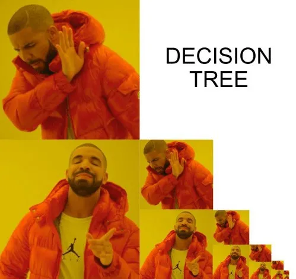

title: NPFL129, Lecture 9
class: title, cc-by-sa
style: .algorithm { background-color: #eee; padding: .5em }
# Decision Trees, Random Forests

## Jindřich Libovický <small>(reusing materials by Milan Straka)</small>

### November 28, 2024

---
class: middle
# Today's Lecture Objectives

After this lecture you should be able to

- Implement Decision Trees and Random Forests for classification and regression

- Explain how the splitting criterion depends on the optimized loss function

---
section: Decision Trees
class: section
# Decision Trees

---
# Decision Trees

The idea of decision trees is to partition the input space into regions and
solve each region with a simpler model.

~~~
We focus on **Classification and Regression Trees** (CART; Breiman et al.,
1984), but there are additional variants like ID3, C4.5, …

~~~

~~~

---
# Inference and Training

## Inference

- Just follow the branching rules until you reach a leaf.

- Output a prediction (real value/distribution/predicted class) based on the leaf.

~~~
## Training

- Training data is stored in tree leaves – the leaf prediction is based on what data items are in the leaf.

- At the beginning the tree is a single leaf node.

- Adding a node = leaf $\rightarrow$ decision node + 2 leaves.

- The goal of training = to find the most consistent leaves for the prediction.

Later, we will show that the consistency measures follow from the loss function we are optimizing.

---
# Regression Decision Trees

Assume we have an input dataset $⇉X ∈ ℝ^{N×D}$, $→t ∈ ℝ^N$.
~~~
At the beginning, the decision tree is just a single node and all input examples
belong to this node.
~~~
We denote $I_𝓣$ the set of training example indices belonging to a node $𝓣$.

~~~
For each leaf (a node without children), our model predicts the average of the
training examples belonging to that leaf, $t̂_𝓣 = \frac{1}{|I_𝓣|} ∑_{i ∈ I_𝓣} t_i$.

~~~
We use a **criterion** $c_𝓣$ telling us how _uniform_ or _homogeneous_ the
training examples of a node $𝓣$ are
~~~
– for regression, we employ the sum of squares error between the examples
belonging to the node and the predicted value in that node; this is proportional
to the variance of the training examples belonging to the node $𝓣$, multiplied
by the number of the examples. Note that even if it is not _mean_ squared error,
it is sometimes denoted as MSE.
$$c_\textrm{SE}(𝓣) ≝ ∑_{i ∈ I_𝓣} (t_i - t̂_𝓣)^2\textrm{, ~where~ } t̂_𝓣=\frac{1}{|I_𝓣|} ∑_{i ∈ I_𝓣} t_i.$$

---
class: middle
# Tree Construction

To split a node, the goal is to find

1. a feature and <small>(i.e., a for-loop over all features)</small>

2. its value <small>(i.e., a for-loop over all unique feature values)</small>

such that when splitting a node $𝓣$ into $𝓣_L$ and $𝓣_R$, the resulting regions
decrease the overall criterion value the most, i.e., the difference $c_{𝓣_L} +
c_{𝓣_R} - c_𝓣$ is the lowest.

---
# Tree Construction: Heuristics
We usually employ several constraints, the most common ones are:
- **maximum tree depth**: we do not split nodes with this depth;

~~~
- **minimum examples to split**: we do not split nodes with this many training
  examples;
~~~
- **maximum number of leaf nodes**: we split until we reach the given number of
  leaves.

~~~
The tree is usually built in one of two ways:
- if the number of leaf nodes is unlimited, we usually build the tree in
  a depth-first manner, recursively splitting every leaf until one
  of the above constraints is met;
~~~
- if the maximum number of leaf nodes is given, we usually split such leaf $𝓣$
  where the criterion difference $c_{𝓣_L} + c_{𝓣_R} - c_𝓣$ is the lowest.

~~~
 

_Terminological note:_ Decision tree with unlimited size can be considered a
non-parametric model: it is a way of building an index. With a limited size,
it has a fixed number of parameters to be learned and it can be considered a
parametric model.

---
# Classification Decision Trees

For multi-class classification, we predict the class which is the most frequent
in the training examples belonging to a leaf $𝓣$.

~~~
To define the criteria, let us denote the average probability for class $k$ in
a region $𝓣$ as $p_{𝓣}(k)$.

~~~
For classification trees, one of the following two criteria is usually used:

- **Gini index**, also called **Gini impurity**, measuring how often a randomly
  chosen element would be incorrectly labeled if it was randomly labeled
  according to $→p_𝓣$:
  $$c_\textrm{Gini}(𝓣) ≝ |I_𝓣| ∑_k p_𝓣(k) \big(1 - p_𝓣(k)\big);$$

~~~
- **entropy criterion**
  $$c_\textrm{entropy}(𝓣) ≝ |I_𝓣| ⋅ H(→p_𝓣) = - |I_𝓣| ∑_{\substack{k\\p_𝓣(k) ≠ 0}} p_𝓣(k) \log p_𝓣(k).$$

---
# From Loss Function to Splitting Criterion

~~~
- Training GLMs and MLPs is formulated as optimizing a loss function.

~~~
- For an already constructed decision tree, we can do it the same way. For each
  leaf, do the optimization and find the best parameter.

~~~
- So far, we were always interested in $\arg\min$, i.e., parameters that
  minimize the loss.

~~~
- If we plug the $\arg\min$ value in the loss function, we get the minimum
  reachable loss for the given tree structure.

~~~
- By splitting a leaf, we want to decrease the minimum reachable loss
  $\Rightarrow$ the **minimum node loss is the splitting criterion**.

---
section: Gini and Entropy Losses
class: section
# Gini and Entropy Losses

---
# Binary Gini as (M)SE Loss

Recall that $I_𝓣$ denotes the set of training example indices belonging to a leaf node $𝓣$.
Let $n_𝓣(0)$ be the number of examples with target value 0, $n_𝓣(1)$ be the
number of examples with target value 1, and let $p_𝓣 = \frac{1}{|I_𝓣|} ∑_{i ∈ I_𝓣} t_i = \frac{n_𝓣(1)}{n_𝓣(0) + n_𝓣(1)}$.

~~~
Consider the sum of squares loss $L(p) = ∑_{i ∈ I_𝓣} (p - t_i)^2$.

~~~
By setting the derivative of the loss to zero, we get that the $p$ minimizing
the loss fulfills $|I_𝓣|p = ∑_{i ∈ I_𝓣} t_i$, i.e., $p = p_𝓣$.

~~~
The value of the loss is then

$\displaystyle L(p_𝓣) = ∑_{i ∈ I_𝓣} (p_𝓣 - t_i)^2$
~~~
$= n_𝓣(0) \textcolor{blue}{(p_𝓣 - 0)^2} + n_𝓣(1) \textcolor{magenta}{(p_𝓣 - 1)^2}$

~~~
$\displaystyle \phantom{L(p_𝓣)}
  = \frac{n_𝓣(0) \textcolor{blue}{n_𝓣(1)^2}}{\textcolor{blue}{\big(n_𝓣(0) + n_𝓣(1)\big)^2}}
    + \frac{n_𝓣(1) \textcolor{magenta}{n_𝓣(0)^2}}{\textcolor{magenta}{\big(n_𝓣(0) + n_𝓣(1)\big)^2}}$
~~~
$\displaystyle = \mathrlap{
  \frac{(n_𝓣(1) + n_𝓣(0)) \textcolor{green}{n_𝓣(0)} \textcolor{red}{n_𝓣(1)}}
       {\textcolor{green}{\big(n_𝓣(0) + n_𝓣(1)\big)} \textcolor{red}{\big(n_𝓣(0) + n_𝓣(1)\big)}}}$

~~~
$\displaystyle \phantom{L(p_𝓣)} = \big(n_𝓣(0) + n_𝓣(1)\big) \textcolor{green}{(1-p_𝓣)} \textcolor{red}{p_𝓣} = |I_𝓣| ⋅ p_𝓣 (1-p_𝓣).$

---
# Entropy as NLL Loss

Again, let $I_𝓣$ denote the set of training example indices belonging to a leaf node $𝓣$,
let $n_𝓣(k)$ be the number of examples with target value $k$, and let
$p_𝓣(k) = \frac{1}{|I_𝓣|} ∑_{i ∈ I_𝓣} [t_i = k] = \frac{n_𝓣(k)}{|I_𝓣|}$.

~~~
Consider a distribution $→p$ on $K$ classes and a non-averaged NLL loss $L(→p) = ∑_{i ∈ I_𝓣} - \log p_{t_i}$.

~~~
By setting the derivative of the loss with respect to $p_k$ to zero (using
a Lagrangian with the constraint $∑_k p_k = 1$), we get that the $→p$ minimizing
the loss fulfills $p_k = p_𝓣(k)$.

~~~
The value of the loss with respect to $→p_𝓣$ is then

$\displaystyle \kern10em\mathllap{L(→p_𝓣)} = ∑_{i ∈ I_𝓣} - \log p_{t_i}$

~~~
$\displaystyle \kern10em{} = - ∑_{\substack{k\\p_𝓣(k)≠0}} n_𝓣(k) \log p_𝓣(k)$

~~~
$\displaystyle \kern10em{} = - |I_𝓣| ∑_{\substack{k\\p_𝓣(k)≠0}}  p_𝓣(k) \log p_𝓣(k) = |I_𝓣| ⋅ H(→p_𝓣).$

---
section: Random Forests
class: section
# Random Forests

---
# Random Forests

Bagging of data combined with a random subset of features (sometimes
called _feature bagging_).

---
# Random Forests

## Bagging

Every decision tree is trained using bagging (i.e., on a bootstrapped dataset).

~~~
## Random Subset of Features

During each node split, only a random subset of features is considered when
finding the best split. A fresh random subset is used for every node.

~~~
## Extra Trees

The so-called extra trees are even more randomized, not finding the best
possible feature value when choosing a split, but considering uniformly
random samples from a feature's empirical range (minimum and maximum in the
training data).

~~~
## Demo

https://cs.stanford.edu/~karpathy/svmjs/demo/demoforest.html

---
class: summary
# Today's Lecture Objectives

After this lecture you should be able to

- Implement Decision Trees and Random Forests for classification and regression

- Explain how the splitting criterion depends on optimized loss function
