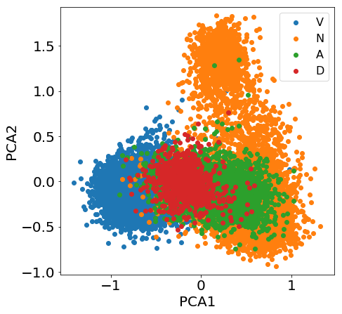

title: NPFL129, Lecture 11
class: title, cc-by-sa
style: .algorithm { background-color: #eee; padding: .5em }
# SVD, PCA, K-Means

## Jindřich Libovický <small>(reusing materials by Milan Straka)</small>

### December 12, 2022

---
class: middle
# Today's Lecture Objectives

After this lecture you should be able to

- Theoretically explain Singular Value Decomposition (SVD), prove it exists and explain what the Eckart-Young theorem says

- Theoretically explain Principal Component Analysis (PCA) and say how it explains the variance in the data based on SVD

- Use SVD or PCA for dimensionality reduction, data visualization and data whitening

- Implement the $k$-means algorithm and use it for clustering

---
# Unsupervised Machine Learning

---
section: LinearAlgebra

# Matrix Decompositions

$$→X = →A→B$$

- $→B$ tell us how to construct $→M$ using columns of $→A$

- $→A$ tell us how to construct $→M$ using rows of $→B$

~~~

 

$→X$ could be our (training) data matrix. If we managed to get decomposition
with orthogonal columns/rows, it would tells something like (statistical)
independent parts the dataset consists of.

* Rows are data points

* Columns are features

---
# Linear Algebra Refresh – Eigenvalues and Eigenvectors

Let $⇉A ∈ ℂ^{N×N}$ be an $N×N$ matrix.

~~~
- A vector $→v ∈ ℂ^N$ is a (right) **eigenvector**, if there exists an
  **eigenvalue** $λ ∈ ℂ$,
  such that
  $$⇉A →v = λ →v.$$

~~~
- If $⇉A ∈ ℝ^{N×N}$ is a real symmetric matrix, then it has $N$ real
  eigenvalues and $N$ real eigenvectors, which can be chosen to be _orthonormal_

~~~
### Quick (almost) proof
$→A→v_ 1 = \lambda_1 →v_1$, we transpose both sides and get $(→A→v_1)^T = \lambda_1 →v_1^T$

Multiply by $→v_2$ from right, we get $→v_1^T →A^T →v_2 = \lambda_1 →v_1^T →v_2$, but $→A$ is symmetric and $→A^T = →A$

$→v_1^T (→A →v_2) = \lambda_1 →v_1^T →v_2 \Rightarrow \lambda_2 →v_1^T →v_2 = \lambda_1 →v_1^T →v_2$

$$(\lambda_2 - \lambda_1) (→v_1^T →v_2) = 0$$

---
# Linear Algebra Refresh – Eigenvalue Decomposition
  We can express $⇉A$ using the **eigenvalue decomposition**
  $$⇉A = ⇉V ⇉Λ ⇉V^T,$$
  where:
~~~
  - $⇉V$ is a matrix, whose columns are the orthonormal eigenvectors $→v_1, →v_2, …, →v_N$;
~~~
  - $⇉Λ$ is a diagonal matrix with the eigenvalues $λ_1, λ_2, …, λ_N$ on the diagonal.

### Quick derivation
$$→A→V = →\Lambda →V = →V →\Lambda$$

$$→A→V→V^T = →V →\Lambda→V^T $$

Because $→V$ is orthonormal $→V^T = →V^{-1}$, so $→V→V^T = \mathbb{1}$ and $→A = →V →\Lambda →V^T$

---
section: SVD
# Singular Value Decomposition

Every (even a rectangular) matrix $→X$ of dimenion $m \times n$ and rank $r$ can be factorized as

$$ →X = →U →\Sigma →V^T $$

* $→U$ is a $m \times m$ orthonormal matrix

* $→\Sigma$ is a $m \times n$ diagonal matrix with non-negative values, so-called singular values, chosen to be in the decreasing order

* $→V$ is a $n \times n$ orthonormal matrix

$$
→X →V = →U →\Sigma

\quad\quad\Rightarrow\quad\quad

→X →v_k = \sigma_k →u_k \quad \forall k = 1, \ldots, r
$$

$$ →X \left[\begin{array}{c} \vdots \\ →v_1 \cdots →v_r \cdots →v_n \\ \vdots \end{array}\right] = \left[\begin{array}{c} \vdots \\ →u_1 \cdots →u_r \cdots →u_m \\ \vdots \end{array}\right] \left[\begin{array}{ccc|c}\sigma_1 \\ & \ddots & & →0 \\ & & \sigma_r \\ \hline & →0 & & 0 \end{array}\right]$$

---
# SVD: Proof

Assuming SVD exists, we can write $→U$ and $→V$ as eigenvector decomposition of row and column similarities:

$$
→X →X^T = (→U →\Sigma →V^T) (→U →\Sigma →V^T)^T =
→U →\Sigma (→V^T →V) →\Sigma →U^T = →U →\Sigma →\Sigma^T →U^T
$$

$$
→X^T →X = (→U →\Sigma →V^T)^T (→U →\Sigma →V^T) =
→V →\Sigma (→U^T →U) →\Sigma →V^T = →V →\Sigma^T →\Sigma →V^T
$$

~~~
Let's take $→V = [→v_1, \ldots, →v_r]^T$ orthonormal eigenvectors of $→X^T →X$ and set $\sigma_k = \sqrt{\lambda_k}$, then, $→X^T →X →v_k = \sigma_k^2 →v_k$. ($\lambda_k \geq 0$ because $→X →X^T$ is positive definite.)

~~~
The decomposition says that $→X →v_k = \sigma_k →u_k \Rightarrow →u_k = \frac{→X →v_k}{\sigma_k}$. To make it work, we need to show that $→u_k$ is indeed an eigenvector of $→X →X^T$ with the same eigenvalue $\lambda_k$.

~~~
$$
→X →X^T →u_k =

→X →X^T \underbrace{\left( \frac{→X →v_k}{\sigma_k} \right)}_{\text{def. of $→u_k$}} =

→X \underbrace{\left( \frac{→X^T →X →v_k}{\sigma_k} \right)}_{→v_k \text{ is eigenvector of } →X^T →X} =

→X \frac{\sigma_k^2 →v_k}{\sigma_k} =

\sigma_k^2 \underbrace{\left( \frac{→X →v_k}{\sigma_k} \right)}_{\text{def. of $→u_k$}} =

\sigma_k^2 →u_k
$$

---
# Interpretation of SVD

* Vectors of $→U$ the components rows consists of, vectors of $→V$ are the same for the colums

~~~
* It defines low-rank decomposition of $→X$ (with rank $r$) as a sum of rank 1 matrices of dimension $m \times n$

$$ →X = \sigma_1 →u_1 →v_1^T + \sigma_2 →u_2 →u_2^T + \ldots + \sigma_r →u_r v_r^T $$

~~~
* If $\sigma$ are in the decreasing order, we can approximate $→X$ taking $k < \min(m, n)$

$$\tilde{→X} = \sum_{i=1}^k \sigma_i u_i v_i^T$$

Eckart-Young theorem: This is the best rank $k$ approximation w.r.t. Frobenius norm (we flatten the matrix to a vector and do $L^2$ norm).

---
# Eckart-Young Theorem

$→X \in \mathbb{R}^{n \times m}$ and $→X_k = \sigma_1 →u_1 →v_1^T + \ldots + \sigma_k →u_k →v_k^T$ its approxiamation using SVD. For each $→B$

$$
|| →X - →X_k ||_F \leq || →A - →B ||_F.
$$

## Sketch of the proof

* $|| →X ||_F = \sqrt{\sum_{i}^n\sum_{j}^m x_{ij}^2} = \sqrt{\operatorname{trace}(→X^T →X)}$ (trace is the sum of the diagonal)

* Multiplying by orthonormal matrix does not change the norm

$$
||→U →A ||_F^2 =
\operatorname{trace}((→U→A)^T →U→A) =
\operatorname{trace}(→A^T \underbrace{→U^T →U}_{→I} →A) =
\operatorname{trace}(→A^T →A) = ||→A||_F^2
$$

* The Frobenius norm is the $L^2$ norm of the diagonal of $→\Sigma$

* The best strategy to keep the most of the norm is removing the smallest values

---
# Image Compression using SVD

| 400 components | 200 components | 100 components | 50 components | 10 components |
| :--: | :--: | :--: | :--: | :--: |
|  |  |  |  |  |
| actually bigger | 1.2× smaller | 2.4× smaller | 4.8× smaller | 24× smaller |

---
# SVD in Recommender Systems

* You have a matrix of what users like what content on a streaming
  platform.

* A user can be represented by a vector of content they liked, content can be
  represented by a vector of user that liked it.

* Such a matrix is **huge** and **noisy**: SVD can be used to reduce the noise
  (throw away small singular value).

* Low-dimensional representation of users and content in terms “eigenusers” and
  “eigencontent”.

* In practice, slightly modified version of SVD are used.

---
section: PCA
# From SVD to Principal Component Analysis

So far, SVD had geometric interpretation, let's add statistical interpretation.

When we apply SVD on mean-centered data $→X - \bar{→x}$, singular value get new interpretation: **components explaining variability in the data**.

$$
||→X - \bar{→x}||_F^2 =
\operatorname{trace}\underbrace{\left((→X - \bar{→x})^T(→X - \bar{→x})\right)}_{N\operatorname{Cov}(→X)}  =
N \sum_i^D \operatorname{Var}( →X_{i,:} )
$$

Approximating the matrix in terms of Frobenius norm means keeping the most variance from the data. Components ordered by how much variablity in the data they capture.

~~~
 

Let $→S = \frac{1}{N}(→X - \bar{→x})^T(→X - \bar{→x})$, then PCA of $→X$ are the eigenvectors of $→S$, i.e., the $→V$ matrix of the SVD decomposition of $→X - \bar{→x}$.

Note the $\frac{1}{N}$ term scales down the eigenvalues compared compared to SVD, but keeps the eigenvectors unchanged.

---
class: middle
# Plot Example

Principle components in data sampled from a 2D gaussian.

* Vectors of $(→\Sigma →U)$ define the directions of the componentes, so called **loadings**

* Vectors of $→V$ tell the distances in a coordinate system given by the loadings

---
# Principal Component Analysis

The **principal component analysis**, **PCA**, is a linear transformation used for
- dimensionality reduction,
- feature extraction,
- whitening,
- data visualization.

~~~
To motivate the dimensionality reduction, consider a dataset consisting
of a randomly translated and rotated image.

~~~
Every member of the dataset can be described just by three quantities –
horizontal and vertical offsets and a rotation. We usually say that the
_data lie on a manifold of dimension three_.

---
section: Whitening
class: dbend
# PCA Applications – Whitening aka Sphering

The PCA formula allows us to perform **whitening** aka **sphering**, which is
a linear transformation of the given data so that the resulting dataset
has zero mean and an identity covariance matrix.

~~~
Notably, if $⇉V$ are the eigenvectors of $⇉S$ and $⇉\Sigma^2$ is the diagonal matrix of
the corresponding eigenvalues (i.e., $⇉S ⇉V = ⇉V ⇉\Sigma^2$), we can define the
transformed data as
$$→z_i ≝ ⇉\Sigma^{-1} ⇉V^T (→x_i - →x̄).$$

~~~
Then, the mean of $→z_i$ is zero and the covariance is given by
$$\begin{aligned}
\frac{1}{N} ∑_i →z_i →z_i^T
  &= \frac{1}{N} ∑_i ⇉\Sigma^{-1} ⇉V^T (→x_i - →x̄) (→x_i - →x̄)^T ⇉V ⇉\Sigma^{-1} \\
  &= ⇉\Sigma^{-1} ⇉V^T ⇉S ⇉V ⇉\Sigma^{-1} = ⇉\Sigma^{-1} ⇉\Sigma^2 ⇉\Sigma^{-1} = ⇉I.
\end{aligned}$$

---
class: middle
# PCA Applications – Whitening or Sphering

The red componentss that are askwew and different length become the $x$ and $y$
axis and have the same length.

---
class: center
# Data Visualization

Word embeddings from neural machine translation.

---
# PCA versus Supervised ML

Note that PCA does not have access to supervised labels, so it may not
give a solution favorable for further classification. PCA = projecting on the magenta line, which does not help the classification.

---
# Principal Component Analysis and MLPs

It can be proven that if we construct an MLP _autoencoder_,
which is a model trying to reconstruct input as close as possible,
then even if the hidden layer uses nonlinear activation, the solution
to an MSE loss is a projection onto the $M$-dimensional subspace defined
by the first $M$ principal components (but is not necessary orthonormal
or orthogonal).

---
# Principal Component Analysis and MLPs

However, nonlinear PCA can be achieved, if both the _encoder_ and the _decoder_
are nonlinear.

---
section: PowerIteration
style: ul {margin-bottom: 0}
# Computing PCA — The Power Iteration Algorithm

If we want only the first (or several first) principal components, we might use
the **power iteration algorithm**.

~~~
The power iteration algorithm can be used to find a **dominant** eigenvalue (an
eigenvalue with an absolute value strictly larger than absolute values of all other
eigenvalues) and the corresponding eigenvector (it is used for example to
compute PageRank). It works as follows:

**Input**: Real symmetric matrix $⇉A$ with a dominant eigenvalue. 
**Output**: The dominant eigenvalue $λ$ and the corresponding eigenvector $→v$, with
probability close to 1.

- Initialize $v$ randomly (for example each component from $U[-1,1]$).
~~~
- Repeat until convergence (or for a fixed number of iterations):
  - $→v ← ⇉A→v$
  - $λ ← \|→v\|$
  - $→v ← →v / λ$

~~~
If the algorithm converges, then $→v = ⇉A→v / λ$, so $→v$ is an eigenvector with
eigenvalue $λ$.

---
class: dbend
# Computing PCA — The Power Iteration Algorithm

In order to analyze the convergence, let $(λ_1, λ_2, λ_3, …)$ be the eigenvalues
of $⇉A$, in the descending order of absolute values, so $|λ_1| > |λ_2| ≥ |λ_3| ≥ …$,
where the strict equality is the consequence of the dominant eigenvalue
assumption.

~~~
If we express the vector $→v$ in the basis of the eigenvectors as
$(a_1, a_2, a_3, …)$, then $⇉A→v$ is in the basis of the eigenvectors:
$$⇉A→v = \left(λ_ 1 a_ 1, λ_ 2 a_ 2, λ_ 3 a_ 3, …\right) $$
~~~
$$⇉A^k→v = \left(λ_1^k a_1, λ_2^k a_2, λ_3^k a_3, …\right) = \lambda_1^k \left(a_1, \frac{\lambda_2^k}{\lambda_1^k}, \frac{\lambda_3^k}{\lambda_1^k}, \ldots\right)$$

~~~
Coordinates $\frac{\lambda_i^k}{\lambda_1^k}$ go to zero with $k \rightarrow
\infty$. Normalization during the algorithm prevents the $\lambda_1^k$ term
from exploding.

~~~
If the initial $→v$ had a nonzero first coordinate $a_1$ (which has probability
very close to 1), then repeated multiplication with $⇉A$ converges to the
eigenvector corresponding to $λ_1$.

---
# Computing PCA — The Power Iteration Algorithm

After we get the largest eigenvalue $λ_1$ and its eigenvector $→v_1$, we can modify the
matrix $⇉A$ to “remove the eigenvalue $λ_1$”.
~~~
Consider $⇉A - λ_1 →v_1 →v_1^T$:
~~~
- multiplying it by $→v_1$ returns zero:
  $$\big(⇉A - λ_1 →v_1 →v_1^T\big) →v_1 = λ_1 →v_1 - λ_1 →v_1 \underbrace{→v_1^T →v_1}_{1} = 0,$$
~~~
- multiplying it by other eigenvectors $→v_i$ gives the same result as
  multiplying $⇉A$:
  $$\big(⇉A - λ_1 →v_1 →v_1^T\big) →v_i = ⇉A →v_i - λ_1 →v_1 \underbrace{→v_1^T →v_i}_{0} = ⇉A →v_i.$$

~~~
Therefore, $⇉A - λ_1 →v_1 →v_1^T$ has the same set of eigenvectors and
eigenvalues, except for $→v_1$, which now has eigenvalue 0.

---
style: ul {margin-bottom: 0}
# Computing PCA — The Power Iteration Algorithm

We are now ready to formulate the complete algorithm for computing the PCA.

**Input**: Matrix $⇉X$, desired number of dimensions $M$.

- Compute the mean $→μ$ of the examples (the rows of $⇉X$).

~~~
- Compute the covariance matrix $⇉S ← \frac{1}{N} \big(⇉X - →μ\big)^T\big(⇉X - →μ\big)$.

~~~
- for $i$ in $\{1, 2, …, M\}$:
  - Initialize $→v_i$ randomly.
  - Repeat until convergence (or for a fixed number of iterations):
    - $→v_i ← ⇉S→v_i$
    - $λ_i ← \|→v_i\|$
    - $→v_i ← →v_i / λ_i$
~~~
  - $⇉S ← ⇉S - λ_i →v_i →v_i^T$
~~~
- Return $⇉X ⇉V$, where the columns of $⇉V$ are $→v_1, →v_2, …, →v_M$.

---
section: Clustering
# Clustering

Clustering is an unsupervised machine learning technique, which given input
data tries to divide them into some number of groups, or **clusters**.

~~~
The number of clusters might be given in advance, or we should infer it.

~~~
When clustering documents, we usually normalize TF-IDF so that each feature
vector has length 1 (i.e., L2 normalization), because then
$$1 - \operatorname{cosine~similarity}(→x, →y) = \frac{1}{2} \|→x - →y\|^2.$$

---
section: KMeans
# K-Means Clustering

Let $→x_1, →x_2, …, →x_N$ be a collection of $N$ input examples, each being
a $D$-dimensional vector $→x_i ∈ ℝ^D$. Let $K$, the number of target clusters,
be given.

~~~
Let $z_{i, k} ∈ \{0, 1\}$ be binary indicator variables describing whether an input
example $→x_i$ is assigned to cluster $k$, and let each cluster be specified by
a point $→μ_1, …, →μ_K$, usually called the cluster **center**.

~~~
Our objective function $J$, which we aim to minimize, is
$$J = ∑_{i=1}^N ∑_{k=1}^K z_{i, k} \|→x_i - →μ_k\|^2.$$

---
# K-Means Clustering

**Input**: Input points $→x_1, …, →x_N$, number of clusters $K$.

- Initialize $→μ_1, …, →μ_K$ as $K$ random input points.

~~~
- Repeat until convergence (or until patience runs out):
~~~
  - Compute the best possible $z_{i, k}$. It is easy to see that the smallest $J$
    is achieved by
    $$z_{i,k} = \begin{cases} 1 & \textrm{~~if~}k = \argmin\nolimits_j \|→x_i - →μ_j\|^2, \\
                              0 & \textrm{~~otherwise}.\end{cases}$$

~~~
  - Compute the best possible $→μ_k = \argmin\nolimits_{→μ} ∑_i z_{i,k} \|→x_i-→μ\|^2$.
~~~
   By computing a derivative with respect to $→μ$, we get
   $$→μ_k = \frac{∑_i z_{i,k} →x_i}{∑_i z_{i,k}}.$$

---
# K-Means Clustering

---
# K-Means Clustering

It is easy to see that:
- updating the cluster assignment $z_{i, k}$ decreases the loss $J$ or keeps it the same;
~~~
- updating the cluster centers again decreases the loss $J$ or keeps it the
  same.

~~~
K-Means clustering therefore converges to a local optimum. However, it
is quite sensitive to the starting initialization:
~~~
- It is common practice to run K-Means algorithm multiple times with different
  initialization and use the result with the lowest $J$ (scikit-learn uses
  `n_init=10` by default).
~~~
- Instead of using random initialization, `k-means++` initialization scheme might
  be used, where the first cluster center is chosen randomly and others are
  chosen proportionally to the square of their distance to the nearest cluster
  center. It can be proven that with this initialization, the solution
  has $𝓞(\log K)$ approximation ratio in expectation.

---
# K-Means Clustering

---
# Gaussian Mixture vs K-Means

It could be useful to consider that different clusters might have different
radii or even be ellipsoidal.

---
class: middle
# Today's Lecture Objectives

After this lecture you should be able to

- Theoretically explain Singular Value Decomposition (SVD), prove it exists and explain what the Eckart-Young theorem says

- Theoretically explain Principal Component Analysis (PCA) and say how it explains the variance in the data based on SVD

- Use SVD or PCA for dimensionality reduction, data visualization and data whitening

- Implement the $k$-means algorithm and use it for clustering
