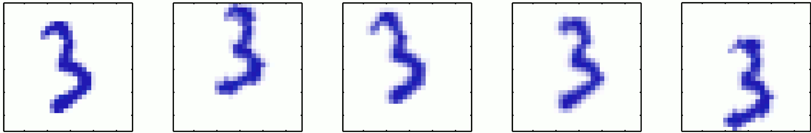
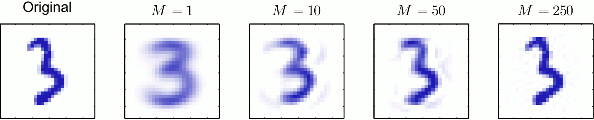
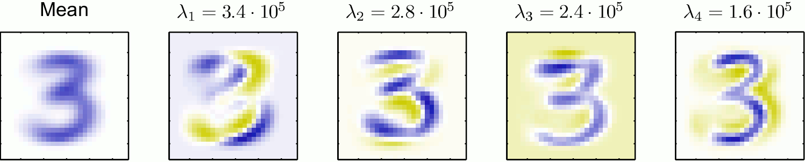

title: NPFL129, Lecture 11
class: title, cc-by-nc-sa
style: .algorithm { background-color: #eee; padding: .5em }
# PCA, K-Means, Gaussian Mixture

## Milan Straka

### December 14, 2020

---
section: PCA
class: center, middle
# Unsupervised Machine Learning

# Unsupervised Machine Learning

---
section: PCA
# Principal Component Analysis

The **principal component analysis**, **PCA**, is a technique used for
- dimensionality reduction,
- feature extraction,
- whitening,
- data visualization.

~~~
To motivate the dimensionality reduction, consider a dataset consisting
of a randomly translated and rotated image.

~~~
Every member of the dataset can be described just by three quantities –
horizontal and vertical offsets and a rotation. We usually say that the
_data lie on a manifold of dimension three_.

---
# Principal Component Analysis

We start by defining the PCA in two ways.

~~~

## Maximum Variance Formulation

Given data $→x_1, …, →x_N$ with $→x_i ∈ ℝ^D$, the goal is to project
them to a space with dimensionality $M < D$, so that the variance
of their projection is maximal.

~~~
We start by considering a projection to one-dimensional space. Such a projection
is defined by a vector $→u_1$, and because only the direction of $→u_1$ matters,
we assume that $→u_1^T →u_1 = 1$.

We start by pointing out that the projection of $→x_i$ to $→u_1$ is given by
$(→u_1^T →x_i) →u_1$, because the vectors $→u_1$ and $→x_i - (→u_1^T →x_i) →u_1$
are orthogonal:

$$→u_1^T \big(→x_i - (→u_1^T →x_i) →u_1\big) = →u_1^T →x_i - (→u_1^T →x_i) →u_1^T →u_1 = 0.$$

---
# Principal Component Analysis

We therefore use $→u_1^T →x_i$ as the projection of $→x_i$. If we define
$→x̄ = ∑_i →x_i / N$, the mean of the projected data is $→u_1^T →x̄$ and the
variance is given by
$$\frac{1}{N} ∑_{i=1}^N \big(→u_1^T →x_i - →u_1^T →x̄\big)^2 = →u_1^T ⇉S →u_1,$$
where $⇉S$ is the data covariance matrix defined as
$$⇉S = \frac{1}{N} ∑_{i=1}^N \big(→x_i - →x̄\big)\big(→x_i - →x̄)^T.$$

~~~
We can write the data covariance matrix in matrix form as
$⇉S = \frac{1}{N} \big(⇉X^T - →x̄\big)^T \big(⇉X - →x̄\big)$.

If the original data is centered (it has zero mean), then
$⇉S = \frac{1}{N} ⇉X^T ⇉X$, which we have already encountered.

---
# Principal Component Analysis

To maximize $→u_1^T ⇉S →u_1$, we need to include the constraint $→u_1^T →u_1$ by
introducing a Lagrange multiplier $λ_1$ for the constraint $→u_1^T →u_1 - 1 = 0$
and then maximizing the Lagrangian
$$L = →u_1^T ⇉S →u_1 - λ_1\big(→u_1^T →u_1 - 1\big).$$

~~~
By computing a derivative with respect to $→u_1$, we get
$$⇉S →u_1 = λ_1 →u_1.$$

~~~
Therefore, $→u_1$ must be an eigenvector of $⇉S$ corresponding to eigenvalue
$λ_1$.

~~~
Because the value to maximize $→u_1^T ⇉S →u_1$ is then $→u_1^T λ_1 →u_1 = λ_1 →u_1^T →u_1 = λ_1$,
the maximum will be attained for eigenvector $→u_1$ corresponding to the largest
eigenvalue $λ_1$.

~~~
The eigenvector $→u_1$ is know as the **first principal component**.

~~~
For a given $M$, the principal components are eigenvectors corresponding
to $M$ largest eigenvalues, and maximize the variance of the projected data.

---
# Principal Component Analysis

## Minimum Error Formulation

Assume $→u_1, …, →u_D$ is some orthonormal set of vectors, therefore,
$→u_i^T →u_j = \big[i == j\big]$.

~~~
Every $→x_i$ can be then expressed using this basis as
$$→x_i = ∑_j \big(→x_i^T →u_j) →u_j,$$
using a similar argument as the one we used to derive the orthogonal projection.

~~~
Because we want to eventually represent the data using $M$ dimensions, we will
approximate the data by the first $M$ basis vectors:
$$→x̃_i = ∑_{j=1}^M z_{i,j} →u_j + ∑_{j=M+1}^D b_j →u_j.$$

---
# Principal Component Analysis

We now choose the vectors $→u_j$, coordinates $z_{i,j}$ and biases $b_j$ to
minimize the approximation error, which we measure as a loss
$$L = \frac{1}{N} ∑_{i=1}^N ||→x_i - →x̃_i||^2.$$

~~~
To minimize the error, we compute the derivative of $L$ with respect to
$z_{i,j}$ and $b_j$, obtaining
$$z_{i,j} = →x_i^T →u_j,~~~~b_j = →x̄^T →u_j.$$

~~~
Therefore, we can rewrite the loss as
$$L = \frac{1}{N} ∑_{i=1}^N ∑_{j=M+1}^D (→x_i^T →u_j - →x̄^T →u_j)^2 = ∑_{j=M+1}^D →u_j^T ⇉S →u_j.$$

~~~
Analogously, we can minimize $L$ by choosing eigenvectors of $D-M$
smallest eigenvalues.

---
# PCA Applications – Data Compression

We can represent the data $→x_i$ by the approximations $→x̃_i$
$$ →x̃_i = ∑_{j=1}^M \big(→x_i^T →u_j\big) →u_j + ∑_{j=M+1}^D \big(→x̄^T →u_j\big) →u_j
        = →x̄ + ∑_{j=1}^M \big(→x_i^T →u_j - →x̄^T →u_j\big)→u_j.$$

---
# PCA Applications – Data Compression

---
# PCA Applications – Whitening or Sphering

The PCA formula allows us to perform **whitening** or **sphering**, which is
a linear transformation of the given data, so that the resulting dataset
has zero mean and identity covariance matrix.

~~~
Notably, if
$$⇉S ⇉U = ⇉U ⇉Λ,$$
we can define transformed data
$$→z_i ≝ ⇉Λ^{-1/2} ⇉U^T (→x_i - →x̄).$$

~~~
Then, the mean of $→z_i$ is zero and the covariance is given by
$$\begin{aligned}
\frac{1}{N} ∑_i →z_i →z_i^T
  &= \frac{1}{N} ∑_i ⇉Λ^{-1/2} ⇉U^T (→x_i - →x̄) (→x_i - →x̄)^T ⇉U ⇉Λ^{-1/2} \\
  &= ⇉Λ^{-1/2} ⇉U^T ⇉S ⇉U ⇉Λ^{-1/2} = ⇉Λ^{-1/2} ⇉Λ ⇉Λ^{-1/2} = ⇉I.
\end{aligned}$$

---
# PCA Applications – Whitening or Sphereing

---
# PCA versus Supervised ML

Note that PCA does not have access to supervised labels, so it may not
give a solution favorable for further classification.

---
# Principal Component Analysis and MLPs

Note that it can be proven that if we construct a MLP _autoencoder_,
which is a model trying to reconstruct input as close as possible,
then even if the hidden layer uses non-linear activation, the solution
to a MSE loss is a projection onto the $M$-dimensional subspace defined
by the first $M$ principal components (but is not necessary orthonormal
or orthogonal).

---
# Principal Component Analysis and MLPs

However, non-linear PCA can be achieved, if both the _encoder_ and the _decoder_
are non-linear.

---
# Computing PCA

There are two frequently used algorithms for performing PCA.

~~~
If we want to compute all (or many) principal components, we can compute
directly the eigenvectors and eigenvalues of the covariance matrix.

~~~
We can even avoid computing the covariance matrix. If we instead compute the
singular value decomposition of $(⇉X - →x̄) = ⇉U ⇉D ⇉V^T$, it holds that
$$\big(⇉X - →x̄\big)^T \big(⇉X - →x̄\big) = ⇉V ⇉D ⇉U^T ⇉U ⇉D ⇉V^T = ⇉V ⇉D^2 ⇉V^T.$$

~~~
Therefore, 
$$\big(⇉X - →x̄\big)^T \big(⇉X - →x̄\big) ⇉V = ⇉V ⇉D^2,$$
which means that $⇉V$ are the eigenvectors of $(⇉X-→x̄)^T (⇉X-→x̄)$ and therefore
of the data covariance matrix $⇉S$. The eigenvalues of $⇉S$ are the squares of
the singular values of $(⇉X-→x̄)$ divided by $N$.

---
section: PowerIteration
# Computing PCA — The Power Iteration Algorithm

If we want only the first (or several first) principal components, we might use
the **power iteration algorithm**.

~~~
The power iteration algorithm can be used to find the largest eigenvalue and the
corresponding eigenvector (it is used for example to compute PageRank). It works as follows:

**Input**: Diagonalizable matrix $⇉A$ with a single largest eigenvalue. 
**Output**: The largest eigenvalue $λ$ and the corresponding eigenvector $→v$, with
probability close to 1.

- Initialize $v$ randomly (for example each component from $U[-1,1]$).

~~~
- Repeat until convergence (or for a fixed number of iterations):
  - $→v ← ⇉A→v$
  - $λ ← ||→v||$
  - $→v ← →v / λ$

~~~
If the algorithm converges, then $→v = ⇉A→v / λ$, so $→v$ is an eigenvector with
eigenvalue $λ$.

---
# Computing PCA — The Power Iteration Algorithm

In order to analyze the convergence, let $(λ_1, λ_2, λ_3, …)$ be the eigenvalues
of $⇉A$, in the descending order of absolute values, so $|λ_1| ≥ |λ_2| ≥ |λ_3| ≥ …$.

~~~
If we express the vector $→v$ in the basis of the eigenvectors as
$(a_1, a_2, a_3, …)$, then $⇉A→v / λ_1$ is in the basis of the eigenvectors:
$$\frac{⇉A→v}{λ_1}
  = \left(\frac{λ_1}{λ_1}a_1, \frac{λ_2}{λ_1}a_2, \frac{λ_3}{λ_1}a_3, …\right)
  = \left(               a_1, \frac{λ_2}{λ_1}a_2, \frac{λ_3}{λ_1}a_3, …\right).$$

~~~
Therefore, all but the first coordinates decreased by at least a factor of
$|λ_2/λ_1|$.

~~~
If the initial $→v$ had a non-zero first coordinate $a_1$ (which has probability
very close to 1), then repeated multiplication with $⇉A$ will converge to the
eigenvector corresponding to $λ_1$.

---
# Computing PCA — The Power Iteration Algorithm

After we get the largest eigenvalue $λ_1$ and its eigenvector $⇉v_1$, we can modify the
matrix $⇉A$ to “remove the eigenvalue $λ$”.
~~~
Considering $⇉A - λ_1 →v_1 →v_1^T$:
- mutiplying it by $→v_1$ returns zero:
  $$\big(⇉A - λ_1 →v_1 →v_1^T\big) →v_1 = λ_1 →v_1 - λ_1 →v_1 \underbrace{→v_1^T →v_1}_{1} = 0,$$
~~~
- mutiplying it by other eigenvectors $→v_i$ gives the same result:
  $$\big(⇉A - λ_1 →v_1 →v_1^T\big) →v_i = ⇉A →v_i - λ_1 →v_1 \underbrace{→v_1^T →v_i}_{0} = ⇉A →v_i.$$

---
# Computing PCA — The Power Iteration Algorithm

We are now ready to formulate the complete algorithm for computing the PCA.

**Input**: Matrix $⇉X$, desired number of dimensions $M$.

- Compute the mean $→μ$ of the examples (the rows of $⇉X$).

~~~
- Compute the covariance matrix $S ← \frac{1}{N} \big(⇉X - →μ\big)^T\big(⇉X - →μ\big)$.

~~~
- for $i$ in $\{1, 2, …, M\}$:
  - Initialize $→v_i$ randomly.
  - Repeat until convergence (or for a fixed number of iterations):
    - $→v_i ← ⇉S→v_i$
    - $λ_i ← ||→v_i||$
    - $→v_i ← →v_i / λ_i$
~~~
  - $⇉S ← ⇉S - λ_i →v_i →v_i^T$
~~~
- Return $⇉X ⇉V$, where the columns of $⇉V$ are $→v_1, →v_2, …, →v_M$.

---
section: Clustering
# Clustering

Clustering is an unsupervised machine learning technique, which given input
data tries to divide them into some number of groups, or _clusters_.

~~~
The number of clusters might be given in advance, or should also be inferred.

~~~
When clustering documents, we usually use TF-IDF normalized so that each
feature vector has length 1 (i.e., L2 normalization).

---
section: KMeans
# K-Means Clustering

Let $→x_1, →x_2, …, →x_N$ be a collection of $N$ input examples, each being
a $D$-dimensional vector $→x_i ∈ ℝ^D$. Let $K$, the number of target clusters,
be given.

~~~
Let $z_{i, k} ∈ \{0, 1\}$ be binary indicator variables describing whether an input
example $→x_i$ is assigned to cluster $k$, and let each cluster be specified by
a point $→μ_1, …, →μ_K$, usually called the cluster _center_.

~~~
Our objective function $J$, which we aim to minimize, is
$$J = ∑_{i=1}^N ∑_{k=1}^K z_{i, k} ||→x_i - →μ_k||^2.$$

---
# K-Means Clustering

**Input**: Input points $→x_1, …, →x_N$, number of clusters $K$.

- Initialize $→μ_1, …, →μ_K$ as $K$ random input points.

~~~
- Repeat until convergence (or until patience runs out):
  - Compute the best possible $z_{i, k}$. It is easy to see that the smallest $J$
    is achieved by
    $$z_{i,k} = \begin{cases} 1 & \textrm{~~if~}k = \argmin\nolimits_j ||→x_i - →μ_j||^2, \\
                              0 & \textrm{~~otherwise}.\end{cases}$$

~~~
  - Compute the best possible $→μ_k = \argmin\nolimits_→μ ∑_i z_{i,k} ||→x_i-→μ||^2$.
~~~
   By computing a derivative with respect to $→μ$, we get
   $$→μ_k = \frac{∑_i z_{i,k} →x_i}{∑_i z_{i,k}}.$$

---
# K-Means Clustering

---
# K-Means Clustering

It is easy to see that:
- updating the cluster assignment $z_{i, k}$ decreases the loss $J$ or keeps it the same;
~~~
- updating the cluster centers again decreases the loss $J$ or keeps it the
  same.

~~~
K-Means clustering therefore converges to a local optimum. However, it
is quite sensitive to the starting initialization:
~~~
- It is common practise to run K-Means algorithm multiple times with different
  initialization and use the result with lowest $J$ (scikit-learn uses
  `n_init=10` by default).
~~~
- Instead of using random initialization, `k-means++` initialization scheme might
  be used, where the first cluster center is chosen randomly and others are
  chosen proportionally to the square of their distance to the nearest cluster
  center. It can be proven that with such initialization, the found solution
  has $𝓞(\log K)$ approximation ratio in expectation.

---
# K-Means Clustering

---
# Gaussian Mixture vs K-Means

It could be useful to consider that different clusters might have different
radii or even be ellipsoidal.

---
section: MultivariateGaussian
# Multivariate Gaussian Distribution

Recall that
$$𝓝(x; μ, σ^2) = \sqrt{\frac{1}{2πσ^2}} \exp \left(-\frac{(x - μ)^2}{2σ^2}\right).$$

~~~
For $D$-dimensional vector $→x$, the multivariate Gaussian distribution takes
the form
$$𝓝(→x | →μ, ⇉Σ) ≝ \frac{1}{\sqrt{(2π)^D |Σ|}} \exp \left(-\frac{1}{2}(→x-→μ)^T ⇉Σ^{-1} (→x-→μ) \right).$$

~~~
The biggest difference compared to the single-dimensional case is the _covariance
matrix_ $⇉Σ$, which is (in the non-degenerate case, which is the only one
considered here) a _symmetrical positive-definite matrix_ of size $D × D$.

---
# Multivariate Gaussian Distribution

If the covariance matrix is an identity, then the multivariate Gaussian
distribution simplifies to
$$𝓝(→x | →μ, ⇉I) = \frac{1}{\sqrt{(2π)^D}} \exp \left(-\frac{1}{2}(→x - →μ)^T (→x - →μ)\right).$$

~~~

We can rewrite the exponent in this case to
$$𝓝(→x | →μ, ⇉I) ∝ \exp \left(-\frac{||→x - →μ||^2}{2}\right).$$

Therefore, the constant surfaces are concentric circles centered at the mean $→μ$.

~~~
The same holds if the covariance is $σ^2 ⇉I$, only the circles' diameter
changes.

---
# Multivariate Gaussian Distribution

Now consider a diagonal covariance matrix $⇉Λ$. The exponent then simplifies to

$$𝓝(→x | →μ, ⇉Λ) ∝ \exp \left(- ∑\nolimits_i \frac{1}{2⇉Λ_{i,i}} \big(→x_i - →μ_i\big)^2\right).$$

The constant surfaces in this case are axis-aligned ellipses centered at the
mean $→μ$ with size of the axes depending on the corresponding diagonal entries
in the covariance matrix.

---
# Multivariate Gaussian Distribution

In the general case of a full covariance matrix, the fact that it is positive
definite implies it has real positive _eigenvalues_ $λ_i$. Considering the
corresponding eigenvectors $→u_i$, it can be shown that the constant
surfaces are again ellipses centered at $→μ$, but this time rotated so that
their axes are the eigenvectors $→u_i$ with sizes $λ_i^{1/2}$.

---
# Multivariate Gaussian Distribution

Generally, we can rewrite a positive-definite matrix $⇉Σ$ as $(⇉U⇉Λ^{1/2})(⇉Λ^{1/2}⇉U)^T$,
and then
$$→x ∼ 𝓝(→μ, ⇉Σ) \iff →x ∼ →μ + ⇉U⇉Λ^{1/2} 𝓝(0, ⇉I).$$

~~~
Therefore, when sampling from a distribution with a full covariance matrix, we
can sample from a standard multivariate $𝓝(0, ⇉I)$, scale by the eigenvalues of
the covariance matrix, rotate according to the eigenvectors of the covariance
matrix and finally shifting by $→μ$.

~~~

Note that different forms of covariance allows more generality, but also
requires more parameters:
- the $σ^2 ⇉I$ has a single parameter,
- the $⇉Λ$ has $D$ parameters,
- the full covariance matrix $⇉Σ$ has $\binom{D+1}{2}$ parameters, i.e., $Θ(D^2)$.

---
section: GaussianMixture
# Gaussian Mixture

Let $→x_1, →x_2, …, →x_N$ be a collection of $N$ input examples, each being
a $D$-dimensional vector $→x_i ∈ ℝ^D$. Let $K$, the number of target clusters,
be given.

~~~
Our goal is to represent the data as a Gaussian mixture, which is a combination
of $K$ Gaussians in the form
$$p(→x) = ∑_{k=1}^K π_k 𝓝(→x | →μ_k, ⇉Σ_k).$$
Therefore, each cluster is parametrized as $𝓝(→x | →μ_k, ⇉Σ_k)$.

---
# Gaussian Mixture

