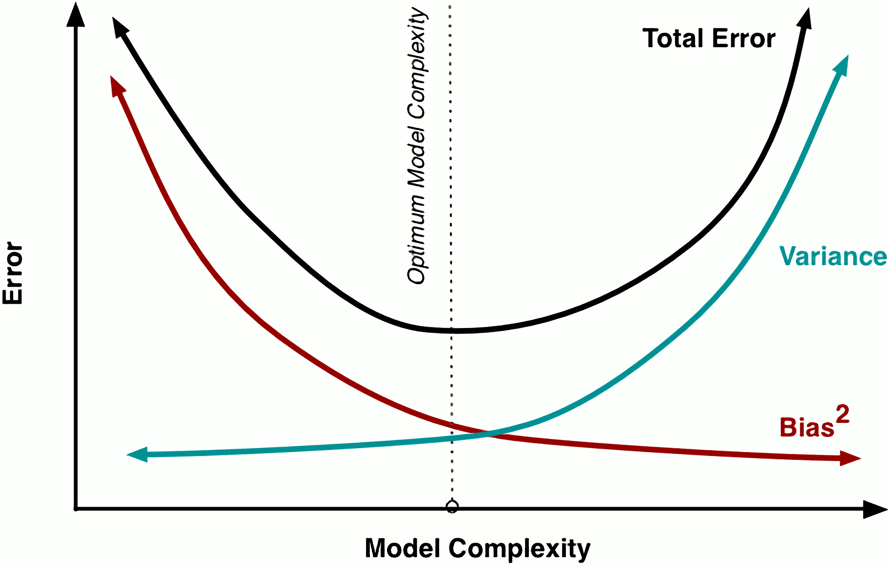

title: NPFL129, Lecture 12
class: title, cc-by-nc-sa
style: .algorithm { background-color: #eee; padding: .5em }
# Gaussian Mixture, EM Algorithm, Bias-Variance Trade-off

## Milan Straka

### December 21, 2020

---
section: GaussianMixture
# Gaussian Mixture

Let $→x_1, →x_2, …, →x_N$ be a collection of $N$ input examples, each being
a $D$-dimensional vector $→x_i ∈ ℝ^D$. Let $K$, the number of target clusters,
be given.

~~~
Our goal is to represent the data as a Gaussian mixture, which is a combination
of $K$ Gaussian in the form
$$p(→x) = ∑_{k=1}^K π_k 𝓝(→x | →μ_k, ⇉Σ_k).$$
Therefore, each cluster is parametrized as $𝓝(→x | →μ_k, ⇉Σ_k)$.

~~~
Let $→z ∈ \{0, 1\}^K$ be a $K$-dimensional random variable, such that exactly
one $z_k$ is 1, denoting to which cluster a training example belongs.
~~~
Let the marginal distribution of $z_k$ be
$$p(z_k = 1) = π_k,$$
so that the priors $π_k$ represent the “fertility” of the clusters.
~~~
Then, $p(→z) = ∏_k π_k^{z_k}$.

---
# Gaussian Mixture

We can write
$$p(→x) = ∑_{→z} p(→z) p(→x | →z) = ∑_{k=1}^K π_k 𝓝(→x | →μ_k, ⇉Σ_k),$$
~~~
and the probability of the whole clustering is therefore
$$\log p(⇉X | →π, →μ, →Σ) = ∑_{i=1}^N \log \left(∑_{k=1}^K π_k 𝓝(→x_i | →μ_k, ⇉Σ_k)\right).$$

~~~
To fit a Gaussian mixture model, we utilize maximum likelihood estimation and
minimize
$$𝓛(⇉X) = - ∑_i \log ∑_{k=1}^K π_k 𝓝(→x_i | →μ_k, ⇉Σ_k).$$

---
# Gaussian Mixture

The derivative of the loss with respect to $→μ_k$ gives
$$\frac{∂𝓛(⇉X)}{∂→μ_k} = - ∑_i \frac{π_k 𝓝(→x_i | →μ_k, ⇉Σ_k)}{∑_{l=1}^K π_l 𝓝(→x_i | →μ_l, ⇉Σ_l)} ⇉Σ_k^{-1} \big(→x_i - →μ_k\big).$$

~~~
Denoting $r(z_{i,k}) = \frac{π_k 𝓝(→x_i | →μ_k, ⇉Σ_k)}{∑_{l=1}^K π_l 𝓝(→x_i | →μ_l, ⇉Σ_l)}$,
setting the derivative equal to zero and multiplying by $⇉Σ_k^{-1}$, we get
$$→μ_k = \frac{∑_i r(z_{i,k}) →x_i}{∑_i r(z_{i,k})}.$$

~~~
The $r(z_{i,k})$ are usually called **responsibilities** and denote the
probability $p(z_k = 1 | →x_i)$. Note that the responsibilities depend on
$→μ_k$, so the above equation is not an analytical solution for $→μ_k$, but
can be used as an _iterative_ algorithm for converging to a local optimum.

---
# Gaussian Mixture

For $⇉Σ_k$, we again compute the derivative of the loss, which is technically
complicated (we need to compute a derivative of a matrix inverse, and also we
need to differentiate matrix determinant) and results in an analogous equation:
$$→Σ_k = \frac{∑_i r(z_{i,k}) (→x_i - →μ_k) (→x_i - →μ_k)^T}{∑_i r(z_{i,k})}.$$

~~~
To minimize the loss with respect to $→π$, we need to include the constraint
$∑_k π_k = 1$, so we form a Lagrangian $𝓛(⇉X) - λ\left(∑\nolimits_k π_k - 1\right)$,
and get
$$\frac{∂𝓛(⇉X)}{∂π_k} = ∑_i \frac{𝓝(→x_i | →μ_k, ⇉Σ_k)}{∑_{l=1}^K π_l 𝓝(→x_i | →μ_l, ⇉Σ_l)} - λ.$$
~~~
Setting the derivative to zero and multiplying it by $π_k$, we obtain $π_k = \frac{1}{λ} ⋅ ∑_i r(z_{i,k})$, so
$$π_k = 1/N ⋅ ∑\nolimits_i r(z_{i,k}).$$

---
# Gaussian Mixture

**Input**: Input points $→x_1, …, →x_N$, number of clusters $K$.

- Initialize $→μ_k, ⇉Σ_k$ and $π_k$. It is common to start by running the
  K-Means algorithm to obtain $z_{i,k}$, set $r(z_{i,k}) ← z_{i,k}$
  and use the **M step** below.

~~~
- Repeat until convergence (or until patience runs out):
  - **E step**. Evaluate the responsibilities as
    $$r(z_{i,k}) = \frac{π_k 𝓝(→x_i | →μ_k, ⇉Σ_k)}{∑_{l=1}^K π_l 𝓝(→x_i | →μ_l, ⇉Σ_l)}.$$
~~~
  - **M step**. Maximize the log-likelihood by setting

    $$→μ_k = \frac{∑_i r(z_{i,k}) →x_i}{∑_i r(z_{i,k})},~~
      →Σ_k = \frac{∑_i r(z_{i,k}) (→x_i - →μ_k) (→x_i - →μ_k)^T}{∑_i r(z_{i,k})},~~
      π_k = \frac{∑_i r(z_{i,k})}{N}.$$

---
# Gaussian Mixture

---
# Gaussian Mixture

---
class: dbend
section: EM
# EM Algorithm

The algorithm for estimating the Gaussian mixture is an example of an **EM
algorithm**.

~~~
The **EM algorithm** algorithm can be used when given a joint distribution
$p(⇉X, ⇉Z | →w)$ over observed variables $⇉X$ and latent (hidden, unseen)
variables $⇉Z$, parametrized by $→w$,
~~~
we maximize
$$\log p(⇉X; →w) = \log \left(∑_⇉Z p(⇉X, ⇉Z; →w)\right)$$
with respect to $→w$.

~~~
Usually, the latent variables $⇉Z$ indicate membership of the data in one of the
set of groups.

~~~
The main idea is to replace the computation of the logarithm of the sum over all
latent variable values by the expectation of a logarithm of the joint
probability under the posterior latent variable distribution $p(⇉Z | ⇉X; →w)$.

---
class: dbend
# EM Algorithm

- Initialize the parameters $→w^\mathrm{new}$.

~~~
- Repeat until convergence (or until patience runs out):
  - $→w^\mathrm{old} ← →w^\mathrm{new}$
  - **E step**. Evaluate
    $$Q\big(→w | →w^\mathrm{old}\big) = 𝔼_{⇉Z|⇉X, →w^\mathrm{old}} \big[\log p(⇉X, ⇉Z; →w)\big].$$
  - **M step**. Maximize the log-likelihood by computing
    $$→w^\mathrm{new} ← \argmax_→w Q\big(→w | →w^\mathrm{old}\big).$$

---
class: dbend
# EM Algorithm – Proof

The EM algorithm increases $Q\big(→w | →w^\mathrm{old}\big)$ on every step, and we now
prove that its increase also causes the $\log p(⇉X; →w)$ to increase, converging
to a local optimum.

~~~
First note that for any $⇉Z$ with nonzero probability, we can write
$$\log p(⇉X; →w) = \log p(⇉X, ⇉Z; →w) - \log p(⇉Z|⇉X; →w).$$

~~~
Computing the expectation with respect to $p(⇉Z|⇉X, →w^\mathrm{old})$, we get
$$\begin{aligned}
  \log p(⇉X; →w)
  &= ∑_⇉Z p(⇉Z|⇉X, →w^\mathrm{old}) \log p(⇉X, ⇉Z; →w) - ∑_⇉Z p(⇉Z|⇉X, →w^\mathrm{old}) \log p(⇉Z|⇉X; →w) \\
  &= Q\big(→w | →w^\mathrm{old}\big) + H\big(p(⇉Z|⇉X; →w^\mathrm{old}), p(⇉Z|⇉X; →w)\big).
\end{aligned}$$

~~~
The above equation holds for any $→w$, so also for $→w^\mathrm{old}$:
$$\log p(⇉X; →w^\mathrm{old}) = Q\big(→w^\mathrm{old} | →w^\mathrm{old}\big) + H\big(p(⇉Z|⇉X; →w^\mathrm{old}), p(⇉Z|⇉X; →w^\mathrm{old})\big).$$

---
class: dbend
# EM Algorithm – Proof

Subtracting the second term $\log p(⇉X; →w^\mathrm{old})$ from the first $\log p(⇉X; →w)$, we obtain
$$\begin{aligned}
  & \log p(⇉X; →w) - \log p(⇉X; →w^\mathrm{old}) \\
  &= Q\big(→w | →w^\mathrm{old}\big) - Q\big(→w^\mathrm{old} | →w^\mathrm{old}\big)
   + H\big(p(⇉Z|⇉X; →w^\mathrm{old}), p(⇉Z|⇉X; →w)\big) - H\big(p(⇉Z|⇉X; →w^\mathrm{old})\big) \\
  &= Q\big(→w | →w^\mathrm{old}\big) - Q\big(→w^\mathrm{old} | →w^\mathrm{old}\big)
   + D_\mathrm{KL}\big(p(⇉Z|⇉X; →w^\mathrm{old}) || p(⇉Z|⇉X; →w)\big).
\end{aligned}$$

~~~
Given that KL divergence is non-negative, we get
$$\log p(⇉X; →w) - \log p(⇉X; →w^\mathrm{old}) ≥ Q\big(→w | →w^\mathrm{old}\big) - Q\big(→w^\mathrm{old} | →w^\mathrm{old}\big),$$
and therefore, if we increase $Q\big(→w | →w^\mathrm{old}\big)$, we also increase
the $\log p(⇉X; →w)$.

---
section: BiasVariance Trade-off
# Bias-Variance Trade-off

Consider a model $y(→x)$ solving a regression problem with MSE loss
$$𝓛 = 𝔼_{→x,t} \big[(y(→x) - t)^2\big].$$

~~~
Denoting $g(→x) ≝ 𝔼_{t|→x} \big[t\big]$, we can rewrite $\big(y(→x) - t\big)^2$ as
$$\begin{aligned}
  \big(y(→x) - t\big)^2
  & = \big(y(→x) - g(→x) + g(→x) - t\big)^2 \\
  & = \big(y(→x) - g(→x)\big)^2 + 2 \big(y(→x) - g(→x)\big)\big(g(→x) - t\big) + \big(g(→x) - t\big)^2.
\end{aligned}$$

~~~
When computing an expectation with respect to $p_\mathrm{data}(→x, t)$, we
obtain
$$\begin{aligned}
  𝓛
  & = 𝔼_{→x,t}\big[(y(→x) - g(→x))^2\big] + 2 𝔼_{→x,t}\big[(y(→x) - g(→x))(g(→x) - t)\big] + 𝔼_{→x,t}\big[(g(→x) - t)^2\big] \\
  & = 𝔼_{→x,t}\big[(y(→x) - g(→x))^2\big] + 𝔼_{→x,t}\big[(g(→x) - t)^2\big],
\end{aligned}$$
because $𝔼_{t|→x}\big[g(→x) - t\big] = 0$.

---
# Bias-Variance Trade-off

We have decomposed the loss into two components, where the second is the “label
noise” called **irreducible error**.

~~~
We now further decompose the first component
$𝔼_{→x,t}\big[(y(→x) - g(→x))^2\big]$.

~~~
Assuming $𝓓$ is a dataset obtained from the data generating distribution, we
denote the prediction of a model trained using this dataset as $y(→x; 𝓓)$.

~~~
$$\begin{aligned}
  \big(y(→x; 𝓓) - g(→x)\big)^2
  & = \big(y(→x; 𝓓) - 𝔼_𝓓\big[y(→x; 𝓓)\big] + 𝔼_𝓓\big[y(→x; 𝓓)\big] - g(→x)\big)^2 \\
  & = \big(y(→x; 𝓓) - 𝔼_𝓓\big[y(→x; 𝓓)\big]\big)^2 \\
  &+ 2\big(y(→x; 𝓓) - 𝔼_𝓓\big[y(→x; 𝓓)\big]\big)\big(𝔼_𝓓\big[y(→x; 𝓓)\big] - g(→x)\big) \\
  &+ \big(𝔼_𝓓\big[y(→x; 𝓓)\big] - g(→x)\big)^2.
\end{aligned}$$

~~~
Note that $𝔼_𝓓\big[y(→x; 𝓓) - 𝔼_𝓓[y(→x; 𝓓)]\big]=0$, therefore,
$$𝔼_𝓓\big[(y(→x; 𝓓) - g(→x))^2\big] = 𝔼_𝓓\big[(y(→x; 𝓓) - 𝔼_𝓓[y(→x; 𝓓)])^2\big] + 𝔼_𝓓\big[(𝔼_𝓓[y(→x; 𝓓)] - g(→x))^2].$$

---
# Bias-Variance Trade-off

Putting all the parts together, we get that
$$\begin{aligned}
  𝔼_𝓓\big[𝓛]
  & = 𝔼_𝓓\big[(y(→x; 𝓓) - t)^2\big] \\
  & = \underbrace{𝔼_𝓓\big[(𝔼_𝓓[y(→x; 𝓓)] - g(→x))^2]}_{\mathrm{bias}^2}
    + \underbrace{𝔼_𝓓\big[(y(→x; 𝓓) - 𝔼_𝓓[y(→x; 𝓓)])^2\big]}_{\mathrm{variance}}
    + \underbrace{𝔼_𝓓\big[(g(→x) - t)^2\big]}_{\mathrm{irreducible~error}}
\end{aligned}$$

~~~
This is the so-called **bias-variance trade-off**, showing that the expected loss
decomposes into the three above components.

~~~
For classification problems, we can use the same decomposition on MSE of the
probabilities, and it is also possible to derive an analogy using the so-called
0-1 loss (see _A Unified Bias-Variance Decomposition_ by P. Domingos for the
exact formulation).

~~~
This decomposition has been long
interpreted as:

---
# Bias-Variance Trade-off

~~~

---
# Bias-Variance Trade-off

~~~

---
# Bias-Variance Trade-off

For a k-NN search, the loss can be decomposed exactly as
$$𝔼\big[(y(→x) - t(→x))^2\big] = \left(t(→x) - \frac{1}{K} ∑_{k=1}^K t\big(N_k(→x)\big)\right)^2 + \frac{σ^2}{K} + σ^2,$$
where $N_k(→x)$ is the k-nearest neighbor of $→x$ and $σ^2$ is the irreducible
error.

---
# Bias-Variance Trade-off

Quoting from _Neural Networks and the Bias/Variance Decomposition_ by S. Geman, 1992:

> _The basic trend is what we expect: bias falls and variance increases with the
> number of hidden units. The effects are not perfectly demonstrated (notice,
> for example, the dip in variance in the experiments with the largest numbers
> of hidden units), presumably because the phenomenon of overfitting is
> complicated by convergence issues and perhaps also by our decision to stop the
> training prematurely._

---
# Bias-Variance Trade-off

However, in past years, neural networks with increasing capacity have performed
better and better.

---
section: DoubleDescent
# Double Descent

---
# Double Descent

---
# Double Descent

---
# Double Descent

---
section: DeepDoubleDescent
# Deep Double Descent

---
# Deep Double Descent

---
# Deep Double Descent

