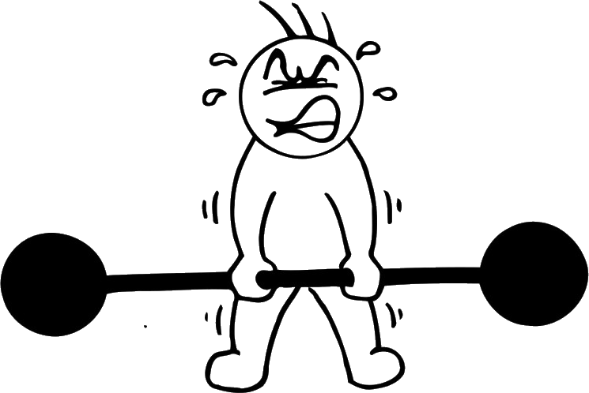
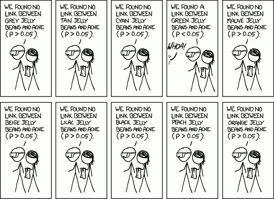

title: NPFL129, Lecture 13
class: title, cc-by-nc-sa
style: .algorithm { background-color: #eee; padding: .5em }
# Statistical Hypothesis Testing, Model Comparison

## Milan Straka

### January 04, 2021

---
section: StatisticalTesting
# Statistical Hypothesis Testing

Variation of a famous saying states, that there are various kinds of truth:

~~~
- truth,

~~~
- half-truth,
~~~
- lie,
~~~
- disgusting lie,
~~~
- and statistics.

---
# Statistical Hypothesis Testing

Assume we have a hypothesis testable using observed data of random variables.

~~~
There are two slightly differing views on statistical hypothesis testing:

~~~
1. In the first one, we assume we have a **null hypothesis** $H_0$, and we
   are interested in whether we can **reject it** using the observed data.

~~~
   The result is **statistically significant**, if it is very unlikely
   that the observed data have occurred given the null hypothesis.

~~~
   The **significance level** of a test is the threshold of this unlikeliness.

~~~
2. In the second view, we have two hypotheses, a null hypothesis $H_0$
   and an **alternative hypothesis** $H_1$, and we want to distinguish among
   them.

~~~
   We consider only two outcomes of the test:
   - either we “reject” the null hypothesis, if the data is very unlikely
   to have occurred given the null hypothesis; or
~~~
   - we cannot reject the null hypothesis.

~~~
   Note that we never “prove” the alternative hypothesis.

---
class: tablewide
# Type I and Type II Errors

Consider the _courtroom trial_ example, which is similar to a criminal trial,
where the defendant is considered not guilty until their guilt is proven.

~~~
In this setting, $H_0$ is “not guilty” and $H_1$ is “guilty”.

~~~
| | $H_0$ is true Truly not guilty | $H_1$ is true Truly guilty |
|-|-----------------------------------|-------------------------------|
| Not proven guilty Not rejecting $H_0$ | Correct decision True negative | Wrong decision False negative **Type II Error** |
| Proven guilty Rejecting $H_0$ | Wrong decision False positive **Type I Error** | Correct decision True positive |

~~~
Our goal is to limit the Type 1 errors – the test **significance level** is the
type 1 error rate.

---
# Match Analogy

I like the following analogy – if you have a theory and want to convince others
that it holds, you devise an _opponent_ for it and let them wrestle.

~~~
If your theory wins, it may be an indication that it really holds.

~~~
However, you must choose an appropriate opponent.

~~~

---
# Statistical Hypothesis Testing

The crucial part of a statistical test is the **test statistic**. It is some
summary of the observed data, very often a single value (like mean), which
can be used to distinguish the null and the alternative hypothesis.

~~~
It is crucial to be able to compute the distribution of the test statistic,
which allows the **p-values** to be calculated.

~~~
A **p-value** is the probability of obtaining test statistic value at least as extreme
as the one actually observed, assuming validity of the null hypothesis.
A very small p-value indicates that the observed data are very unlikely under
the null hypothesis.

~~~
Given a test statistic, we usually perform one of

- a one-sided right-tail test, when the p-value of $t$ is $P(\mathrm{test~statistic} > t | H_0)$;

~~~

- a one-sided left-tail test, when the p-value of $t$ is $P(\mathrm{test~statistic} < t | H_0)$;
~~~

- a two-sides test, when the p-value of $t$ is twice the minimum of
  $P(\mathrm{test~statistic} < t | H_0)$ and $P(\mathrm{test~statistic} > t | H_0)$.

---
# Statistical Hypothesis Testing

Therefore, the whole procedure consists of the following steps:
~~~
1. Formulate the null hypothesis $H_0$, and optionally the alternative
   hypothesis $H_1$.

~~~
1. Choose the test statistic.
~~~
1. Compute the observed value of the test statistic.
~~~
1. Calculate the p-value, which is the probability of a test
   statistic value at least as extreme as the observed one,
   under the null hypothesis $H_0$.
~~~
1. Reject the null hypothesis $H_0$ (in favor of the alternative hypothesis
   $H_1$), if the p-value is less than the chosen significance level $α$ (0.5%
   and 0.1% are common choices).

---
# Test Statistics

There are several kinds of test statistics:
~~~
- **one-sample tests**, where we sample values from one distribution.

~~~
  Common one-sample tests usually check for
  - the mean of the distribution to be greater/ than and/or equal to zero;
  - the goodness of fit (that the data comes from a normal or categorical
    distribution of given parameters).

~~~
- **two-sample tests**, where we sample independently from two distributions.

~~~
- **paired tests**, in which case we also sample from two distributions, but
  the samples are paired (i.e., evaluating several models on the same data).

~~~
  In paired tests, we usually compute the difference between the paired members
  and perform one-sample test on the mean of the differences.

---
# Test Statistics

There are many commonly used test statistics, with different requirements
and conditions. We only mention several commonly-used ones, but it is by no means
a comprehensive treatment.

~~~
- **Z-Test** is a test, where the test statistic can be approximated by a normal
  distribution. For example, it can be used when comparing a mean of samples
  _with known variance_ to a given value.

~~~
- In **Student's _t_-test** the test statistic follow a Student's _t_-distribution
  (where Student is the pseudonym used by the real author W. S. Gosset), which
  is the distribution of a sample mean of normally-distributed population _with
  unknown variance_.

~~~
  Therefore, the _t_-test is used when comparing a mean of
  samples with unknown variance to a given value, or to a mean of samples from
  another distribution with the same sample size and variance.

~~~
- **Chi-squared test** utilizes a test statistic with a chi-squared
  distribution, which is a distribution of a sum of squares of $k$
  independent normally distributed variables.

~~~
  The essential Pearson's chi-squared test can be used to evaluate a goodness of
  fit of $k$ random categorical samples with respect to a given categorical
  distribution.

---
section: MultipleComparisons
# Multiple Comparisons Problem

A **multiple comparisons problem** (or multiple testing problem) arises, if we
consider many statistical hypotheses tests using the same observed data.

~~~

---
# Multiple Comparisons Problem

---
# Multiple Comparisons Problem

---
# Multiple Comparisons Problem

~~~
Usually, the problem is that we perform many statistical tests and only report
the ones with statistically significant results.

~~~

---
# Multiple Comparisons Problem: Post-Mortem Salmon Study

Even world-class researchers make mistakes in multiple comparisons problem.
Consider the paper
> _Neural Correlates of Interspecies Perspective Taking in the Post-Mortem
> Atlantic Salmon: An Argument For Proper Multiple Comparisons Correction_

~~~
Functional magnetic resonance imaging (fMRI) is a technique for monitoring brain
activity via measuring the changes in blood oxygenation. The measurement is
performed for every _voxel_ in the brain; the authors claim that 130k voxels are
common in a single fMRI measurement.

~~~
The correlation is usually computed for every voxel, and usually a cluster of
some number of neighboring voxels, all of which must pass statistically
significant test, is required.

~~~
However, with such a large number of voxels, a positive result can be caused by
chance without some multiple comparison correction.

---
# Multiple Comparisons Problem: Post-Mortem Salmon Study

The authors perform the following experiment. Citing:

> _One mature Atlantic Salmon (Salmo salar) participated in the fMRI study. The
> salmon measured approximately 18 inches long, weighed 3.8 lbs, and was not
> alive at the time of scanning. It is not known if the salmon was male or
> female, but given the post-mortem state of the subject this was not thought to
> be a critical variable._
~~~

> …

> _The task administered to the salmon involved completing an open-ended
> mentalizing task. The salmon was shown a series of photographs depicting human
> individuals in social situations with a specified emotional valence, either
> socially inclusive or socially exclusive. The salmon was asked to determine
> which emotion the individual in the photo must have been experiencing._

---
# Multiple Comparisons Problem: Post-Mortem Salmon Study

_A t-contrast was used to test for regions with significant BOLD signal change
during the presentation of photos as compared to rest. The relatively low extent threshold value was chosen due to
the small size of the salmon’s brain relative to voxel size. Several active
voxels were observed in a cluster located within the salmon’s brain cavity
(see Fig. 1). The size of this cluster was 81 mm$^3$ with a cluster-level
significance of $p = 0.001$._

---
# Multiple Comparisons Problem: Post-Mortem Salmon Study

The authors claim that:

> _Sadly, while methods for multiple comparisons correction are included in
> every major neuroimaging software package these techniques are not always
> invoked in the analysis of functional imaging data. For the year 2008 only 74%
> of articles in the journal NeuroImage reported results from a general linear
> model analysis of fMRI data that utilized multiple comparisons correction
> (193/260 studies). Other journals we examined were Cerebral Cortex (67.5%,
> 54/80 studies), Social Cognitive and Affective Neuroscience (60%, 15/25
> studies), Human Brain Mapping (75.4%, 43/57 studies), and the Journal of
> Cognitive Neuroscience (61.8%, 42/68 studies).
> …
> The issue is not limited to published articles, as proper multiple comparisons
> correction is somewhat rare during neuroimaging conference presentations.
> During one poster session at a recent neuroscience conference only 21% of the
> researchers used multiple comparisons correction in their research (9/42).
> A further, more insidious problem is that some researchers would apply
> correction to some contrasts but not to others depending on the results of
> each comparison._

---
section: FWER
# Family-Wise Error Rate

There are several ways to handle the multiple comparison problem; one of the
easiest (but often overly conservative) is to limit the **family-wise error
rate**, which is the probability of at least one type 1 error in the family.
$$\mathrm{FWER} = P\bigg(⋃_i \Big(p_i ≤ α\Big)\bigg).$$

~~~
One way of controlling the family-wise error rate is the **Bonferroni
correction**, which rejects the null hypothesis of a test in the family of
size $m$ when $p_i ≤ \frac{α}{m}$.

~~~
Assuming such a correction and utilizing the Boole's inequality
$P\big(⋃\nolimits_i A_i\big) ≤ ∑_i P(A_i)$, we get that
$$\mathrm{FWER} = P\bigg(⋃_i \Big(p_i ≤ \frac{α}{m}\Big)\bigg) ≤ ∑_i P\Big(p_i ≤ \frac{α}{m}\Big) = m \cdot \frac{α}{m} = m.$$

~~~
Note that there exist other more powerful methods like Holm-Bonferroni or Šidák correction.

---
section: ModelComparison
# Model Comparison

WIP

---
section: BootstrapResampling
# Bootstrap Resampling

WIP

---
section: BootstrapPairTest
# Bootstrap Pair Test

WIP

---
# Bootstrap Pair Test

For illustration, consider models for the `isnt_it_ironic` competition
utilizing either 3, 4 or 5 in-word character n-grams.

---
# Bootstrap Pair Test

For illustration, consider models for the `isnt_it_ironic` competition
utilizing either 3, 4 or 5 in-word character n-grams.

---
# Bootstrap Pair Test

For illustration, consider models for the `isnt_it_ironic` competition
utilizing either 3, 4 or 5 in-word character n-grams.

